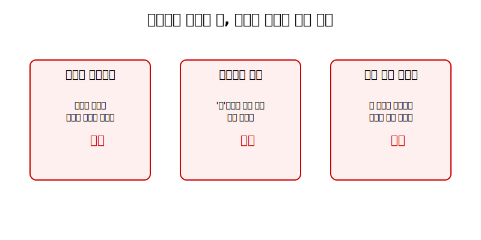
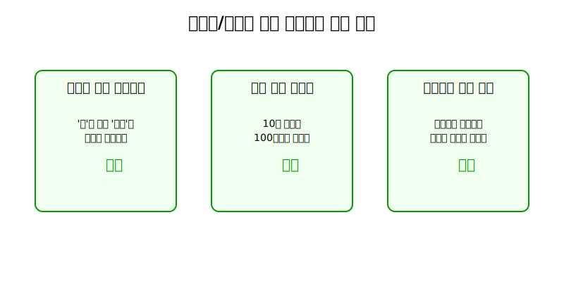
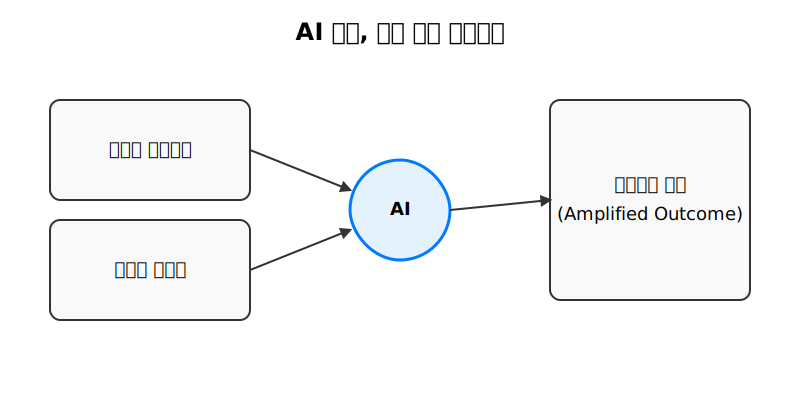
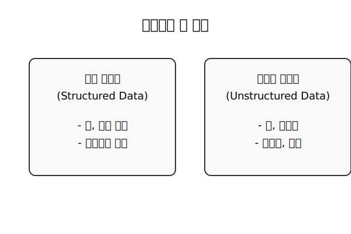
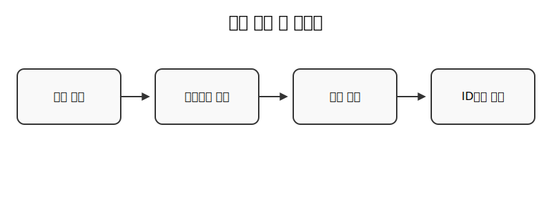
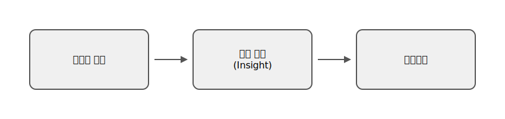
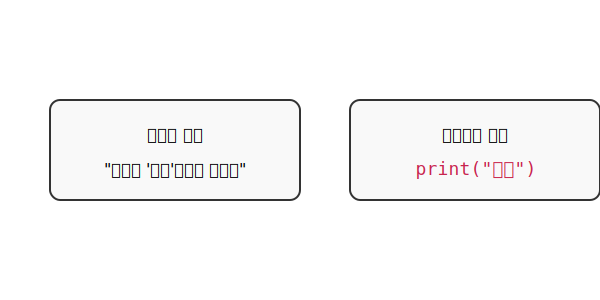
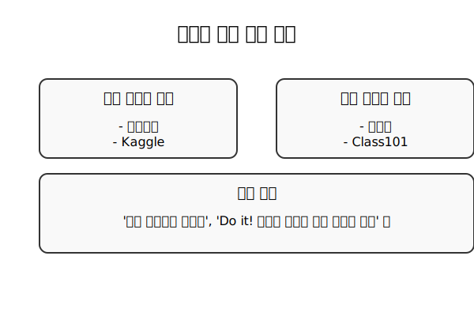

# **AI 시대를 준비하는 데이터와 코딩 이해**

## 입문 강의

---

# **1부: 데이터와 코딩, 새로운 시대의 교양**

---

## "나도 모르게 손해 보고 있었다" (일상 편)

- 데이터를 읽지 못하면, 우리는 일상에서 시간, 돈, 기회를 잃고 있습니다.

---

## "일잘러들의 비밀 무기" (업무 편)

- 업무에서 데이터와 코딩은 더 이상 기술이 아닌, 논리적인 '무기'가 됩니다.

---

## 그리고, AI가 모든 것을 바꾸기 시작했다

- 데이터/코딩 능력은 이제 '있으면 좋은 것'에서 '필수적인 것'이 되었습니다.
- AI라는 강력한 동료와 함께 일하기 위해, 우리는 데이터와 논리의 언어를 배워야 합니다.

---

# **2부: 데이터와 친해지기**

---

## 데이터의 두 얼굴: 정형 vs 비정형

- **정형 데이터:** 표처럼 깔끔하게 정리된 데이터
- **비정형 데이터:** 글, 사진, 동영상처럼 형태가 없는 데이터

---

## 우리 주변에 숨어있는 데이터들

- 우리는 매 순간 데이터를 만들고 소비하는 '데이터 생활자'입니다.

---

## 데이터, 왜 중요할까?

- 데이터 속에 숨겨진 '패턴'을 발견하여, 더 나은 '의사결정'을 할 수 있습니다.

---

# **3부: 코딩의 첫걸음 내딛기**

---

## 컴퓨터와 소통하는 언어, '코딩'

- 복잡한 기술이 아닌, 컴퓨터에게 일을 시키기 위한 '쉽고 명확한 약속'입니다.

---

## 코딩의 핵심 개념 3가지

- **변수 (Variable):** 데이터를 담는 상자
- **조건문 (Condition):** 만약 ~라면, ~한다
- **반복문 (Loop):** ~를 반복한다

---

## 간단한 데이터 분석 실습

- 카페의 일주일 매출 데이터로, 하루 평균 몇 잔을 팔았는지 코드로 계산해보기

---

# **4부: AI는 어떻게 만들어지고 있을까?**

---

## 규칙 기반 vs 학습 기반

- **전통 코딩:** 사람이 모든 규칙을 직접 만듦
- **머신러닝:** 컴퓨터가 데이터를 보고 스스로 규칙(패턴)을 학습함

---

## AI 모델 학습 과정

- AI를 만드는 과정은 '공부하고 시험보는' 인간의 학습 과정과 같습니다.

---

## 우리 삶의 AI 서비스 원리

- **데이터**를 통해 **패턴**을 학습하고, 결과를 **예측**합니다.

---

# **5부: 다음 스텝을 위한 안내**

---

## 오늘 배운 것들 요약

---

## 나는 무엇을 더 해볼 수 있을까?

- 나의 직무와 관심사에 맞춰 다음 스텝을 정해보세요.

---

## 학습을 위한 추천 자료

- 모든 것을 다 하려 하지 말고, 가장 흥미로운 것 하나부터 시작하세요!

---

# **Q&A**

궁금한 점이 있다면 편하게 질문해주세요.

