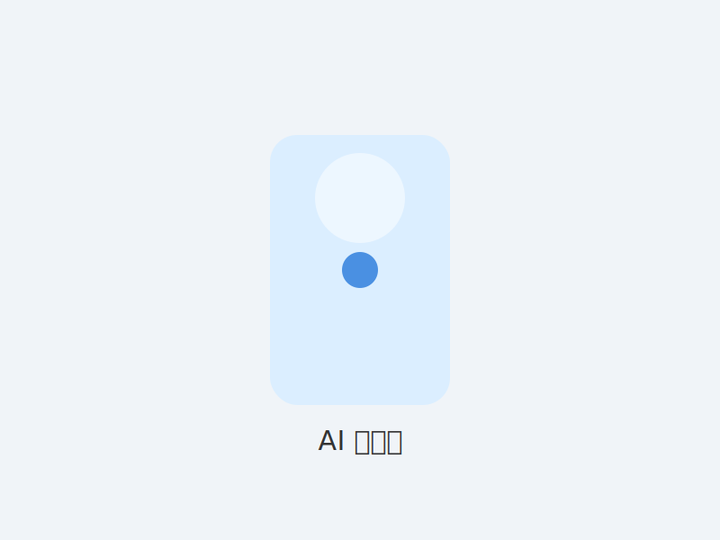
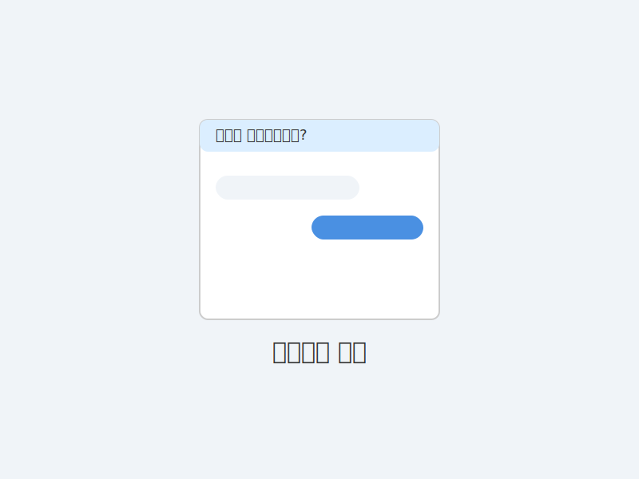
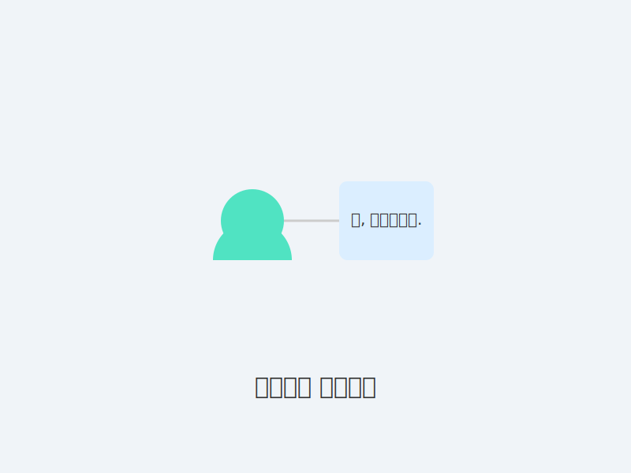

# **1강. 똑똑한 비서가 생겼어요!**
## AI Agent 처음 만나기

---

## **오늘 배울 것**

1.  **인공지능(AI)**은 어려운 게 아니에요.
2.  **AI Agent**는 나의 **'디지털 비서'**예요.
3.  우리 주변에는 어떤 **AI 비서**들이 있을까요?

---

## **용어 미리 알기**

- **인공지능(AI)**: 많은 정보를 스스로 익혀 우리가 묻는 질문에 답해주는 똑똑한 프로그램
- **에이전트(Agent)**: 사람 대신 특정 일을 처리해주는 도움꾼을 뜻하는 영어 단어
- **디지털 비서**: 스마트폰·스피커 속에서 목소리로 돕는 작은 비서라는 뜻으로 쉽게 부르기 위한 표현

> 어려운 말이 나오면 이렇게 다시 떠올려보세요. **"AI = 똑똑한 프로그램, Agent = 도와주는 친구"**

---

## **1. 인공지능(AI)은 어려운 게 아니에요**

*   **스스로 생각하고 배우는** 똑똑한 컴퓨터 프로그램이에요.
*   **이미 우리 주변에 많이 있답니다!**
    *   스마트폰으로 사진 찍을 때 **얼굴을 찾아주는 기능**
    *   자동차 길 안내 앱이 **안 막히는 길을 찾아주는 기능**

---

## **2. AI Agent = '나의 디지털 비서'**

*   **AI Agent(에이전트)** 라는 말이 어렵게 느껴지시죠?
*   그냥 **'나를 도와주는 디지털 비서'**라고 생각하면 쉬워요.
*   내가 **말을 걸면 알아듣고,**
*   내가 **시키는 일을 대신 해주는** 아주 편리한 친구랍니다.

---

## **3. 우리 주변의 AI 비서들**

우리 주변에 숨어있는 AI 비서들을 함께 찾아볼까요?

*   **내 스마트폰 속 비서**
*   **우리 집 거실의 비서**
*   **컴퓨터 화면 속 비서**

> 잠깐! 혹시 아직도 "나는 기계를 잘 못 다뤄서…" 라고 걱정되시나요? 잠시 후 실제로 어떻게 불러야 하는지 하나씩 알려드릴 테니 천천히 따라오시면 됩니다.

---

### **내 스마트폰 속 비서**

*   아이폰을 쓰신다면 **"시리야"**
*   삼성 갤럭시폰은 **"하이 빅스비"**
*   다른 안드로이드폰은 **"오케이 구글"**

이렇게 부르면 대답하는 친구들이 바로 스마트폰 속 AI 비서입니다.

---

### **우리 집 거실의 비서**

*   "지니야, 오늘 날씨 어때?" (**KT 기가지니**)
*   "아리야, 신나는 노래 틀어줘" (**SKT 누구**)
*   "클로바, 지금 몇 시야?" (**네이버 클로바**)

집에 있는 동그란 스피커들도 훌륭한 AI 비서입니다.

---

### **컴퓨터 화면 속 비서**

*   은행이나 관공서 홈페이지에 들어가면,
*   오른쪽 아래에 작은 창이 뜨면서 **"무엇을 도와드릴까요?"** 라고 물어보죠?
*   이 친구도 간단한 질문에 대답해주는 AI 비서의 한 종류랍니다.

---

## **정리해볼까요?**

*   인공지능은 **스스로 배우는 똑똑한 컴퓨터**다.
*   AI Agent는 **나를 도와주는 '디지털 비서'**다.
*   AI 비서는 **스마트폰, AI 스피커, 컴퓨터** 등 어디에나 있다.

### **다음 장 예고**
* **다음 시간에는 이 비서들에게 어떻게 말을 걸어야 하는지 배워볼게요!**

---

# **2강. 비서에게 어떻게 말을 걸까요?**
## AI와 대화하는 법

---

## **오늘 배울 것**

1.  AI 비서에게 **'부탁하는 방법'**을 배워요.
2.  어떻게 말해야 **찰떡같이 알아들을까요?**
3.  다 함께 **직접 비서를 불러봐요!**

---

## **1. 사람에게 부탁하듯이!**

*   AI 비서와 대화하는 건 사람과 대화하는 것과 같아요.
*   **"누구에게, 무엇을, 어떻게 해줘"** 라고 명확하게 말하는 게 중요해요.
*   어려운 전문 용어로 말할 필요 없이, **일상적인 언어**로 편하게 말씀하시면 됩니다.

---

## **먼저 준비하기: 비서 불러보기**

1.  **아이폰:** 홈 버튼을 길게 누르거나 옆 버튼을 길게 눌러 "시리야"라고 말하기
2.  **갤럭시폰:** 전원 버튼을 길게 누른 뒤 "하이 빅스비"라고 말하기 (설정 > 고급 기능 > 빅스비를 켜야 해요)
3.  **AI 스피커:** 기기 위에 있는 **불이 들어온 버튼**을 눌러 준비 시키고 "지니야" 또는 "아리야"라고 불러보기

> 버튼 위치를 모르겠다면 가족이나 강사에게 한 번 더 물어보세요. 버튼을 누르고 불이 켜지면 비서가 들을 준비가 됐다는 신호입니다.

---

## **2. 어떻게 말해야 찰떡같이 알아들을까요?**

AI 비서는 아직 어린 아이와 같아서, 쉽고 구체적으로 말해줘야 잘 알아들어요.

### **애매한 부탁 (X)**
*   "노래 틀어줘"
*   "오늘 어때?"
*   "전화해줘"

### **좋은 부탁 (O)**
*   **"가수 나훈아의 '테스형' 틀어줘"**
*   **"오늘 서울 미세먼지 농도 알려줘"**
*   **"우리 아들에게 전화 걸어줘"**

---

## **핵심 비법: 콕 집어 말하기**

*   **언제, 어디서, 누가, 무엇을, 어떻게, 왜**

이 여섯 가지를 생각하며 말하면 AI 비서가 훨씬 똑똑하게 일한답니다.

*   그냥 "알람 맞춰줘" 보다는
*   **"내일 아침 7시 30분에 '기상'이라고 알람 맞춰줘"** 가 훨씬 좋아요.

---

## **3. 다 함께 직접 비서를 불러봐요!**

지금 바로 스마트폰을 꺼내서 AI 비서를 불러볼까요?

1.  아이폰은 **"시리야"**, 갤럭시는 **"하이 빅스비"** 라고 불러보세요.
2.  비서가 "네" 하고 대답하면,
3.  **"지금 몇 시야?"** 라고 물어보세요.

*성공하셨나요? 축하합니다! 여러분은 이제 AI 비서의 주인이 되셨습니다!*

---

## **연습 미션 체크리스트**

- [ ] 내 스마트폰이나 AI 스피커에서 비서를 불러봤다.
- [ ] 시간이나 날씨처럼 쉬운 질문을 해봤다.
- [ ] 원하는 답을 듣지 못했을 때 다시 말해봤다.
- [ ] 오늘 배운 좋은 부탁 문장을 종이에 적어봤다.

> 체크가 모두 끝나면 이미 훌륭한 AI 비서 사용자입니다!

---

## **잘 안 들릴 때 이렇게 해보세요**

- 주변이 시끄러우면 잠시 조용한 곳에서 다시 말해보세요.
- 말을 너무 빠르게 했다면 **천천히, 또박또박** 말해보세요.
- 비서가 엉뚱한 답을 하면 "그게 아니야, 다시 설명할게"라고 말하고 원하는 내용을 다시 알려주세요.
- 그래도 어려우면 가족이나 친구에게 "내가 이렇게 말했는데 맞는지 봐줄래?"라고 요청해 함께 연습하세요.

실수는 당연한 과정입니다. 아이와 대화하듯 편하게 반복하면 금방 익숙해져요.

---

## **정리해볼까요?**

*   AI 비서에게는 **사람에게 말하듯** 편하게 대화해요.
*   **구체적이고 명확하게** 말해야 잘 알아들어요.
*   **"시리야", "하이 빅스비"** 등을 불러 **직접 써보는 것**이 가장 좋은 공부예요.

### **다음 장 예고**
* **다음 시간에는 이 비서로 우리 삶을 얼마나 편하게 만들 수 있는지 알아볼게요!**

---

# **3강. 똑똑한 비서 활용법**
## 이렇게 쓰면 삶이 편해져요!

---

## **오늘 배울 것**

내 삶을 도와주는 분야별 비서 활용법을 알아봅니다.

1.  **건강 관리** 비서
2.  **일상 생활** 비서
3.  **즐거운 여가** 비서
4.  **소통과 연결** 비서

---

## **1. 건강 관리 비서**

깜빡하기 쉬운 약 시간, 이제 걱정 마세요.

*   **"매일 아침 8시에 혈압약 먹으라고 알려줘"**
*   **"30분 뒤에 안약 넣으라고 알려줘"**
*   **"다음 주 화요일 오전 10시에 치과 예약 있다고 알려줘"**

> 예시 시나리오: 김순자 어르신은 약 시간을 자주 잊었습니다. 비서에게 알람을 부탁한 뒤, 아침마다 "혈압약 드실 시간이에요"라는 안내를 받고 빠짐없이 챙겨 드셨습니다.

---

## **2. 일상 생활 비서**

매일 하는 일들, 이제 말로 편하게 해결하세요.

*   **"장보기 목록에 두부, 콩나물, 계란 추가해줘"**
*   (요리하다가) **"계란찜 맛있게 하는 법 알려줘"**
*   (빨래 삶을 때) **"타이머 20분 맞춰줘"**

> 예시 시나리오: 시장에 가기 전, 스마트폰 비서에게 장보기 목록을 불러준 뒤 시장 앞에서 "장보기 목록 보여줘"라고 물으면 적어둔 품목을 바로 확인할 수 있어요.

---

## **3. 즐거운 여가 비서**

혼자 있어도 심심할 틈이 없어요.

*   **"가수 이미자의 노래 메들리로 틀어줘"**
*   **"KBS 1라디오 틀어줘"**
*   **"옛날 영화배우 김지미에 대해 알려줘"**

> 예시 시나리오: 혼자 계신 시간에 "추억의 트로트 30분만 틀어줘"라고 부탁하면 음악이 흘러나오고, 산책할 때도 이어폰으로 같은 명령을 반복해 들을 수 있습니다.

---

## **4. 소통과 연결 비서**

이제 손가락 아프게 화면을 누르지 않아도 괜찮아요.

*   **"우리 손주에게 전화 걸어줘"**
*   **"보고 싶다고 우리 딸에게 문자 보내줘"**
*   (운전 중에) **"스피커폰으로 아들에게 전화 걸어줘"**

> 예시 시나리오: 작은 글씨로 문자 보내기 어려울 때 "우리 딸에게 오늘 저녁에 전화 달라고 문자 보내줘"라고 말하면 자동으로 음성을 글자로 바꿔 전송해 줍니다.

---

## **생활 속 미션 함께해요**

1.  **건강:** "오늘 저녁 7시에 혈당 체크하라고 알람 맞춰줘"라고 말해보기
2.  **일상:** 내일 장보기 전날 비서에게 목록을 불러주고, 다음 날 다시 확인해보기
3.  **여가:** "오늘 기분 좋은 노래 추천해줘"라고 말해 새로운 음악을 들어보기
4.  **소통:** 가족 한 명을 정해 "사랑한다고 전해줘" 문자를 보내보기

> 네 가지 중 한 가지만 성공해도 생활이 한층 편해집니다. 오늘 강의 후 곧바로 한 가지를 실천해 보세요.

---

## **정리해볼까요?**

*   AI 비서는 **건강, 일상, 여가, 소통** 등 삶의 모든 면에서 우리를 도울 수 있어요.
*   **"~해줘"** 라고 구체적으로 말하는 습관을 들이면, AI 비서는 정말 **'똑똑한 비서'**가 된답니다.

### **다음 장 예고**
* **다음 시간에는 이렇게 편리한 비서를 어떻게 하면 더 안전하게 쓸 수 있는지 알아볼게요!**

---

# **4강. 안전하게 사용해요**
## 마무리 및 질의응답

---

## **오늘 배울 것**

1.  똑똑한 비서를 **안전하게 이용하는 방법**
2.  AI 비서와 **더 친해지는 법**
3.  **궁금한 점**을 모두 물어보세요!

---

## **1. 이것만은 꼭! 안전하게 사용하기**

비서가 똑똑해도, 중요한 비밀은 내가 지켜야 해요.

*   **주민등록번호, 은행 계좌번호, 비밀번호** 등 중요한 개인정보는 절대로 말하지 마세요.
*   AI 비서가 하는 말이 **가끔 틀릴 수도 있다**는 점을 기억하세요. (예: 약 정보를 물어볼 수는 있지만, 최종 확인은 꼭 의사/약사와 하세요!)

> 추가 팁: 새 기기에 로그인을 할 때는 반드시 가족이나 신뢰하는 사람과 함께 진행하고, 이상한 메시지가 오면 바로 확인해 주세요.

---

## **2. 자주 묻는 질문 (Q&A)**

**Q. 데이터 요금은 얼마나 드나요?**
> 비서를 부르는 것은 통화가 아니라 인터넷 사용입니다. 와이파이를 연결해 두면 추가 요금 없이 사용할 수 있어요.

**Q. 인터넷이 안 되면 어떡하죠?**
> 네트워크가 필요합니다. 불이 빨간색으로 들어오거나 "인터넷 연결이 필요해요"라고 말하면, 공유기나 스마트폰 데이터를 켜주세요.

**Q. 목소리를 못 알아듣는다면요?**
> 마스크를 잠시 내리고 또박또박 말하거나, 가까이에서 다시 말해보세요. 기기 마이크 구멍을 손으로 가리지 않았는지 확인합니다.

---

## **3. AI 비서와 더 친해지는 법**

*   **자주 사용해보세요:** 매일 한 번씩 말을 걸어보면 금방 익숙해져요. "오늘의 운세 알려줘" 같은 간단한 것도 좋아요.
*   **실수해도 괜찮아요:** 말을 잘 못 알아들으면, 다시 한 번 말하면 돼요. 사람도 가끔 대화를 잘못 알아들을 때가 있잖아요?
*   **AI는 여러분을 돕기 위해 태어난 친구**라는 점을 잊지 마세요!

---

## **4. 오늘의 마무리 미션**

1.  내 비서에게 "내일 오전 9시에 약 먹으라고 알려줘"라고 부탁하기
2.  가족이나 지인 한 명에게 "AI 비서에게 이런 부탁을 했어"라고 이야기해보기
3.  비서가 이해하지 못하면 다시 말하면서 오늘 배운 표현으로 고쳐보기

> 미션을 완료했다면 다음 시간에는 더 어려운 명령도 거뜬히 하실 수 있습니다.

---

## **총정리: 내 손안의 똑똑한 비서**

*   **1강:** AI 비서는 **나를 돕는 디지털 비서**예요.
*   **2강:** 비서에게는 **구체적으로, 명확하게** 말해야 해요.
*   **3강:** 비서를 활용하면 **건강, 일상, 여가**가 즐거워져요.
*   **4강:** **개인정보는 스스로** 지키고, 자주 사용하며 친해져요.

---

# **궁금한 점이 있다면 편하게 물어보세요!**

## 감사합니다