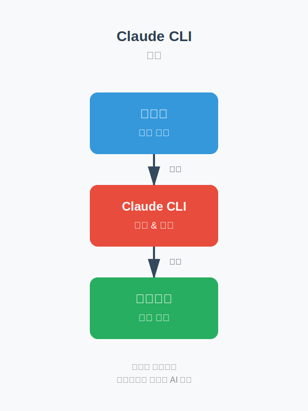
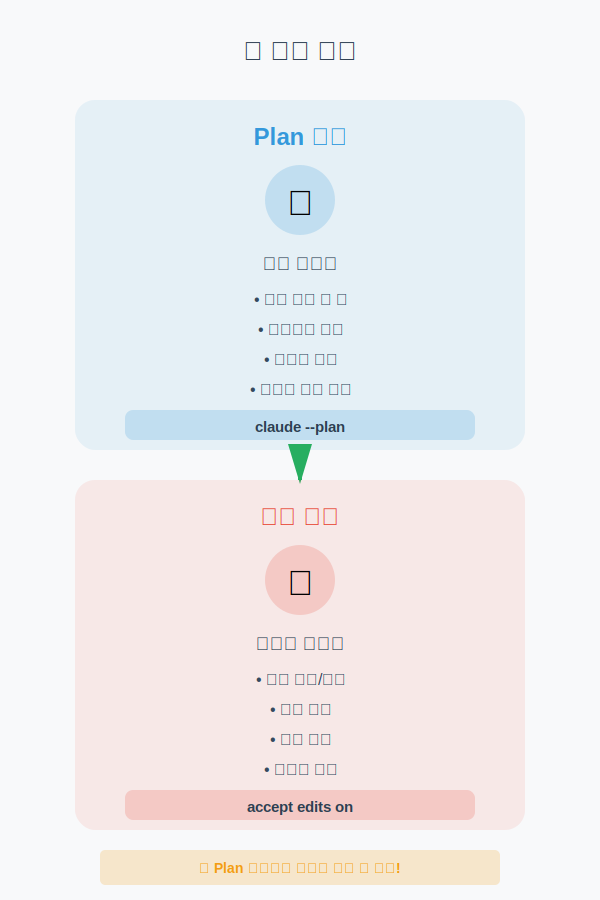
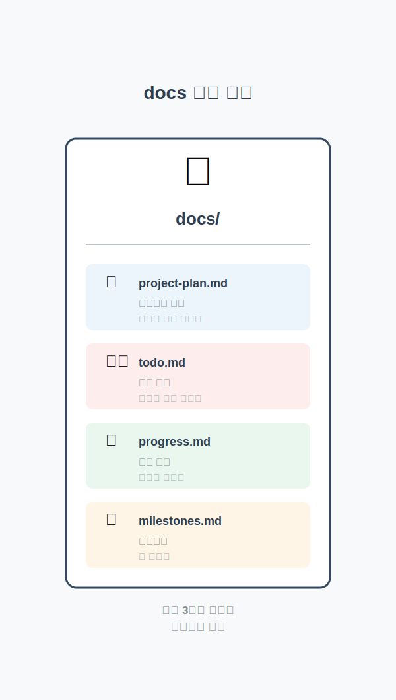
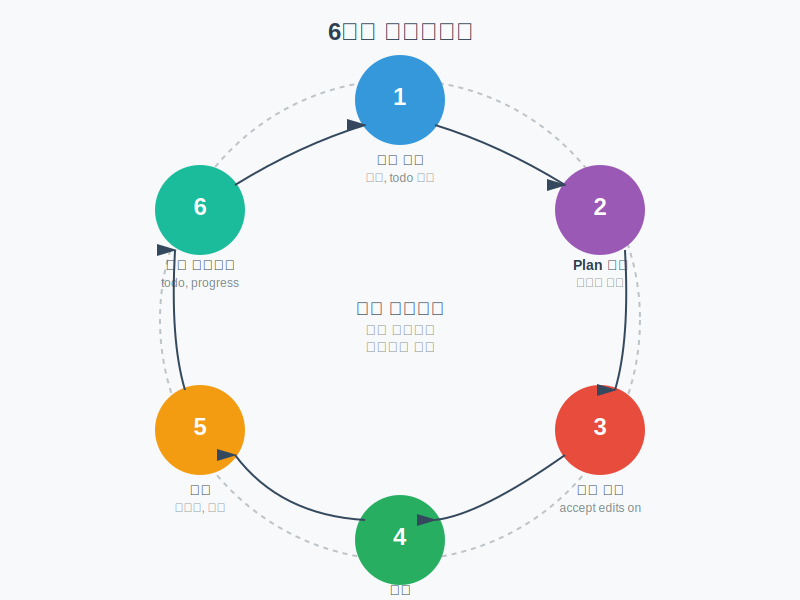

<style>
section {
  padding: 60px 80px;
}

section.lead {
  padding: 60px 80px;
}

/* 배경 이미지 크기와 위치 조정 */
section > div[data-marpit-advanced-background-container] > div[data-marpit-advanced-background-direction] {
  background-size: 35% auto !important;
  background-position: center center !important;
  padding: 40px !important;
}
</style>



# Claude CLI로 프로젝트 관리하기

## 문서 중심 개발 워크플로우

---

## 오늘 배울 3가지

1. **Claude CLI 시작하기** - 새로운 프로젝트 동료
2. **문서로 말하기** - 프로젝트를 문서로 관리하는 법
3. **실전 워크플로우** - Claude와 함께 일하기

---


# 1강: Claude CLI 시작하기

## 새로운 프로젝트 동료

---

## Claude CLI가 뭔가요?

터미널에서 대화하며 프로젝트를 진행할 수 있는 **AI 비서**입니다.

- 코드를 직접 작성하지 않아도 됨
- 문서로 소통하며 프로젝트 관리
- 회사의 팀 프로젝트처럼 문서로 협업

**핵심:** 코드는 보지 않아도 됩니다. 중요한 건 '무엇을 만들 것인가'에 대한 문서!

---

## 환경 설정: 3가지만 준비하세요

**1단계: 프로젝트 폴더 만들기**

```bash
mkdir my-project
cd my-project
mkdir docs
```

**2단계: Claude CLI 띄우기**

```bash
claude
```

**3단계: Cursor IDE 함께 띄우기**

```bash
cursor .
```

---

## 프로젝트 폴더 구조

```
my-project/
├── docs/                  # 문서 폴더 (가장 중요!)
│   ├── project-plan.md    # 프로젝트 계획
│   ├── todo.md            # 작업 목록
│   └── progress.md        # 진행 상황
├── src/                   # Claude가 만들 코드 폴더
└── README.md              # 프로젝트 소개
```

---



## Plan 모드 vs 실행 모드

**Plan 모드 (계획 세우기)**

- 파일을 만들거나 수정하지 않음
- 오직 대화만
- 충분한 논의로 명확한 방향 설정

**실행 모드 (실제로 만들기)**

- 실제로 파일 생성, 코드 작성
- 확정된 계획을 바탕으로 구현

---

## 왜 Plan 모드가 중요한가?

- **시행착오 방지:** 만들고 나서 "아, 이게 아닌데"를 막음
- **명확한 방향:** Claude와 충분히 대화하며 정확히 원하는 것을 정의
- **시간 절약:** 처음부터 제대로 만들면 수정 시간이 줄어듦

**💡 핵심:** Plan 모드에서 충분히 대화한 후 실행!

---

## 첫 대화 시작하기: 실제 예시

```
You: claude --plan

Claude: Plan 모드로 시작합니다. 무엇을 도와드릴까요?

You: 간단한 할일 관리 웹앱을 만들고 싶어.

Claude: 몇 가지 확인하고 싶습니다:
        1. 어떤 기술 스택을 사용하시겠어요?
        2. 데이터는 어디에 저장하나요?
        3. 디자인은 어떤 스타일을 원하시나요?

You: React를 사용하고, 로컬 저장소에 저장.
     디자인은 깔끔하고 단순하게.

Claude: 알겠습니다. [상세한 계획 제시...]
        이대로 진행할까요?

You: 완벽해! accept edits on
```

---

## 1강 정리

**핵심 3가지**

1. Claude CLI = 문서로 소통하는 프로젝트 비서
2. 환경 설정은 간단: 폴더 + Claude CLI + Cursor IDE
3. Plan 모드로 충분히 대화한 후 실행 모드로 전환

**다음:** 문서를 어떻게 작성하고 관리하는지 배워봅시다!

---



# 2강: 문서로 말하기

## 프로젝트를 문서로 관리하는 법

---

## 왜 문서화가 중요한가?

코드는 Claude가 작성하지만, 프로젝트의 방향과 진행 상황은 **문서로 관리**합니다.

**회사 프로젝트와 똑같습니다:**

- 회의록: 무엇을 하기로 했는지 기록
- 작업 목록: 누가 무엇을 하는지 관리
- 진행 상황: 어디까지 왔는지 공유

---

## 문서 중심 접근의 장점

1. **코드를 보지 않아도 됩니다**
   - 문서만 보면 프로젝트 전체를 이해

2. **언제든 재개할 수 있습니다**
   - 며칠 후에도 어디서 멈췄는지 알 수 있음

3. **Claude와 명확히 소통**
   - 문서로 정리된 내용은 정확히 이해

4. **팀과 공유 가능**
   - 다른 사람도 문서로 프로젝트 이해

---


## docs 폴더: 3가지 핵심 문서

```
docs/
├── project-plan.md
├── todo.md
├── progress.md
└── milestones.md
```

**1. project-plan.md** - 프로젝트 계획
**2. todo.md** - 작업 목록
**3. progress.md** - 진행 상황
**4. milestones.md** - 마일스톤

---

## project-plan.md 템플릿

```markdown
# 프로젝트 계획: [프로젝트 이름]

## 1. 프로젝트 개요
**목적:** 이 프로젝트를 왜 만드는가?
**설명:** 한 문장으로 설명하면?

## 2. 주요 기능
1. [기능 1]: 설명
2. [기능 2]: 설명

## 3. 기술 스택
- 프론트엔드: React
- 백엔드: Node.js

## 4. 우선순위
1. **핵심 기능:** 꼭 있어야 하는 것
2. **추가 기능:** 있으면 좋은 것
```

---

## todo.md: 작업 목록 관리

```markdown
# 작업 목록

## 진행 중 (Doing)
- [ ] 로그인 페이지 UI 구현
  - 담당: Claude 세션 #3
  - 시작: 2025-10-17

## 대기 중 (Todo)
- [ ] 회원가입 기능 구현
- [ ] 비밀번호 찾기 기능

## 완료 (Done)
- [x] 프로젝트 초기 설정 (2025-10-16)
- [x] 데이터베이스 스키마 설계 (2025-10-16)
```

---

## 작업 목록 관리 원칙

1. **작은 단위로 쪼개기**
   - 큰 작업은 작은 작업들로 분할

2. **우선순위 표시**
   - 중요한 것부터 위에 배치

3. **진행 상태 표시**
   - Doing, Todo, Done으로 구분

4. **날짜 기록**
   - 언제 시작하고 완료했는지 기록

---

## Claude와 todo.md 함께 사용하기

```
You: todo.md를 보고 다음 작업을 진행하자.
     "로그인 페이지 UI 구현"을 시작할게.

Claude: todo.md를 확인했습니다.
        로그인 페이지 UI를 구현하겠습니다.
        project-plan.md에서 디자인 가이드를
        참고하여 진행할게요.
```

---

## 마일스톤 설정

```markdown
## 🎯 마일스톤 1: MVP (최소 기능 제품)
**목표 날짜:** 2025-10-25
**상태:** 진행 중 (60%)

**포함 기능:**
- [x] 프로젝트 초기 설정
- [x] 데이터베이스 설계
- [ ] 로그인/회원가입
- [ ] 기본 CRUD 기능
```

큰 프로젝트를 작은 목표로 나누어 관리하면 성취감도 느끼고 진행 상황도 명확합니다.

---

## 2강 정리

**핵심 3가지**

1. 문서로 관리하면 코드를 보지 않아도 프로젝트를 이해할 수 있다
2. docs 폴더에 최소 3가지 문서: 계획, todo, 진행상황
3. 마일스톤으로 큰 목표를 작은 단계로 나눈다

**문서 작성 원칙:** 명확하게, 최소한으로, 지속적으로

---



# 3강: 실전 워크플로우

## Claude와 함께 일하기

---

## 완벽한 워크플로우: 6단계

1. **문서 준비** - 계획, todo 작성
2. **Plan 모드 대화** - 충분한 논의
3. **계획 확정** - accept edits on
4. **실행 모드 작업** - 실제 구현
5. **작업 완료 확인** - 테스트, 검증
6. **문서 업데이트** - todo, progress 업데이트

이 6단계를 반복하며 프로젝트를 완성합니다.

---

## Plan 모드: 충분한 대화의 힘

**나쁜 예: 서두르는 대화**

```
You: 블로그 만들어줘.
Claude: 어떤 기능이 필요한가요?
You: 그냥 일반적인 블로그. 빨리 만들어.
```

**좋은 예: 충분한 대화**

```
You: 개인 블로그를 만들고 싶어. 계획을 같이 세우자.
Claude: 좋습니다. 몇 가지 질문드릴게요...
You: 마크다운으로 글을 작성하고, 댓글은 일단 필요 없어.
     카테고리는 태그 방식으로...
```

---

## 좋은 대화의 원칙

1. **서두르지 않기**
   - 계획 단계에서는 시간을 충분히 투자

2. **구체적으로 답하기**
   - "그냥", "적당히" 같은 애매한 표현 피하기

3. **추가 아이디어 환영**
   - 대화 중 떠오르는 아이디어 즉시 공유

4. **이해 확인**
   - Claude의 제안을 제대로 이해했는지 확인

---

## 세션 분리 전략

큰 프로젝트는 한 번에 하지 말고, **작은 작업 단위로 나누어** 세션별로 진행합니다.

**장점:**

1. **집중력 유지** - 한 세션에 한 가지 작업만
2. **명확한 진행 상황** - 각 세션 후 문서 업데이트
3. **오류 최소화** - 작은 단위로 테스트
4. **유연한 일정** - 시간 날 때마다 한 세션씩

---

## 세션 분리 예시

**프로젝트: 전자상거래 웹사이트**

```markdown
## 세션 1 (2025-10-17)
**목표:** 프로젝트 초기 설정 및 메인 페이지
**작업:** [x] Next.js 프로젝트 생성, [x] 메인 페이지 레이아웃
**결과:** 기본 구조 완성

## 세션 2 (2025-10-18)
**목표:** 상품 목록 페이지
**작업:** [x] 상품 데이터 모델, [x] 상품 목록 컴포넌트
**결과:** 상품 목록 표시 완성

## 세션 3 (2025-10-19)
**목표:** 상품 상세 페이지
**작업:** [ ] 상품 상세 정보, [ ] 장바구니 담기
**상태:** 진행 예정
```

---

## 세션 시작 전 & 종료 전 체크리스트

**시작 전:**

- [ ] docs/todo.md에서 이번 세션의 작업 확인
- [ ] Claude CLI 시작: `claude --plan`
- [ ] 이전 세션 작업 내용 Claude에게 공유
- [ ] 이번 세션 목표 명확히 전달

**종료 전:**

- [ ] 작업 결과 테스트 및 확인
- [ ] todo.md 업데이트 (완료 체크)
- [ ] progress.md에 작업 내역 기록
- [ ] git commit으로 작업 저장

---

## 문서 업데이트: 작업의 마무리

작업이 끝나면 **반드시 문서를 업데이트**합니다.

**1. todo.md 업데이트**

```markdown
- [x] 로그인 페이지 UI 구현 (2025-10-17 완료)
- [ ] 로그인 API 연동
```

**2. progress.md 업데이트**

```markdown
## 2025-10-17 세션 3
### 완료한 작업
- 로그인 페이지 UI 완성
```

**3. Claude에게 요청**

```
You: todo.md와 progress.md를 업데이트해줘.
```

---

## 실전 사례 1: 웹 애플리케이션

**프로젝트:** React 할일 관리 앱

**워크플로우:**

- **세션 1:** 계획 및 초기 설정 (1시간)
- **세션 2:** 할일 추가 기능 (45분)
- **세션 3:** 완료/삭제 기능 (45분)
- **세션 4:** 스타일링 (30분)

**결과:** 총 4세션, 약 3시간에 완전히 작동하는 앱 완성

**핵심:** 각 세션마다 하나의 기능에 집중

---

## 실전 사례 2: 데이터 분석

**프로젝트:** 판매 데이터 분석 리포트

**워크플로우:**

- **세션 1:** 데이터 탐색 (CSV 로드, 기본 통계)
- **세션 2:** 시각화 (그래프 생성)
- **세션 3:** 자동화 (스크립트화, PDF 생성)

**결과:** 총 3세션, 약 2시간에 자동화된 분석 스크립트 완성

**핵심:** 데이터 분석도 작은 단계로 분할

---

## 실전 사례 3: 문서/콘텐츠 생성

**프로젝트:** 기술 블로그 글 작성

**워크플로우:**

- **세션 1:** 아웃라인 작성
- **세션 2:** 초안 작성
- **세션 3:** 코드 예제 추가
- **세션 4:** 최종 검토 및 편집

**결과:** 총 4세션, 약 4시간에 5000단어 기술 글 완성

**핵심:** 구조 → 초안 → 내용 → 검토 순서

---

## 보편적인 원칙 (모든 프로젝트에 적용)

**원칙 1: 문서 먼저**

- 코드보다 문서를 먼저 작성
- 무엇을 만들지 명확히 정의

**원칙 2: 작게 나누기**

- 큰 프로젝트를 작은 작업으로 분할

**원칙 3: 자주 확인**

- 각 작업 후 테스트

**원칙 4: 기록 남기기**

- 모든 작업을 문서에 기록

---

## 프로젝트 유형별 팁

**웹 개발**

- 페이지/컴포넌트 단위로 세션 분리
- UI → 기능 → 스타일 순서

**데이터 작업**

- 탐색 → 처리 → 분석 → 시각화 순서

**문서 작성**

- 아웃라인 → 초안 → 내용 → 검토 순서

**자동화 스크립트**

- 수동 작업 먼저 확인 → 하나씩 자동화

---

## 자주 묻는 질문

**Q1: Claude가 내 의도를 잘못 이해했어요**

```
You: 잠깐, 내가 원한 건 그게 아니야. 다시 설명할게...
```

언제든 멈추고 수정 가능합니다.

**Q2: 세션을 나누면 Claude가 이전 내용을 기억할까요?**

```
You: docs/project-plan.md와 progress.md를 읽어봐.
     지난번에 로그인 페이지를 완성했어.
```

문서가 기억 역할을 합니다.

---

## Q3, Q4

**Q3: 문서를 매번 업데이트하기 귀찮아요**

- Claude에게 자동 업데이트 요청
- 습관이 되면 5분도 안 걸림
- 나중에 혼란 겪는 것보다 훨씬 이득

**Q4: 프로젝트가 너무 커서 어디서부터 시작할지 모르겠어요**

```
You: 이 프로젝트가 너무 커서 압도되는데,
     어떻게 시작하면 좋을까?

Claude: MVP(최소 기능 제품)부터 시작하는 게 좋겠습니다.
```

---

## 3강 정리

**핵심 5가지**

1. **6단계 워크플로우:** 문서 준비 → Plan 대화 → 확정 → 실행 → 확인 → 업데이트
2. **충분한 대화:** Plan 모드에서 서두르지 말고 명확해질 때까지
3. **세션 분리:** 큰 프로젝트는 작은 작업으로 나누어 진행
4. **문서 업데이트:** 작업 후 todo, progress 문서 업데이트
5. **보편 원칙:** 문서 먼저, 작게 나누기, 자주 확인, 기록 남기기

---

## 실전 체크리스트

| 시작 전 | 진행 중 | 완료 후 |
|---------|---------|---------|
| 문서 준비 | 한 번에 한 가지 | 문서 업데이트 |
| Plan 모드 | 자주 확인 | git commit |
| 충분한 대화 | 결과 확인 | 다음 계획 |

---

## 마치며

Claude CLI는 단순한 도구가 아니라 **함께 일하는 팀원**입니다.

문서로 명확히 소통하고, 체계적으로 작업을 관리하면, 누구나 훌륭한 프로젝트를 만들 수 있습니다.

**🎉 지금 바로 시작해보세요! 🎉**

---

# 감사합니다!

## 질문이 있으신가요?

**연락처:**

- GitHub: [강의 생성 프로젝트]
- 이메일: [blackdew7@gmail.com]

**다음 강의:** 고급 Claude CLI 활용 기법
