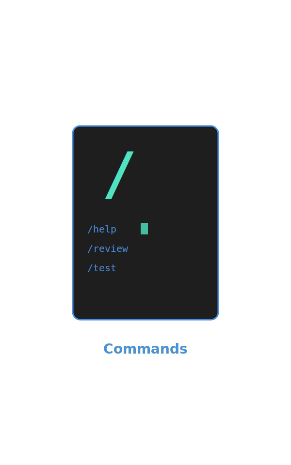
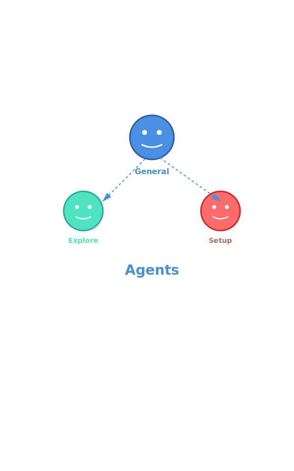
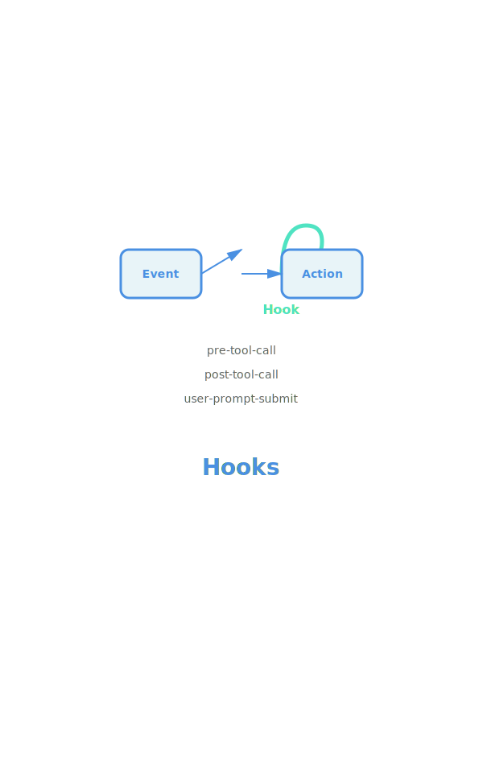

<style>
section {
  padding: 60px 80px;
}

section.lead {
  padding: 60px 80px;
}
</style>

---


# Claude Code 기능 완전 정복

초보자를 위한 핵심 기능 가이드

---

## Claude Code란?

터미널에서 사용하는 AI 코딩 어시스턴트

**주요 특징**

- 코드 읽기, 편집, 실행을 한 번에
- 파일 탐색과 검색 자동화
- Git, npm, docker 등 개발 도구 통합
- 프로젝트 전체를 이해하고 작업

---

## 강의 목표

이 강의에서 배울 내용

| 핵심 기능 | 추가 기능 | 실전 활용 |
|----------|----------|---------|
| Skills | MCP | Best Practices |
| Commands | Hooks | 실제 사용 사례 |
| Sub-process/Agents | | 효과적인 프롬프트 |

---

## 오늘의 주요 내용

**3가지 핵심 기능**

1. **Skills** - 전문화된 작업 수행
2. **Commands** - 반복 작업 자동화
3. **Agents** - 복잡한 작업 위임

**추가로 배울 것**

- MCP (Model Context Protocol)
- Hooks (이벤트 기반 자동화)
- 실전 팁과 주의사항

---


# Part 1: Skills

전문화된 작업 도구

---

## Skills란 무엇인가?

특정 작업에 특화된 전문 도구

**Skills의 특징**

- 각 Skill은 하나의 전문 영역에 집중
- 사용자가 요청하지 않아도 자동으로 실행 가능
- 복잡한 작업을 간단한 명령으로 처리
- 확장 가능한 플러그인 시스템

---

## Skills 사용 시나리오

| 시나리오 | 기존 방식 | Skills 활용 |
|---------|---------|----------|
| PDF 분석 | 파일 열기 → 복사 → 붙여넣기 | 자동 텍스트 추출 |
| Excel 처리 | 수동 데이터 확인 | 자동 파싱 및 분석 |
| 이미지 분석 | 별도 도구 사용 | 직접 이미지 읽기 |

---

## Skills 호출 방법

**방법 1: Skill 도구 사용**

```
Use the Skill tool with:
- command: "pdf" (skill 이름만)
```

**방법 2: 자동 호출**

Skills는 필요시 자동으로 실행됩니다

- PDF 파일 분석 요청 시 → pdf skill 자동 실행
- Excel 파일 처리 요청 시 → xlsx skill 자동 실행

---

## 현재 사용 가능한 Skills

**참고: 실제 사용 가능한 Skills 확인 방법**

```bash
# Claude Code 실행 후
/help
```

시스템 메시지의 `<available_skills>` 섹션 확인

**일반적인 Skills 예시**

- `pdf` - PDF 파일 처리
- `xlsx` - Excel 파일 처리

---

## Skills 실습: PDF 분석

**시나리오**

프로젝트 요구사항이 담긴 PDF 파일 분석

**실행 방법**

1. PDF 파일을 프로젝트에 추가
2. Claude Code에게 요청:
   ```
   requirements.pdf 파일을 분석하고
   주요 기능 목록을 정리해줘
   ```
3. pdf skill이 자동으로 실행되어 내용 추출
4. 분석 결과를 마크다운으로 정리

---

## Skills 활용 팁

| 팁 | 설명 |
|----|------|
| 자동 실행 신뢰 | Skills는 필요시 자동 실행되므로 명시적 호출 불필요 |
| 파일 형식 명시 | 파일 확장자를 명확히 하면 적절한 Skill 선택 |
| 복합 작업 | 여러 Skills를 조합하여 복잡한 작업 수행 가능 |

**주의사항**

- 현재 시스템에 설치된 Skills만 사용 가능
- 새 Skills는 확장을 통해 추가 가능

---



# Part 2: Commands

반복 작업을 자동화하는 도구

---

## Commands란 무엇인가?

사용자 정의 명령어로 반복 작업 간소화

**Commands의 특징**

- `/`로 시작하는 슬래시 명령어
- 자주 쓰는 작업을 한 줄로 실행
- 마크다운 파일로 쉽게 작성
- 프로젝트별 또는 전역으로 설정 가능

---

## Commands vs Skills

| 구분 | Commands | Skills |
|-----|----------|--------|
| 목적 | 반복 작업 자동화 | 특정 파일 형식 처리 |
| 실행 | 사용자가 명시적 호출 | 자동 실행 가능 |
| 생성 | 마크다운 파일 작성 | 플러그인 설치 |
| 범위 | 프로젝트 맞춤형 | 범용적 |

---

## Commands 사용 예시

**기본 명령어**

```
/help       # 도움말 보기
/clear      # 대화 기록 지우기
```

**커스텀 명령어 예시**

```
/review-pr 123          # PR 리뷰
/run-tests              # 테스트 실행 및 결과 분석
/deploy staging         # 스테이징 배포
```

---

## Commands 저장 위치

**프로젝트별 Commands**

```
.claude/
└── commands/
    ├── review-pr.md
    ├── run-tests.md
    └── deploy.md
```

**전역 Commands**

```
~/.config/claude/
└── commands/
    └── my-command.md
```

---

## Command 파일 구조

**파일명**: `.claude/commands/review-pr.md`

**내용 예시**:

```markdown
# PR 리뷰 수행

주어진 PR 번호의 코드를 리뷰하고 다음을 확인:
- 코드 스타일 일관성
- 잠재적 버그
- 테스트 커버리지
- 문서화 여부

리뷰 결과를 마크다운으로 정리해줘.
```

---

## Custom Command 만들기

**Step 1: 디렉토리 생성**

```bash
mkdir -p .claude/commands
```

**Step 2: 명령어 파일 작성**

```bash
# .claude/commands/analyze-bundle.md 생성
```

**Step 3: 내용 작성**

```markdown
# 번들 크기 분석

1. package.json의 dependencies 확인
2. 큰 패키지 상위 5개 찾기
3. 대체 가능한 경량 라이브러리 제안
```

---

## Command 사용 방법

**실행**

```
/analyze-bundle
```

**인자가 있는 Command**

파일 내용에서 `{인자}` 참조 가능:

```markdown
# PR {pr_number} 리뷰

PR #{pr_number}의 변경사항을 리뷰해줘.
```

실행: `/review-pr 123`

---

## 유용한 Command 예시 (1/2)

**코드 리뷰**

```markdown
# 코드 리뷰

최근 커밋의 변경사항을 리뷰하고:
- 버그 가능성
- 성능 이슈
- 보안 문제
를 확인해줘.
```

**테스트 실행**

```markdown
# 테스트 실행 및 분석

1. npm test 실행
2. 실패한 테스트 분석
3. 수정 방법 제안
```

---

## 유용한 Command 예시 (2/2)

**문서 생성**

```markdown
# README 업데이트

프로젝트의 주요 기능을 분석하고
README.md를 최신 상태로 업데이트해줘.

포함 내용:
- 설치 방법
- 사용 예시
- API 문서
```

---

## Commands 활용 팁

| 팁 | 설명 |
|----|------|
| 명확한 이름 | 명령어 이름은 기능을 명확히 표현 |
| 단계별 지시 | 복잡한 작업은 단계별로 나누어 작성 |
| 재사용성 | 자주 쓰는 패턴을 명령어로 만들기 |
| 문서화 | 주석으로 명령어 목적 설명 |

---

## Commands 실습

**실습: 코드 품질 체크 명령어 만들기**

1. `.claude/commands` 디렉토리 생성
2. `quality-check.md` 파일 생성
3. 다음 내용 작성:
   - ESLint 실행
   - Type 체크
   - 테스트 실행
   - 결과 요약
4. `/quality-check` 명령으로 실행

---

## Command 디버깅

**확인 사항**

- 파일이 `.claude/commands/` 에 있는지 확인
- 파일 확장자가 `.md` 인지 확인
- 명령어 이름이 파일명과 일치하는지 확인

**도움말 확인**

```
/help
```

사용 가능한 모든 명령어 목록이 표시됩니다.

---



# Part 3: Sub-process & Agents

복잡한 작업을 위임하는 전문가 시스템

---

## Agent란 무엇인가?

독립적으로 실행되는 전문화된 작업 수행자

**Agent의 특징**

- 복잡한 다단계 작업을 자율적으로 수행
- 메인 세션과 독립적으로 실행
- 작업 완료 후 결과를 최종 보고서로 전달
- 병렬 실행 가능

---

## Agent가 필요한 이유

| 시나리오 | Agent 없이 | Agent 사용 |
|---------|----------|----------|
| 대규모 코드베이스 탐색 | 여러 번의 검색과 읽기 | Explore Agent 한 번 |
| 여러 파일 리팩토링 | 파일마다 수동 작업 | General-purpose Agent |
| 동시 다발적 조사 | 순차적 처리 | 병렬 Agent 실행 |

**핵심 이점**

- 컨텍스트 사용량 절약
- 작업 병렬화로 시간 단축
- 복잡한 워크플로우 자동화

---

## 사용 가능한 Agent 유형

| Agent | 용도 | 주요 도구 |
|-------|------|---------|
| general-purpose | 복잡한 다단계 작업 | 모든 도구 (*) |
| Explore | 코드베이스 빠른 탐색 | Glob, Grep, Read, Bash |
| statusline-setup | 상태바 설정 | Read, Edit |
| output-style-setup | 출력 스타일 생성 | Read, Write, Edit, Glob, Grep |

---

## General-purpose Agent

가장 범용적인 Agent

**사용 시나리오**

- 여러 파일에 걸친 리팩토링
- 복잡한 버그 수정
- 기능 구현 (여러 단계 필요)
- 문서 생성 및 업데이트

**특징**

- 모든 도구에 접근 가능
- 자율적인 의사결정
- 상세한 최종 보고서 제공

---

## Explore Agent

코드베이스 탐색 전문 Agent

**thoroughness 레벨**

- `quick`: 기본 검색
- `medium`: 적당한 탐색
- `very thorough`: 포괄적 분석

**사용 예시**

```
"API endpoints가 어떻게 동작하는지 찾아줘"
→ Explore Agent 자동 실행
```

---

## Agent 사용 시점

**Agent를 사용해야 할 때**

- 여러 위치를 탐색해야 하는 검색
- 복잡한 다단계 작업
- 병렬로 처리할 수 있는 독립적 작업들
- 대규모 코드베이스 분석

**Agent를 사용하지 말아야 할 때**

- 특정 파일 경로를 알고 있을 때 → Read 도구 사용
- 특정 클래스 정의 검색 → Glob 도구 사용
- 2-3개 파일 내 검색 → Read 도구 사용

---

## Agent 호출 방법

**Task 도구 사용**

```
Use the Task tool with:
- subagent_type: "general-purpose" | "Explore" | ...
- prompt: "상세한 작업 지시"
- description: "작업 요약 (3-5 단어)"
```

**자동 호출**

Claude Code가 필요 시 자동으로 Agent 실행

---

## Agent 실행 흐름

**1. Agent 시작**

```
<command-message>The "{name}" agent is loading</command-message>
```

**2. 백그라운드 실행**

Agent가 독립적으로 작업 수행

**3. 결과 전달**

작업 완료 후 최종 보고서 반환

**4. 사용자에게 요약**

보고서 내용을 사용자에게 전달

---

## 병렬 Agent 실행

여러 Agent를 동시에 실행하여 시간 단축

**예시: 프로젝트 분석**

```
동시에 3개 Agent 실행:
1. Frontend 구조 분석 (Explore)
2. Backend API 분석 (Explore)
3. 테스트 코드 분석 (Explore)
```

**방법**

단일 메시지에 여러 Task 도구 호출

---

## Agent 프롬프트 작성 팁

| 팁 | 설명 | 예시 |
|----|------|------|
| 명확한 목표 | 무엇을 찾거나 할지 구체적으로 | "인증 관련 코드 찾기" |
| 예상 결과 명시 | 어떤 형식으로 보고할지 | "파일 경로와 함수명 리스트" |
| 범위 제한 | 탐색 범위 지정 | "src/ 디렉토리만" |
| 우선순위 | 중요한 것부터 | "먼저 에러 찾고, 그 다음 경고" |

---

## Agent 실습 (1/2)

**시나리오: 에러 처리 패턴 찾기**

```
사용자 요청:
"이 프로젝트에서 에러를 어떻게 처리하는지 찾아줘"

Claude Code 실행:
1. Explore Agent 자동 실행
2. thoroughness: "medium"
3. 에러 처리 코드 탐색
4. 패턴 분석 및 보고
```

---

## Agent 실습 (2/2)

**결과 예시**

```
보고서:
1. 에러 처리 방식
   - try/catch 사용 (80%)
   - Error boundary (React)

2. 주요 파일
   - src/utils/errorHandler.ts
   - src/components/ErrorBoundary.tsx

3. 패턴
   - 커스텀 에러 클래스 사용
   - 중앙화된 로깅
```

---

## Agent 활용 고급 팁

**컨텍스트 절약**

- 큰 탐색 작업은 Agent에게 위임
- 메인 세션의 컨텍스트 윈도우 보존

**작업 분할**

- 독립적인 작업들을 여러 Agent로 분할
- 병렬 실행으로 시간 단축

**명확한 지시**

- Agent는 사용자와 추가 소통 불가
- 첫 프롬프트에 모든 정보 포함

---

## Agent 주의사항

| 주의사항 | 이유 |
|---------|------|
| Agent는 상태 없음 | 각 호출은 독립적 |
| 추가 메시지 불가 | 첫 프롬프트가 전부 |
| 결과 신뢰 | Agent 결과는 일반적으로 신뢰 가능 |
| 명확한 범위 | 범위가 모호하면 불필요한 탐색 |

---

## Agent 활용 정리

**언제 사용하나**

- 복잡한 탐색이 필요할 때
- 여러 작업을 병렬 처리할 때
- 컨텍스트를 절약하고 싶을 때

**어떻게 사용하나**

- 명확하고 상세한 프롬프트 작성
- 적절한 Agent 유형 선택
- 필요시 병렬 실행

**무엇을 기대하나**

- 자율적인 작업 수행
- 최종 보고서 형태의 결과
- 시간과 컨텍스트 절약

---


# Part 4: MCP & Hooks

Claude Code 확장하기

---

## MCP란 무엇인가?

Model Context Protocol - AI와 외부 도구 연결

**MCP의 역할**

- Claude Code에 새로운 도구 추가
- 외부 데이터 소스 접근
- 서드파티 서비스 통합
- 표준화된 프로토콜

---

## MCP 개념

**기본 구조**

```
Claude Code ← MCP Protocol → MCP Server ← 외부 서비스
```

**MCP Server 예시**

- 파일 시스템 접근
- 데이터베이스 쿼리
- API 호출
- 브라우저 자동화

---

## MCP vs 기본 도구

| 구분 | 기본 도구 | MCP |
|-----|---------|-----|
| 범위 | 파일, Git, Bash 등 | 무제한 확장 |
| 설치 | 기본 제공 | 별도 설치 필요 |
| 커스터마이징 | 제한적 | 완전한 자유 |
| 예시 | Read, Write, Bash | DB 쿼리, 웹 스크래핑 |

---

## MCP 서버 설치

**1. MCP 서버 찾기**

- [modelcontextprotocol.io](https://modelcontextprotocol.io)
- GitHub에서 "mcp server" 검색
- 커뮤니티 추천

**2. 설정 파일 수정**

```bash
~/.config/claude/config.json
```

**3. Claude Code 재시작**

새 MCP 도구 사용 가능

---

## 유용한 MCP 서버 (1/2)

**파일 시스템**

- `@modelcontextprotocol/server-filesystem`
- 파일 읽기/쓰기 확장 기능

**데이터베이스**

- `@modelcontextprotocol/server-postgres`
- PostgreSQL 쿼리 실행

---

## 유용한 MCP 서버 (2/2)

**웹 자동화**

- `@modelcontextprotocol/server-puppeteer`
- 브라우저 제어 및 스크래핑

**외부 API**

- 다양한 서드파티 API 서버들
- 날씨, 주식, 뉴스 등

---

## MCP 설정 예시

**config.json 구조**

```json
{
  "mcpServers": {
    "filesystem": {
      "command": "npx",
      "args": [
        "-y",
        "@modelcontextprotocol/server-filesystem",
        "/path/to/allowed/directory"
      ]
    }
  }
}
```

---

## MCP 활용 예시

**시나리오: 데이터베이스 마이그레이션**

```
사용자: "users 테이블 스키마를 확인하고
        새 email 필드를 추가해줘"

Claude Code:
1. MCP PostgreSQL 서버로 스키마 조회
2. 마이그레이션 SQL 생성
3. 안전성 검토
4. 실행 여부 확인
```

---

## MCP 주의사항

| 주의사항 | 설명 |
|---------|------|
| 보안 | MCP 서버에 접근 권한 부여 시 주의 |
| 성능 | 일부 MCP 서버는 느릴 수 있음 |
| 의존성 | MCP 서버 업데이트 관리 필요 |
| 호환성 | Claude Code 버전과 호환성 확인 |

---



# Hooks

이벤트 기반 자동화

---

## Hooks란 무엇인가?

특정 이벤트 발생 시 자동 실행되는 스크립트

**Hooks의 특징**

- 도구 호출 전후에 실행
- 셸 명령어로 구현
- 프로젝트별 설정 가능
- 워크플로우 자동화

---

## Hooks 종류

| Hook | 실행 시점 | 용도 |
|------|---------|------|
| user-prompt-submit | 사용자 메시지 전송 시 | 입력 검증, 로깅 |
| pre-tool-call | 도구 실행 전 | 권한 확인, 백업 |
| post-tool-call | 도구 실행 후 | 결과 검증, 알림 |

---

## Hooks 설정 방법

**설정 파일 위치**

```bash
~/.config/claude/config.json
```

**Hook 추가 예시**

```json
{
  "hooks": {
    "pre-tool-call": "echo 'Running tool...'",
    "post-tool-call": "./scripts/notify.sh"
  }
}
```

---

## Hook 실습: 자동 백업

**시나리오**

파일 편집 전 자동 백업 생성

**pre-tool-call Hook**

```bash
#!/bin/bash
# .config/claude/hooks/backup.sh

if [[ "$TOOL_NAME" == "Write" ]]; then
  FILE_PATH=$(echo "$TOOL_INPUT" | jq -r '.file_path')
  if [[ -f "$FILE_PATH" ]]; then
    cp "$FILE_PATH" "$FILE_PATH.backup"
    echo "Backup created: $FILE_PATH.backup"
  fi
fi
```

---

## Hook 활용 예시 (1/2)

**자동 포맷팅**

```bash
# post-tool-call hook
if [[ "$TOOL_NAME" == "Write" ]]; then
  FILE_PATH=$(echo "$TOOL_INPUT" | jq -r '.file_path')
  if [[ "$FILE_PATH" == *.js ]]; then
    prettier --write "$FILE_PATH"
  fi
fi
```

---

## Hook 활용 예시 (2/2)

**민감 정보 체크**

```bash
# pre-tool-call hook
if [[ "$TOOL_NAME" == "Bash" ]]; then
  COMMAND=$(echo "$TOOL_INPUT" | jq -r '.command')
  if [[ "$COMMAND" == *"rm -rf"* ]]; then
    echo "Dangerous command blocked"
    exit 1
  fi
fi
```

---

## Hook 피드백 처리

**Hook 메시지**

Hook의 출력은 `<user-prompt-submit-hook>` 태그로 표시

**차단된 작업**

- Hook이 non-zero exit code 반환 시 작업 차단
- Claude Code는 대안 시도 가능
- 사용자에게 확인 요청 가능

---

## Hook 디버깅

**확인 사항**

- Hook 스크립트 실행 권한 (`chmod +x`)
- 환경 변수 접근 가능 여부
- 출력이 표준 출력으로 전달되는지

**로깅**

```bash
echo "Hook executed: $TOOL_NAME" >> /tmp/claude-hooks.log
```

---

## Hooks 활용 팁

| 팁 | 설명 |
|----|------|
| 최소한으로 유지 | Hook이 너무 많으면 느려짐 |
| 명확한 메시지 | Hook 실행 시 무엇을 했는지 출력 |
| 조건부 실행 | 필요한 경우에만 실행 |
| 에러 처리 | Hook 실패 시 명확한 메시지 |

---

## MCP vs Hooks 비교

| 구분 | MCP | Hooks |
|-----|-----|-------|
| 목적 | 새 도구 추가 | 기존 워크플로우 자동화 |
| 복잡도 | 높음 | 낮음 |
| 유연성 | 매우 높음 | 제한적 |
| 사용 난이도 | 어려움 | 쉬움 |

**선택 기준**

- 새 기능 필요 → MCP
- 자동화만 필요 → Hooks

---

## MCP & Hooks 정리

**MCP**

- 외부 도구와 데이터 소스 연결
- 무한한 확장 가능성
- 설정 및 유지보수 필요

**Hooks**

- 이벤트 기반 자동화
- 간단한 스크립트로 구현
- 워크플로우 개선

**함께 사용하기**

MCP로 기능 추가 + Hooks로 자동화

---


# Part 5: Best Practices

Claude Code 효과적으로 사용하기

---

## 효과적인 프롬프트 작성

**명확하고 구체적으로**

| 비추천 | 추천 |
|-------|------|
| "코드 고쳐줘" | "login.ts의 인증 에러를 수정하고 테스트 추가" |
| "버그 찾아줘" | "cart.ts에서 총액 계산이 틀린 이유 찾기" |
| "개선해줘" | "API 응답 시간을 1초 이내로 최적화" |

---

## 프롬프트 작성 원칙

**1. 컨텍스트 제공**

```
"React 프로젝트에서 TypeScript를 사용 중입니다.
src/components/UserProfile.tsx의 prop types를
더 엄격하게 만들어주세요."
```

**2. 예상 결과 명시**

```
"리팩토링 후 기존 테스트가 모두 통과해야 합니다."
```

**3. 우선순위 표시**

```
"먼저 보안 이슈를 수정하고, 그 다음 성능을 개선해주세요."
```

---

## Plan Mode 활용

**Plan Mode란?**

- 실행 전 계획 검토
- 변경사항 미리 확인
- 승인 후 실행

**사용 시점**

- 대규모 리팩토링
- 중요한 파일 수정
- 여러 파일 동시 변경
- 불확실한 작업

---

## Plan Mode 예시

**1. Plan Mode 요청**

```
/plan

"인증 시스템을 JWT에서 OAuth로 변경해줘"
```

**2. 계획 검토**

```
계획:
1. auth/ 디렉토리 구조 변경
2. 의존성 추가 (passport.js)
3. 환경 변수 설정
4. 기존 토큰 마이그레이션
```

**3. 승인 또는 수정 요청**

```
"마이그레이션 단계는 건너뛰고 새로 시작하자"
```

---

## Todo 관리 활용

**Todo List 장점**

- 진행 상황 추적
- 복잡한 작업 분해
- 누락 방지
- 투명성 제공

**자동 생성 시점**

- 3단계 이상 작업
- 여러 파일 변경
- 사용자가 명시적 요청

---

## Todo 관리 예시

**작업 요청**

```
"쇼핑몰 장바구니 기능 구현"
```

**생성된 Todo**

```
☐ 장바구니 데이터 모델 설계
☑ API 엔드포인트 구현
→ React 컴포넌트 작성
☐ 상태 관리 (Redux)
☐ 테스트 코드 작성
```

---

## 병렬 도구 호출

**성능 향상**

독립적인 작업은 동시에 실행

**예시**

```
동시에 실행:
- git status
- npm test
- 파일 3개 읽기
```

**주의**

의존 관계가 있으면 순차 실행

---

## 도구 사용 원칙

| 원칙 | 설명 | 예시 |
|-----|------|------|
| 전문 도구 우선 | Bash 대신 전용 도구 | cat → Read |
| 병렬화 | 독립 작업 동시 실행 | 여러 파일 읽기 |
| Agent 위임 | 복잡한 탐색 위임 | Explore Agent |
| 컨텍스트 절약 | 필요한 것만 읽기 | offset/limit 활용 |

---

## 주의사항 (1/2)

**보안**

- `.env` 파일 커밋 방지
- 민감 정보 노출 주의
- Hook으로 위험 명령 차단

**성능**

- 큰 파일은 부분만 읽기
- Agent로 탐색 작업 분리
- 불필요한 도구 호출 최소화

---

## 주의사항 (2/2)

**코드 품질**

- 변경 후 반드시 테스트
- 린터 규칙 준수
- 기존 코드 스타일 유지

**협업**

- 커밋 메시지 명확히
- PR 설명 상세히
- 리뷰 요청 전 검증

---

# 실제 사용 사례

다양한 시나리오 살펴보기

---

## 사례 1: 웹 개발 프로젝트

**시나리오**

새로운 사용자 프로필 페이지 추가

**작업 흐름**

```
1. /plan 모드로 계획 수립
2. 컴포넌트 파일 생성
3. API 연결
4. 스타일링
5. 테스트 작성
6. Todo 체크
7. Git commit
```

---

## 사례 1: 상세 과정

**1. Plan Mode**

```
사용자: /plan
"사용자 프로필 페이지를 만들어줘.
이름, 이메일, 아바타를 표시해야 해."

Claude: [계획 제시]
사용자: "좋아, 진행해줘"
```

**2. 구현**

```
☑ UserProfile.tsx 생성
☑ API 호출 함수 작성
→ CSS 스타일링
☐ 테스트 코드
```

---

## 사례 2: 버그 수정

**시나리오**

결제 금액 계산 오류

**접근 방법**

```
1. Explore Agent로 관련 코드 찾기
2. 버그 원인 분석
3. 수정안 제시
4. 테스트 케이스 추가
5. 검증
```

---

## 사례 2: Agent 활용

**Agent 프롬프트**

```
"결제 관련 코드를 찾아서
총액 계산 로직을 분석해줘"

결과:
- src/utils/payment.ts:45
- src/components/Cart.tsx:120
- 세금 계산 시 반올림 오류 발견
```

**수정 및 테스트**

```
1. 반올림 로직 수정
2. 테스트 케이스 추가
3. 기존 테스트 통과 확인
```

---

## 사례 3: 리팩토링

**시나리오**

레거시 코드 모던 문법으로 변경

**전략**

| 단계 | 작업 | 도구 |
|-----|------|------|
| 1 | 코드베이스 분석 | Explore Agent |
| 2 | 변경 범위 파악 | Grep, Read |
| 3 | 리팩토링 실행 | Edit |
| 4 | 테스트 확인 | Bash (npm test) |

---

## 사례 3: 병렬 처리

**여러 파일 동시 리팩토링**

```
3개 Agent 병렬 실행:

Agent 1: utils/ 디렉토리 리팩토링
Agent 2: components/ 리팩토리 리팩토링
Agent 3: hooks/ 디렉토리 리팩토링

결과 통합 후 테스트
```

---

## 사례 4: 문서 자동 생성

**시나리오**

API 문서 자동 업데이트

**Custom Command 활용**

```markdown
# .claude/commands/update-api-docs.md

1. src/api/ 디렉토리의 모든 엔드포인트 찾기
2. JSDoc 주석 추출
3. docs/API.md 업데이트
4. 예시 코드 추가
```

**실행**

```
/update-api-docs
```

---

## 사례 5: 테스트 커버리지 향상

**시나리오**

테스트가 없는 함수에 테스트 추가

**워크플로우**

```
1. 커버리지 보고서 분석
2. 테스트 없는 함수 목록 작성
3. 각 함수별 테스트 케이스 생성
4. 엣지 케이스 추가
5. 커버리지 재확인
```

---

## 사례 5: Todo 활용

**Todo List**

```
☑ 커버리지 보고서 생성
☑ 미테스트 함수 10개 식별
☑ utils/formatDate.ts 테스트 (3/10)
→ utils/validateEmail.ts 테스트 (4/10)
☐ api/userService.ts 테스트 (5/10)
...
```

**진행 상황 투명하게 공유**

---

## 성공 사례 패턴

**공통 요소**

1. **명확한 목표 설정**
   - 무엇을 달성할지 구체적으로

2. **적절한 도구 선택**
   - Skills, Commands, Agents 활용

3. **단계별 접근**
   - 복잡한 작업은 분해

4. **지속적 검증**
   - 각 단계마다 확인

---

## 학습 로드맵

**초급** (1-2주)

- Skills 자동 실행 경험
- 기본 Commands 사용
- 파일 읽기/쓰기

**중급** (2-4주)

- Custom Commands 작성
- Agent 활용
- Plan Mode 숙달

**고급** (1-2개월)

- MCP 서버 설치
- Hooks 설정
- 워크플로우 최적화

---

## 추천 학습 방법

| 방법 | 설명 |
|-----|------|
| 실제 프로젝트 | 작은 기능부터 시작 |
| 실험 | 다양한 프롬프트 시도 |
| 문서 읽기 | 공식 문서 참고 |
| 커뮤니티 | 경험 공유 및 질문 |

---

## 도움받기

**공식 문서**

- [docs.claude.com/claude-code](https://docs.claude.com/claude-code)
- 전체 기능 레퍼런스

**피드백 및 이슈**

- [github.com/anthropics/claude-code/issues](https://github.com/anthropics/claude-code/issues)
- 버그 리포트, 기능 요청

**도움말**

```
/help
```

---

# 요약

핵심 내용 정리

---

## 3가지 핵심 기능

**Skills**

- 특정 작업 전문화
- 자동 실행
- PDF, Excel 등

**Commands**

- 반복 작업 자동화
- 슬래시 명령어
- 커스터마이징 가능

**Agents**

- 복잡한 작업 위임
- 병렬 실행
- 컨텍스트 절약

---

## 확장 기능

**MCP**

- 외부 도구 연결
- 무한한 확장성
- 데이터 소스 통합

**Hooks**

- 이벤트 기반 자동화
- 워크플로우 개선
- 간단한 스크립트

---

## Best Practices 요약

| 원칙 | 핵심 |
|-----|------|
| 명확한 프롬프트 | 구체적이고 상세하게 |
| Plan Mode | 큰 변경 전 계획 검토 |
| Todo 활용 | 진행 상황 추적 |
| 적절한 도구 | 상황에 맞는 도구 선택 |
| 병렬 처리 | 독립 작업 동시 실행 |

---

## 다음 단계

**즉시 시작**

1. 간단한 프로젝트에서 시도
2. Custom Command 하나 만들기
3. Explore Agent 사용해보기

**점진적 학습**

- 한 번에 하나씩
- 실패를 두려워하지 말기
- 실험과 반복

---

## 마무리

**Claude Code는 도구입니다**

- 여러분의 생산성을 높이는 파트너
- 반복 작업을 자동화
- 복잡한 문제 해결 지원

**효과적 활용의 핵심**

- 명확한 의도 전달
- 적절한 기능 선택
- 지속적인 학습

**여러분의 코딩을 즐겁게!**

---

# Q&A

질문이 있으신가요?
