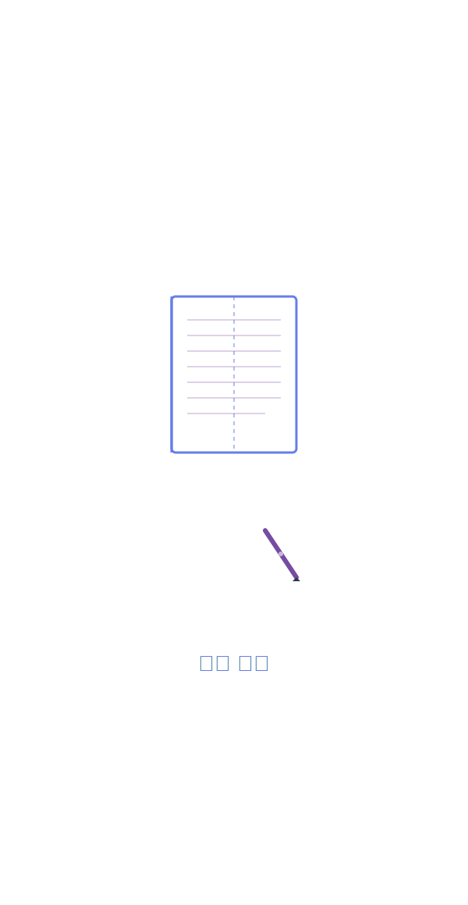
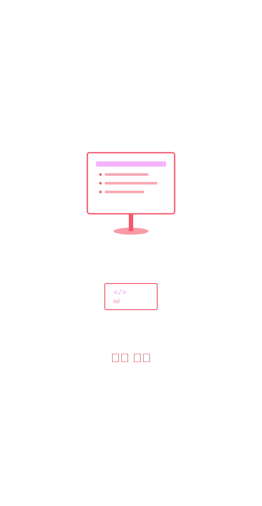
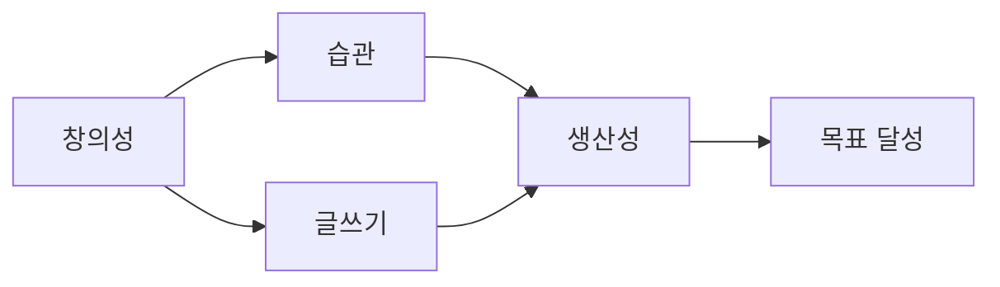

<style>
section {
  padding: 60px 80px;
}

section.lead {
  padding: 60px 80px;
}
</style>

<!-- _class: lead -->


# Claude Code 문서 작업 마스터하기

소설, 논문, 강의 자료 제작까지

---

## 이 강의는 다릅니다

**코딩이 아닌 문서 작업에 집중**

- 소설 집필
- 강의 자료 제작
- 논문 리뷰 및 작성
- 개인 문서 관리

**비개발자도 환영**

마크다운만 알면 충분합니다

---

## 강의 구성

| Part | 주제 | 시간 |
|------|------|------|
| 1 | 소설 집필 프로젝트 | 15분 |
| 2 | 강의 자료 제작 | 15분 |
| 3 | 논문 리뷰 및 작성 | 15분 |
| 4 | 개인 문서 관리 | 15분 |

**실전 중심**

모든 사례는 실제 사용 가능한 워크플로우

---

## 왜 Claude Code인가?

**기존 도구의 한계**

- Word/Notion: 버전 관리 어려움
- Google Docs: 오프라인 작업 제한
- 수동 정리: 시간 낭비

**Claude Code의 강점**

- 마크다운 기반 (간단, 범용적)
- 파일 시스템 (Git 호환)
- AI 지원 (자동화, 분석)
- 플랫폼 독립적

---

## 필요한 준비물

**필수**

- Claude Code CLI 설치
- 터미널 기본 사용법
- 마크다운 기초

**권장**

- Git 설치 (버전 관리)
- VS Code (마크다운 편집)
- Marp (강의 자료 제작 시)

---



# Part 1: 소설 집필 프로젝트

Claude Code로 장편 소설 쓰기

---

## 소설 집필의 도전 과제

**작가들이 겪는 어려움**

- 챕터별 일관성 유지
- 캐릭터 설정 추적
- 플롯 구조 관리
- 시간선 정리
- 반복되는 표현 찾기

**Claude Code가 해결하는 방법**

각 챕터를 파일로 관리하고, 전체 구조를 체계적으로 유지

---

## 프로젝트 구조

**추천 디렉토리 구성**

```
my-novel/
├── outline.md              # 전체 플롯 개요
├── characters/
│   ├── protagonist.md      # 주인공 설정
│   ├── villain.md          # 악당 설정
│   └── supporting.md       # 조연 설정
├── chapters/
│   ├── chapter-01.md
│   ├── chapter-02.md
│   └── ...
├── worldbuilding/
│   ├── setting.md          # 배경 설정
│   ├── timeline.md         # 시간선
│   └── rules.md            # 세계관 규칙
└── notes/
    └── ideas.md            # 아이디어 메모
```

---

## 시작하기: 프로젝트 초기화

**디렉토리 생성 및 Claude 실행**

```bash
cd ~/Documents
claude
```

**Claude에게 요청**

```
"장편 소설 프로젝트 구조를 만들어줘.
판타지 소설이고, 주인공은 마법사야."
```

---

## 자동 생성 결과

**생성되는 것**

- 기본 디렉토리 구조
- 템플릿 파일들
- outline.md 초안
- characters/ 폴더와 기본 설정 파일

---

## 사례: 캐릭터 일관성 유지

**문제 상황**

10개 챕터를 쓰다 보니 주인공의 눈 색깔이 파란색에서 녹색으로 바뀜

**Claude Code 활용**

```
"전체 챕터에서 주인공 외모 묘사를 찾아서
일관성을 확인해줘"
```

**Agent가 수행하는 작업**

1. Explore Agent 자동 실행
2. chapters/ 디렉토리 전체 탐색
3. 외모 관련 표현 추출
4. 불일치 발견 및 보고

---

## Agent 결과 예시

**보고서**

```
캐릭터 외모 불일치 발견:

Chapter 1: "푸른 눈동자"
Chapter 3: "파란 눈"
Chapter 7: "녹색 눈이 빛났다"  ← 불일치!
Chapter 10: "그의 파란 눈"

권장 수정:
- Chapter 7:45 → "파란 눈이 빛났다"
```

**한 번에 수정**

```
"Chapter 7의 녹색 눈을 파란 눈으로 수정해줘"
```

---

## Custom Command: 챕터 분석

**`.claude/commands/analyze-chapter.md`**

```markdown
# 챕터 분석

다음 항목을 확인해줘:

1. **캐릭터 일관성**
   - 외모, 성격, 말투 확인
   - characters/ 폴더 설정과 비교
2. **시간선 정합성**
   - timeline.md와 일치 여부
   - 이전 챕터와의 연결
3. **문체 검토**
   - 반복되는 표현
   - 클리셰 확인
   - 문장 길이 분포
4. **플롯 진행**
   - outline.md의 계획대로 진행되는지
```

---

## Command 사용

**챕터 작성 후**

```
/analyze-chapter chapters/chapter-05.md
```

**Claude가 자동으로**

- 캐릭터 설정 파일 읽기
- 타임라인 확인
- 문체 분석
- 피드백 제공

---

## 플롯 구조 관리 (1/2)

**시나리오**

여러 챕터에 걸쳐 복선을 깔았는데, 어디에 무엇을 썼는지 기억이 안 남

**해결 방법**

```
"전체 챕터에서 '붉은 목걸이'에 대한
모든 언급을 찾아서 시간 순으로 정리해줘"
```

---

## 플롯 구조 관리 (2/2)

**결과**

```
붉은 목걸이 타임라인:

1. Chapter 2:134
   "할머니가 물려준 붉은 목걸이를 목에 걸었다"

2. Chapter 5:89
   "목걸이가 이상하게 따뜻해졌다"

3. Chapter 8:201
   "목걸이에서 빛이 났다"

→ Chapter 9에서 정체를 밝힐 복선 완성
```

---

## 문체 일관성 검사

**Custom Command 활용**

**`.claude/commands/style-check.md`**

```markdown
# 문체 검사

1. 과도하게 반복되는 단어나 표현 찾기
2. 문장 길이 통계
3. 대화 비율 vs 서술 비율
4. 수동태 사용 빈도
```

**실행**

```
/style-check chapters/
```

---

## 아이디어 메모 관리 (1/2)

**작업 흐름**

1. 아이디어가 떠오를 때마다 notes/ideas.md에 기록
2. 주기적으로 정리 요청

```
"notes/ideas.md의 아이디어들을
카테고리별로 분류하고
각각 어느 챕터에 쓸 수 있을지 제안해줘"
```

---

## 아이디어 메모 관리 (2/2)

**자동 분류 결과**

```markdown
## 캐릭터 관련
- [Chapter 3에 추가] 주인공의 트라우마 회상 장면
- [Chapter 12에 추가] 악당의 과거 이야기

## 플롯 관련
- [Chapter 7-9에 적용] 반전 복선
- [엔딩에 사용] 감동적인 재회 장면
```

---

## 챕터 간 연결 확인 (1/2)

**문제**

Chapter 5가 Chapter 6과 자연스럽게 이어지는지 확인

**요청**

```
"chapter-05.md의 마지막 부분과
chapter-06.md의 시작 부분을 비교해서
자연스럽게 연결되는지 확인하고
필요하면 전환 문장을 제안해줘"
```

---

## 챕터 간 연결 확인 (2/2)

**Claude의 분석**

```
현재 상태:
Chapter 5 끝: "그는 문을 닫고 잠들었다."
Chapter 6 시작: "다음날 아침, 급한 노크 소리..."

→ 연결이 자연스럽습니다.

추가 제안:
Chapter 6 시작 전에 시간 경과를 더 명확히:
"다음날 이른 아침, 해가 채 뜨기도 전에
급한 노크 소리가 그를 깨웠다."
```

---

## 출판 준비: 통합 및 포맷팅

**최종 단계**

모든 챕터를 하나의 파일로 병합하고 포맷 정리

```
"chapters/ 디렉토리의 모든 챕터를
순서대로 병합해서 manuscript.md를 만들어줘.

각 챕터 사이에 페이지 구분을 넣고,
목차도 자동으로 생성해줘."
```

---

## 통합 파일 생성 (1/2)

**Claude가 수행하는 작업**

1. 챕터 파일 순서대로 읽기
2. 목차 자동 생성
3. 페이지 구분 추가
4. 통일된 포맷 적용
5. manuscript.md 생성

---

## 통합 파일 생성 (2/2)

**결과물**

```markdown
# 소설 제목

## 목차
- 1장: 시작
- 2장: 만남
- ...

---

# 1장: 시작
[챕터 내용]

---

# 2장: 만남
[챕터 내용]
```

---

## 버전 관리로 수정 이력 추적

**Git 활용**

```
"Git 저장소를 초기화하고
현재까지의 작업을 커밋해줘"
```

**이점**

- 각 챕터의 수정 이력 확인
- 잘못된 수정 되돌리기
- 다양한 버전 실험

**예시**

```bash
git log chapters/chapter-03.md
# Chapter 3의 모든 수정 이력 확인
```

---

## Skills 활용: 참고 자료 분석

**시나리오**

중세 시대 배경 소설을 쓰는데 역사적 고증 필요

**PDF 참고 자료 활용**

```
"medieval-history.pdf를 분석해서
중세 성곽 구조와 일상생활에 대한
핵심 정보를 정리해줘.

worldbuilding/medieval-reference.md에 저장"
```

**자동 실행**

- pdf skill이 자동 실행
- 텍스트 추출 및 요약
- 마크다운으로 정리

---

## 실전 팁: 소설 집필 워크플로우

| 단계 | Claude Code 활용 |
|-----|-----------------|
| 1. 기획 | outline.md 작성, 플롯 구조 검토 |
| 2. 캐릭터 설정 | 캐릭터 파일 생성, 일관성 체크 |
| 3. 집필 | 챕터별 작성, 실시간 피드백 |
| 4. 검토 | 전체 일관성 검사, 복선 추적 |
| 5. 수정 | 문체 개선, 반복 표현 제거 |
| 6. 통합 | 최종 manuscript 생성 |

---

## 주의사항

**Claude Code는 도구입니다**

- 아이디어와 창의성은 작가의 몫
- Claude는 구조화와 일관성 유지를 돕는 조수
- 최종 결정은 항상 작가가

**추천 작업 방식**

- 챕터 초안은 자유롭게 작성
- 검토 단계에서 Claude 활용
- 기계적 작업은 자동화하고 창작에 집중

---

## 소설 집필 정리

**Claude Code의 강점**

- 여러 파일에 걸친 일관성 유지
- 캐릭터/플롯 추적 자동화
- 구조화된 프로젝트 관리
- 반복 작업 자동화

**작가가 얻는 것**

- 더 많은 시간을 창작에 투자
- 실수와 불일치 최소화
- 체계적인 작품 관리

**다음: 강의 자료 제작 사례**

---



# Part 2: 강의 자료 제작

Marp로 프레젠테이션 슬라이드 만들기

---

## 강의 자료 제작의 도전 과제

**강사들이 겪는 어려움**

- 슬라이드 내용 구성
- 시각 자료 준비
- 일관된 디자인 유지
- 여러 강의 버전 관리
- 반복 작업 (포맷팅, 이미지 삽입)

**Claude Code로 해결**

마크다운으로 작성하고 Marp로 변환, 모든 과정을 자동화

---

## 실제 사례: 이 강의 자료

**바로 이 강의가 Claude Code로 제작되었습니다!**

**프로젝트 구조**

```
lectures/
├── CLAUDE.md                    # 작업 컨텍스트
├── generate-presentation.sh     # 빌드 스크립트
├── lecture-01-ai-data-coding/
├── lecture-02-프로젝트공유/
├── lecture-03-ai-agent-intro/
├── lecture-04-claude-code-features/
└── lecture-05-문서작업-실전/   ← 지금 만드는 중!
    ├── part-01-novel-writing.md
    ├── part-02-lecture-creation.md
    ├── lecture.md
    └── images/
```

---

## 작업 흐름: 강의 기획 (1/2)

**1. 개요 작성**

```
"Claude Code를 활용한 문서 작업에 대한
강의 개요를 만들어줘.

대상: 비개발자 포함
주제: 소설, 강의, 논문, 개인 문서
시간: 60분"
```

---

## 작업 흐름: 강의 기획 (2/2)

**2. Claude의 제안**

```markdown
## 강의 구성안

Part 1: 소설 집필 (15분)
- 프로젝트 구조
- 캐릭터 일관성
- 플롯 관리

Part 2: 강의 자료 제작 (15분)
- Marp 활용
- 자동화
...
```

---

## Part 파일 분리 작업

**모듈화 전략**

각 Part를 별도 파일로 작성하고 나중에 통합

**요청**

```
"Part 1: 소설 집필에 대한 슬라이드를 작성해줘.
part-01-novel-writing.md 파일로 저장.

Marp 형식으로 작성하되:
- 슬라이드는 ---로 구분
- 각 슬라이드는 한 화면에 들어갈 분량
- 코드 예시와 실전 팁 포함"
```

---

## Plan Mode로 구조 검토

**큰 작업 전 계획 확인**

```
/plan
"Part 1부터 Part 4까지 모든 슬라이드를 작성해줘"
```

**Claude의 계획**

```
1. Part 1: 소설 집필 (20 슬라이드 예상)
2. Part 2: 강의 자료 (15 슬라이드)
...

각 Part는 별도 파일로 작성 후, lecture.md에 통합
```

**승인**

```
"좋아, 진행해줘"
```

---

## 이미지 생성: SVG 활용

**배경 이미지 필요**

각 Part마다 배경 이미지 필요

**요청**

```
Part 1용 배경 이미지를 SVG로 만들어줘.
책과 펜을 상징하는 심플한 디자인. 콘텐츠는 중앙 배치
파일명: images/img_1_novel.svg
```

**중요: SVG 디자인 원칙**

- 콘텐츠는 항상 중앙 배치
- 내부 여백 충분히 확보
- 세로 방향으로 긴 디자인

---

## SVG 자동 생성

**Claude가 생성한 SVG**

```xml
<svg viewBox="0 -80 600 1160" xmlns="http://www.w3.org/2000/svg">
  <defs>
    <linearGradient id="grad1" x1="0%" y1="0%" x2="0%" y2="100%">
      <stop offset="0%" style="stop-color:#667eea"/>
      <stop offset="100%" style="stop-color:#764ba2"/>
    </linearGradient>
  </defs>

  <!-- 책 아이콘 -->
  <rect x="200" y="400" width="200" height="250"
        fill="white" stroke="#667eea" stroke-width="3"/>

  <!-- 펜 아이콘 -->
  <line x1="350" y1="300" x2="400" y2="400"
        stroke="#764ba2" stroke-width="4"/>
</svg>
```

---

## Custom Command: 슬라이드 생성

**`.claude/commands/new-slide.md`**

```markdown
# 새 슬라이드 섹션 생성

주어진 주제에 대해 5-7개 슬라이드를 생성해줘.

형식:
- Marp 마크다운 (--- 구분자)
- 각 슬라이드: 제목 + 3-5개 불릿 포인트
- 코드 예시는 ```로 감싸기
- 표가 적절한 경우 마크다운 표 사용

확인 사항:
- 한 슬라이드에 너무 많은 내용 X
- 시각적 여백 확보
- 핵심만 간결하게
```

---

## Command 활용

**새 섹션 추가 시**

```
/new-slide "Git을 활용한 버전 관리"
```

**자동 생성 결과**

```markdown
---

## Git으로 버전 관리

**강의 자료도 코드처럼**

- 각 수정사항을 커밋으로 기록
- 이전 버전으로 되돌리기 쉬움
- 여러 버전 실험 가능

---
...
```

---

## 일관성 검사: Todo 활용

**긴 강의 제작 시**

```
여러 Part를 작성하는 Todo:

☑ Part 1: 소설 집필 완료
☑ Part 2: 강의 자료 완료
→ Part 3: 논문 리뷰 작성 중
☐ Part 4: 개인 문서
☐ 이미지 생성
☐ lecture.md 통합
☐ HTML 빌드 및 테스트
```

**진행 상황을 한눈에 파악**

---

## 파일 통합: lecture.md 생성

**모든 Part가 완성되면**

```
"part-01부터 part-04까지 모든 파일을
순서대로 lecture.md에 통합해줘.

맨 앞에 다음 프런트매터 추가:
---
marp: true
theme: default
size: 16:9
paginate: true
---

그리고 CSS 스타일도 추가:
section { padding: 60px 80px; }"
```

---

## 자동 통합 작업

**Claude가 수행하는 작업**

1. 프런트매터 생성
2. CSS 스타일 추가
3. 표지 슬라이드 생성
4. part-01.md 내용 삽입
5. part-02.md 내용 삽입
6. part-03.md 내용 삽입
7. part-04.md 내용 삽입
8. 마무리 슬라이드 추가

**결과: lecture.md 완성**

---

## 빌드: HTML 생성

**빌드 스크립트 실행**

```bash
./generate-presentation.sh lecture-05 lecture.md
```

**수행 작업**

Marp로 HTML 변환 → 이미지 폴더 복사 → 완료 메시지

---

## 검토: 브라우저 테스트

**HTML 파일 열기**

```bash
open lecture-05-문서작업-실전/lecture.html
```

**확인 항목**

| 항목 | 확인 사항 |
|-----|---------|
| 여백 | 텍스트가 가장자리에 붙지 않는지 |
| 배경 이미지 | 35% 크기, 잘리지 않는지 |
| 오버플로우 | 슬라이드 하단이 잘리지 않는지 |
| 이미지 | 모든 이미지가 로드되는지 |
| 폰트 | 한글이 깨지지 않는지 |

---

## 문제 발견 시

**슬라이드 오버플로우**

```
"Part 2의 5번째 슬라이드가 너무 길어서
내용이 잘려요. 두 슬라이드로 나눠줘"
```

**배경 이미지 여백 부족**

```
"images/img_2_lecture.svg가
슬라이드 가장자리에 붙어있어.
마크다운에서 35%로 줄여줘"
```

**Claude가 즉시 수정**

---

## 반복 작업 자동화

**`.claude/commands/build-and-review.md`**

- 빌드 스크립트 실행
- HTML 생성 확인
- 체크리스트 검사

**사용**: `/build-and-review`

---

## 버전 관리

**Git 커밋 요청**

```
"강의 자료 커밋해줘.
메시지: feat: Part 1-2 완성"
```

**자동 실행**: `git add` → `git commit`

---

## 강의 업데이트 시나리오

**6개월 후 내용 업데이트 필요**

**Claude Code 활용**

```
"Part 3에 최신 AI 정보 추가.
새 슬라이드 2개"
```

**자동으로**

- 기존 내용 읽기
- 적절한 위치 파악
- 새 슬라이드 삽입
- 일관된 포맷 유지

---

## 여러 강의 시리즈 관리

**프로젝트 구조**

```
lectures/
├── lecture-01-기초/
│   ├── lecture.md
│   └── images/
├── lecture-02-중급/
│   ├── lecture.md
│   └── images/
└── lecture-03-고급/
    ├── lecture.md
    └── images/
```

**일관성 유지**

```
"lecture-01, 02, 03 모두에서
슬라이드 디자인이 일관되는지 확인하고
CSS 스타일을 통일해줘"
```

---

## Agent로 전체 검토 (1/2)

**Explore Agent 활용**

```
"lectures/ 디렉토리 전체를 분석해서:

1. 각 강의의 슬라이드 개수
2. 사용된 이미지 목록
3. 중복된 내용이 있는지
4. 일관되지 않은 표현

을 보고서로 정리해줘"
```

---

## Agent로 전체 검토 (2/2)

**Agent 보고서**

```
강의 시리즈 분석 결과:

lecture-01: 45 슬라이드, 8 이미지
lecture-02: 52 슬라이드, 10 이미지
lecture-03: 48 슬라이드, 9 이미지

중복 내용:
- "Git 기초" 설명이 01, 02에 중복
  → 02에서는 참조만 하도록 수정 권장
```

---

## PDF 변환

**인쇄용 PDF 생성**

**방법 1: 브라우저 인쇄**

1. HTML 파일을 브라우저로 열기
2. Cmd+P (인쇄)
3. "배경 그래픽" 옵션 활성화
4. PDF로 저장

**방법 2: Command 자동화**

```markdown
# .claude/commands/export-pdf.md

1. HTML 파일이 최신인지 확인
2. 브라우저 인쇄 방법 안내
```

---

## 협업: 피드백 반영

**동료 강사의 피드백**

```
"Part 2의 예시가 너무 기술적이에요.
비개발자도 이해할 수 있게 쉽게 바꿔주세요"
```

**Claude에게 요청**

```
"part-02-lecture-creation.md에서
기술 용어를 쉬운 말로 바꾸고,
비개발자도 이해할 수 있게 예시를 수정해줘"
```

**자동 수정 후 확인**

---

## 강의 자료 재사용

**다른 형식으로 변환**

```
"lecture.md를 블로그 포스트 형식으로 변환해줘.
blog-post.md로 저장하고:

- 슬라이드 구분(---) 제거
- 섹션별로 ## 헤딩으로 구분
- 코드 블록은 그대로 유지"
```

**결과**

강의 슬라이드 → 블로그 글 자동 변환

---

## CLAUDE.md: 작업 컨텍스트

**프로젝트 루트에 CLAUDE.md**

```markdown
# 강의 자료 제작 프로젝트

## 규칙
- Marp 형식 준수
- 이미지는 SVG, 중앙 배치
- 슬라이드당 5-7 불릿 포인트
- 배경 이미지는 35% 크기

## 구조
각 강의는 lecture-XX-주제/ 디렉토리
part-0X.md로 모듈화 후 lecture.md 통합
```

**Claude가 자동으로 규칙 준수**

---

## 실전 팁

| 단계 | Claude Code 활용 |
|-----|-----------------|
| 기획 | 개요 작성, 구조 제안 |
| 작성 | Part별 슬라이드 생성 |
| 이미지 | SVG 자동 생성 |
| 통합 | lecture.md 병합 |
| 빌드 | 스크립트 실행 |
| 검토 | 자동 체크리스트 |
| 업데이트 | 특정 섹션만 수정 |

---

## 강의 제작 시간 비교

| 단계 | PowerPoint | Claude Code + Marp |
|-----|-----------|-------------------|
| 기획 | 2시간 | 1시간 (AI 도움) |
| 작성 | 8시간 | 4시간 (마크다운) |
| 디자인 | 4시간 | 0시간 (자동) |
| 이미지 | 3시간 | 1시간 (SVG) |
| **총계** | **17시간** | **6시간 (65% 절약)** |

---

## 강의 자료 제작 정리

| Claude Code 이점 | 강사 혜택 |
|-----------------|----------|
| 마크다운 빠른 작성 | 내용에 집중 |
| 버전 관리 용이 | 시간 절약 |
| 디자인 자동 유지 | 체계적 관리 |
| 재사용/업데이트 쉬움 | 형식 변환 자유 |
| 협업 편리 | |

---


# Part 3: 논문 리뷰 및 작성

학술 연구를 위한 Claude Code 활용

---

## 논문 작업의 도전 과제

**연구자들이 겪는 어려움**

- 수십 개의 참고문헌 관리
- 논문 PDF 읽고 핵심 추출
- 관련 논문 간 비교 분석
- 인용 형식 통일
- 섹션별 일관성 유지
- 버전 관리

**Claude Code의 해결책**

PDF Skill + 구조화된 파일 관리 + 자동화

---

## 프로젝트 구조

**추천 디렉토리**

```
my-research/
├── papers/                    # 수집한 논문 PDF
├── notes/                     # 수집 논문별 노트
├── synthesis/                 # 종합 분석
│   ├── literature-review.md
│   └── comparison-table.md
├── my-paper/                  # 내 논문 작성
│   ├── abstract.md
│   ├── introduction.md
│   ├── methodology.md
│   ├── results.md
│   └── conclusion.md
└── references.bib             # 참고문헌
```

---

## Skills: PDF 논문 분석

**시나리오**

새로운 논문 PDF 파일을 다운로드했고, 핵심 내용을 빠르게 파악하고 싶음

**Claude Code 활용**

```
"papers/smith2023.pdf를 분석해서
다음 정보를 추출해줘:

1. 연구 목적 및 질문
2. 방법론
3. 주요 결과
4. 한계점
5. 우리 연구와의 관련성

notes/smith2023-notes.md로 저장"
```

---

## PDF Skill 자동 실행 (1/2)

**백그라운드 처리**

1. pdf skill 자동 실행
2. PDF 텍스트 추출
3. 내용 분석 및 구조화
4. 마크다운 파일로 저장

---

## PDF Skill 자동 실행 (2/2)

**생성된 노트 예시**

```markdown
# Smith et al. (2023) - Deep Learning for NLP

## 연구 목적
자연어 처리에서 Transformer 모델의 효율성 개선

## 방법론
- 데이터셋: WikiText-103
- 모델: Modified Transformer
- 평가 지표: Perplexity, BLEU

## 주요 결과
- 기존 모델 대비 15% 성능 향상
- 추론 속도 2배 개선
...
```

---

## 여러 논문 일괄 분석

**시나리오**

papers/ 폴더에 10개의 PDF가 있고, 모두 요약 필요

**Agent 활용**

```
"papers/ 디렉토리의 모든 PDF 파일을 분석해서
각각에 대한 요약 노트를 notes/ 에 생성해줘.

파일명은 원본 PDF 이름을 따르되 -notes.md 추가"
```

**General-purpose Agent 자동 실행**

- 모든 PDF 파일 탐색
- 순차적으로 분석
- 노트 파일 생성

---

## Custom Command: 논문 리뷰

**`.claude/commands/review-paper.md`**

```markdown
# 논문 리뷰 생성
주어진 PDF 파일을 분석하고 다음 형식으로 리뷰 작성:

## 기본 정보
- 제목, 저자, 연도, 학술지

## 핵심 내용 (3-5 문장)

* 강점: 3-5개 불릿
* 약점: 3-5개 불릿
* 우리 연구와의 관련성: 어떻게 활용할 수 있는지
* 인용 필요 여부: Yes/No 및 이유

파일명: notes/{저자}{연도}-review.md
```

---

## Command 실행

**새 논문 리뷰 시**

```
/review-paper papers/lee2024.pdf
```

**자동 생성**

- PDF 읽기
- 구조화된 리뷰 작성
- notes/lee2024-review.md 저장

**시간 절약**

수동 요약: 30-45분 → Claude Code: 2-3분

---

## 논문 비교 분석

**시나리오**

관련 논문 5개를 비교하여 차이점과 공통점 파악

**요청**

```
"notes/ 폴더의 smith2023, lee2024, kim2023,
park2024, choi2023 노트를 읽고

다음을 비교 분석해줘:
1. 사용한 방법론
2. 데이터셋
3. 성능 지표
4. 주요 차이점

synthesis/comparison-table.md로 저장"
```

---

## 생성된 비교표

**Markdown 표 형식**

| 논문 | 방법론 | 데이터셋 | 성능 (BLEU) | 특징 |
|-----|-------|---------|------------|------|
| Smith 2023 | Transformer | WikiText | 42.5 | 속도 개선 |
| Lee 2024 | BERT | GLUE | 45.1 | 정확도 우선 |
| Kim 2023 | GPT-3 | Custom | 48.3 | Few-shot |
| Park 2024 | T5 | C4 | 46.7 | 다국어 |
| Choi 2023 | RoBERTa | BookCorpus | 44.2 | 사전학습 |

**시각적으로 차이 한눈에 파악**

---

## 문헌 리뷰 작성

**시나리오**

내 논문의 Related Work 섹션 작성

**Claude Code 활용**

```
"synthesis/comparison-table.md와
notes/ 폴더의 모든 리뷰를 바탕으로

학술 논문 형식의 Literature Review를
작성해줘.

- 시간순 또는 주제별로 구성
- 각 논문의 기여도 설명
- 우리 연구의 위치 명확히

my-paper/related-work.md로 저장"
```

---

## 생성된 Literature Review

**예시**

```markdown
# Related Work

## Transformer-based Approaches

Smith et al. (2023) proposed an efficient Transformer
variant that achieves 15% better performance while
reducing inference time by half. Their approach focuses
on architectural modifications to the attention mechanism.

## Few-shot Learning Methods

Kim et al. (2023) demonstrated that GPT-3 can...

## Our Contribution

While previous work has focused on either efficiency
or accuracy, our approach aims to balance both...
```

---

## 참고문헌 관리 (1/2)

**BibTeX 파일 생성**

```
"notes/ 폴더의 모든 논문 정보를 읽고
references.bib 파일을 생성해줘.

BibTeX 형식으로, 각 논문의:
- author, title, year, journal/conference
- DOI (가능한 경우)

를 포함해줘"
```

---

## 참고문헌 관리 (2/2)

**자동 생성 references.bib**

```bibtex
@article{smith2023deep,
  author = {Smith, John and Doe, Jane},
  title = {Deep Learning for NLP},
  journal = {ACL},
  year = {2023},
  doi = {10.18653/v1/2023.acl-long.123}
}

@inproceedings{lee2024bert,
  author = {Lee, Minho},
  title = {BERT for Korean},
  booktitle = {EMNLP},
  year = {2024}
}
```

---

## 논문 작성: 섹션별 관리

**모듈화 전략**

각 섹션을 별도 파일로 작성

**섹션 파일**

| 파일 | 내용 |
|-----|------|
| abstract.md | 초록 |
| introduction.md | 서론 |
| methodology.md | 방법 |
| results.md | 결과 |

**장점: 섹션별 집중, 공유 용이, 버전 관리**

---

## 섹션 작성 지원

**Introduction 작성 예시**

```
"my-paper/introduction.md를 작성해줘.

다음 내용 포함:
1. 연구 배경 (2-3 문단)
2. 기존 연구의 한계 (1-2 문단)
3. 우리의 접근 방법 (1 문단)
4. 논문 구성 (1 문단)

synthesis/literature-review.md와
notes/ 폴더 내용을 참고해줘"
```

**Claude가 초안 작성**

---

## 일관성 검사

**시나리오**

여러 섹션에서 같은 개념을 다르게 표현했을 수 있음

**검사 요청**

```
"my-paper/ 폴더의 모든 섹션을 읽고

다음을 확인해줘:
1. 용어 일관성 (같은 개념을 다른 용어로 표현)
2. 약어 통일 (처음 사용 시 전체 이름 + 약어)
3. 시제 일관성 (Abstract는 현재형 등)
4. 수치 표기 일관성"
```

---

## 일관성 검사 결과

**Agent 보고서**

```
용어 일관성 문제:

1. "모델" vs "model" (한영 혼용)
   - introduction.md: "모델"
   - methodology.md: "model"
   → 통일 필요

2. 약어 정의
   - "NLP" 첫 사용 시 정의 없음
   - introduction.md:12에 추가 필요: "Natural Language Processing (NLP)"

3. 시제
   - abstract.md: 과거형과 현재형 혼용
   → 현재형으로 통일 권장
```

**즉시 수정 가능**

---

## 표와 그림 관리 (1/2)

**LaTeX 표 생성**

```
"synthesis/comparison-table.md의
마크다운 표를 LaTeX 표로 변환해줘.

\begin{table}...\end{table} 형식
캡션: 'Comparison of recent NLP models'"
```

---

## 표와 그림 관리 (2/2)

**자동 변환**

```latex
\begin{table}[h]
\centering
\caption{Comparison of recent NLP models}
\begin{tabular}{lllll}
\hline
Paper & Method & Dataset & BLEU & Feature \\
\hline
Smith 2023 & Transformer & WikiText & 42.5 & Speed \\
Lee 2024 & BERT & GLUE & 45.1 & Accuracy \\
...
\end{tabular}
\end{table}
```

---

## 통계 분석 지원

**Excel/CSV 데이터 분석**

```
"results/experiment-data.csv를 읽고

1. 기술 통계 계산 (평균, 표준편차)
2. 각 조건별 결과 비교
3. LaTeX 표로 변환
4. 간단한 해석 추가

my-paper/results-table.md로 저장"
```

**csv Skill 또는 Read로 처리**

---

## 버전 관리: Git 활용

**논문 작성 시작 시**

```
"Git 저장소 초기화하고 현재 구조를 커밋해줘"
```

**섹션 완성 시마다**

```
"introduction.md 작성 완료했어. Git 커밋해줘"
```

**자동 커밋**

```bash
git add my-paper/introduction.md
git commit -m "feat: Introduction 초안 완성"
```

---

## 협업: 공동 저자 피드백

**피드백 관리**

```
my-research/
└── feedback/
    ├── reviewer1-comments.md
    ├── reviewer2-comments.md
    └── response.md
```

**피드백 반영**

```
"feedback/reviewer1-comments.md를 읽고
지적된 사항을 my-paper/ 섹션에 반영해줘.

변경사항 목록을 feedback/changes.md에 기록"
```

---

## 투고 준비: 형식 변환

**학회별 형식 요구사항**

```
"my-paper/ 폴더의 모든 섹션을 통합해서
ACL 2024 형식에 맞는 단일 LaTeX 파일로
만들어줘.

- 섹션 순서: Abstract, Intro, Method, Results, Conclusion
- 참고문헌은 references.bib 사용
- 표와 그림 포함

output/paper-acl2024.tex로 저장"
```

---

## 최종 체크리스트

**Custom Command: 투고 전 검사**

**`.claude/commands/final-check.md`**

```markdown
# 투고 전 최종 검사

1. 모든 섹션 완성 확인
2. 참고문헌 형식 통일
3. 표와 그림 캡션 확인
4. 페이지 제한 준수
5. 저자 정보 및 감사의 글
6. 보충 자료 준비

체크리스트 형식으로 결과 출력
```

---

## 논문 리뷰 (심사자 입장)

**역할 전환: 내가 심사자라면**

```
"my-paper/ 폴더의 논문을 읽고
학술지 심사자 입장에서 리뷰를 작성해줘.

형식:
- 전체 평가 (Accept/Revise/Reject)
- 강점 3-5개
- 약점 3-5개
- 구체적 수정 제안
- 질문 사항

feedback/self-review.md로 저장"
```

**객관적 피드백 얻기**

---

## 연구 노트 관리

**일일 연구 기록**

```
notes/
└── daily/
    ├── 2024-01-15.md
    ├── 2024-01-16.md
    └── ...
```

**주간 요약 자동 생성**

```
"notes/daily/ 폴더의 이번 주 (1/15-1/21)
일일 노트를 읽고 주간 요약을 만들어줘.

- 주요 진행 사항
- 발견한 문제점
- 다음 주 계획

notes/weekly/2024-W03.md로 저장"
```

---

## 학회 발표 자료 준비

**논문 → 슬라이드 변환**

```
"my-paper/ 폴더의 논문을 바탕으로
15분 발표용 슬라이드를 만들어줘.

Marp 형식으로:
- 제목 슬라이드
- 연구 배경 (2 슬라이드)
- 방법론 (3 슬라이드)
- 결과 (4 슬라이드)
- 결론 (1 슬라이드)
- Q&A (1 슬라이드)

presentation/conference-talk.md로 저장"
```

---

## 연구 프로젝트 타임라인

| 2024-01 (완료) | 2024-02 (진행) | 2024-03 (예정) |
|---------------|---------------|---------------|
| ☑ 문헌 조사 | ☑ 실험 설계 | ☐ 본 실험 |
| ☑ 질문 정립 | → 데이터 수집 | ☐ 결과 분석 |
| | ☐ 예비 실험 | ☐ 논문 작성 |

---

## 실전 팁

| 단계 | Claude Code 활용 |
|-----|-----------------|
| 문헌 조사 | PDF 일괄 분석, 노트 자동 생성 |
| 비교 분석 | 표 생성, 종합 리포트 |
| 논문 작성 | 섹션별 초안, 일관성 검사 |
| 참고문헌 | BibTeX 자동 생성 |
| 협업 | Git 버전 관리, 피드백 반영 |
| 투고 준비 | 형식 변환, 최종 검사 |

---

## 시간 절약 효과

| 단계 | 기존 방식 | Claude Code | 절약률 |
|-----|---------|------------|-------|
| 문헌 조사 (10편) | 20시간 | 5시간 | 75% |
| 비교 분석 | 8시간 | 2시간 | 75% |
| 논문 작성 | 40시간 | 25시간 | 37% |
| 형식 맞추기 | 6시간 | 1시간 | 83% |
| **총계** | **74시간** | **33시간** | **55%** |

---

## 주의사항

| Claude 역할 | 연구자 역할 |
|-----------|-----------|
| 구조화, 정리 | 아이디어, 질문 |
| 형식 변환 | 실험 설계/수행 |
| 참고문헌 관리 | 결과 해석 |

**절대 금지**

- AI가 논문 전체 작성
- 인용 없이 AI 문장 사용
- 논문 윤리 위반

---

## 논문 작업 정리

| Claude 지원 | 연구자 혜택 |
|-----------|----------|
| PDF 빠른 분석 | 시간 절약 (55%) |
| 논문 비교 정리 | 체계적 관리 |
| 초안 작성 지원 | 일관된 품질 |
| 형식 검사 | 협업 효율 증가 |
| 참고문헌 관리 | |

---


# Part 4: 개인 문서 관리

일기, 메모, 지식 베이스 구축하기

---

## 개인 문서 관리의 중요성

**왜 개인 문서 시스템이 필요한가?**

- 아이디어를 잃어버리지 않기
- 배운 것을 체계적으로 정리
- 나중에 쉽게 찾기
- 생각의 연결고리 발견
- 개인 성장 추적

**Claude Code의 역할**

흩어진 메모를 구조화하고, 연결하고, 활용하기

---

## 추천 시스템 구조

**Zettelkasten 방식 기반**

```
personal-docs/
├── inbox/                 # 빠른 메모
│   ├── 2024-01-15.md
│   └── ...
├── permanent/            # 정제된 노트
│   ├── idea-001-ai-writing.md
│   └── ...
├── projects/             # 프로젝트별
│   ├── blog/
│   ├── book-reading/
│   └── learning-python/
├── journal/              # 일기
│   ├── 2024-01.md
│   └── ...
└── index.md              # 전체 인덱스
```

---

## 빠른 메모: Inbox

**아이디어가 떠오를 때**

터미널에서 Claude Code 실행:

```
"오늘 읽은 책에서 좋은 문장을 발견했어. inbox/ 에 메모해줘:
'창의성은 연결하는 능력이다 - 스티브 잡스'

태그: #creativity #quotes
출처: Steve Jobs Interview, 1996"
```

**자동 생성**

- 파일명: `inbox/2024-01-15.md`
- 타임스탬프 포함
- 태그 자동 추가

---

## Inbox 메모 예시

**생성된 파일**

```markdown
# 메모 - 2024-01-15 14:30

## 내용
"창의성은 연결하는 능력이다" - 스티브 잡스

## 태그
#creativity #quotes

## 출처
Steve Jobs Interview, 1996

## 메타데이터
- 작성일: 2024-01-15
- 카테고리: Quotes
```

---

## Custom Command: 빠른 메모

**`.claude/commands/quick-note.md`**

```markdown
# 빠른 메모
사용자가 제공한 내용을 inbox/ 에 저장

형식:
- 파일명: inbox/YYYY-MM-DD-HHMM.md
- 타임스탬프 포함
- 태그 추출 (# 으로 시작하는 단어)
- 메타데이터 자동 추가
```

**사용**

```
/quick-note
"오늘 배운 것: Python의 list comprehension은
성능이 좋다. #python #programming"
```

---

## Inbox 정리: 주간 리뷰

**매주 일요일 루틴**

```
"inbox/ 폴더의 이번 주 메모를 검토하고:

1. 비슷한 주제끼리 그룹화
2. 각 그룹에 대해 permanent/ 노트 제안
3. 어떤 메모는 프로젝트에 연결 제안
4. 버릴 메모 식별

결과를 reviews/2024-W03-review.md로 저장"
```

---

## 주간 리뷰 결과

**Agent 분석 보고서**

```markdown
# 주간 리뷰: 2024년 3주차

## 창의성 관련 (5개 메모)
permanent/idea-creativity.md 생성 권장:
- inbox/2024-01-15.md (잡스 인용)
- inbox/2024-01-17.md (창의적 사고법)

## Python 학습 (3개 메모)
projects/learning-python/week-03.md에 추가 권장:
- list comprehension
- decorators
- generators

## 버릴 메모
- inbox/2024-01-16.md (중복)
```

---

## Permanent Note 생성 (1/2)

**정제된 영구 노트**

```
"inbox/의 창의성 관련 메모 3개를 통합해서
permanent/creativity-connection.md를 만들어줘.

내 생각과 배운 것을 정리하고,
다른 노트와의 연결 링크 추가"
```

---

## Permanent Note 생성 (2/2)

**생성된 Permanent Note**

```markdown
# 창의성과 연결의 힘

## 핵심 아이디어
창의성은 기존 아이디어들을 새로운 방식으로
연결하는 능력이다.

## 관련 인용
> "창의성은 연결하는 능력이다" - 스티브 잡스

## 실천 방법
1. 다양한 분야 공부
2. 메모 간 연결 찾기
3. 패턴 인식 훈련

## 관련 노트
- [[idea-002-habit-tracking]] - 습관이 창의성에 미치는 영향
- [[projects/blog/creative-writing]] - 글쓰기에 적용
```

---

## 일기 작성

**매일 저녁 루틴**

```
"오늘 하루를 일기로 작성해줘.
journal/2024-01.md에 추가.

오늘의 하이라이트:
- 새 프로젝트 시작
- 좋은 책 발견
- 친구와 깊은 대화

형식: 날짜별 섹션"
```

---

## 생성된 일기

**journal/2024-01.md**

```markdown
# 2024년 1월 일기

## 2024-01-15 (월)

### 오늘의 하이라이트
새 프로젝트를 시작했다. Claude Code를 활용한 개인 문서 시스템 구축. 설레는 마음으로 시작.

### 배운 것
- Zettelkasten 방식의 메모 관리
- 아이디어를 빠르게 기록하는 중요성

### 감사한 일
친구와 나눈 깊은 대화. 서로의 목표를 응원.

### 내일 할 일
- [ ] Permanent note 3개 작성
- [ ] Python 학습 1시간
```

---

## 프로젝트 문서 관리

**독서 프로젝트 예시**

```
projects/book-reading/
├── 2024-books.md          # 올해 읽은 책 목록
├── the-lean-startup/      # 책별 폴더
│   ├── summary.md
│   ├── quotes.md
│   └── action-items.md
└── atomic-habits/
    ├── summary.md
    ├── quotes.md
    └── action-items.md
```

---

## 책 요약 자동 생성

**새 책을 읽었을 때**

```
"'린 스타트업' 책을 읽었어.
projects/book-reading/the-lean-startup/summary.md
를 만들고 다음 내용 정리:

- 책의 핵심 메시지 (3-5 문장)
- 주요 개념 (불릿 리스트)
- 인상 깊었던 인용구
- 내 삶에 적용할 점

그리고 2024-books.md에도 추가해줘"
```

---

## 지식 연결: 그래프 생성

**노트 간 연결 찾기**

```
"permanent/ 폴더의 모든 노트를 분석해서
주제별로 연결 관계를 찾아줘.

Mermaid 다이어그램으로 시각화:
graph/knowledge-graph.md로 저장"
```

**생성된 그래프**



---

## 태그 시스템 (1/2)

**태그별 노트 찾기**

```
"#python 태그가 있는 모든 노트를 찾아서
python-notes-index.md로 정리해줘.

각 노트의:
- 제목
- 파일 경로
- 작성 날짜
- 간단한 요약"
```

---

## 태그 시스템 (2/2)

**자동 생성 인덱스**

```markdown
# Python 관련 노트 모음

## inbox/2024-01-15.md
- 작성: 2024-01-15
- List comprehension 성능 이점

## permanent/python-decorators.md
- 작성: 2024-01-10
- 데코레이터 패턴 이해와 활용
...
```

---

## 검색 기능

**특정 주제 찾기**

```
"전체 personal-docs/ 에서 '생산성'이라는
단어가 포함된 모든 노트를 찾아줘.

관련성 높은 순으로 정렬하고
각 노트의 관련 문장 발췌"
```

**Grep + Agent 활용**

- 모든 마크다운 파일 검색
- 컨텍스트 포함 결과 제공
- 관련성 순 정렬

---

## 아이디어 클러스터링

**비슷한 아이디어 묶기**

```
"permanent/ 폴더의 모든 노트를 읽고 주제별로 클러스터링해줘.

- 대표 주제명
- 포함된 노트 목록
- 클러스터 간 연결 관계

clusters/2024-Q1.md로 저장"
```

**예상 클러스터**

- 개인 성장
- 기술/프로그래밍
- 창의성/글쓰기
- 습관/생산성

---

## 정기 리포트 생성

**월간 회고**

```
"journal/2024-01.md를 분석해서
월간 회고 리포트를 만들어줘.

포함 내용:
- 이달의 하이라이트
- 가장 많이 배운 것
- 감사한 일들
- 다음 달 목표

reports/2024-01-retrospective.md로 저장"
```

---

## 생성된 월간 회고

**reports/2024-01-retrospective.md**

```markdown
# 2024년 1월 회고

## 이달의 하이라이트
1. 개인 문서 시스템 구축 시작

## 배운 것
가장 많이 등장한 주제:
- 생산성 (15회)

## 감사 일기 통계
감사한 일을 기록한 날: 28/31일
주요 감사 대상: 가족, 친구, 좋은 책

## 다음 달 목표
일기에서 추출한 미완료 목표:
- [ ] Python 프로젝트 1개 완성
- [ ] 블로그 글 4개 발행
```

---

## To-Do 관리

**프로젝트별 할 일**

```
projects/
└── blog/
    ├── ideas.md           # 글감 목록
    ├── drafts/            # 초안
    │   ├── post-01.md
    │   └── post-02.md
    └── published/         # 발행
        └── 2024-01-15-first-post.md
```

**할 일 추출**

```
"projects/ 폴더 전체에서 [ ] 로 표시된
미완료 할 일을 모두 찾아서
todo-master.md로 정리해줘.

프로젝트별로 그룹화"
```

---

## 습관 추적

**일일 체크인**

```
habits/
└── 2024-01-tracking.md
```

**내용**

```markdown
# 2024년 1월 습관 추적

| 날짜 | 운동 | 독서 | 글쓰기 | 명상 |
|-----|-----|-----|-------|-----|
| 01  | ✓   | ✓   | -     | ✓   |
...
```

**통계 생성**

```
"habits/2024-01-tracking.md를 분석해서 이달의 습관 통계를 만들어줘"
```

---

## 습관 통계 예시

**자동 생성**

```markdown
# 2024년 1월 습관 통계

## 달성률
- 운동: 24/31일 (77%)
- 독서: 28/31일 (90%)
- 글쓰기: 20/31일 (65%)

## 연속 기록
- 명상: 최장 25일 연속
- 독서: 최장 18일 연속

## 개선 제안
글쓰기 습관이 가장 낮습니다. 시간대를 아침으로 변경 고려
```

---

## 개인 위키 구축

**index.md - 전체 지도**

```
"personal-docs/ 전체를 분석해서
위키 스타일 index.md를 생성해줘.

포함 내용:
- 주요 주제별 노트 개수
- 최근 업데이트된 노트 5개
- 가장 많이 연결된 노트 5개
- 태그별 분류

자동으로 매일 업데이트되도록
Custom Command도 만들어줘"
```

---

## Custom Command: 인덱스 갱신

**`.claude/commands/update-index.md`**

```markdown
# 인덱스 업데이트

1. personal-docs/ 전체 스캔
2. 주제별 노트 개수 계산
3. 최근 수정 파일 확인 (git log 또는 mtime)
4. 태그 추출 및 분류
5. index.md 갱신

실행 시 타임스탬프 표시
```

**매일 실행**

```
/update-index
```

---

## 백업 및 버전 관리

**Git으로 안전하게**

```
"personal-docs/ 폴더를 Git 저장소로 만들고
현재 상태를 커밋해줘.

앞으로 매일 저녁 자동으로 커밋하는
Hook을 설정해줘"
```

**자동 백업**

- 매일 저녁 9시에 자동 커밋
- 커밋 메시지: "Daily backup: YYYY-MM-DD"
- GitHub/GitLab에 자동 push

---

## 검색 및 발견

**우연한 발견 (Serendipity)**

```
"personal-docs/permanent/ 에서
무작위로 노트 하나를 골라서 보여줘.

오늘의 재발견 노트!"
```

**잊고 있던 아이디어 재발견**

3개월 전 메모가 오늘의 문제 해결에 도움이 될 수도!

---

## 통합 대시보드

**dashboard.md 자동 생성**

```
"다음 정보를 모아서 dashboard.md 생성:

1. 이번 주 작성한 노트 개수
2. 미완료 To-Do 개수
3. 이달의 습관 달성률
4. 최근 일기 요약
5. 다음 Action Items

매일 아침 업데이트"
```

---

## 대시보드 예시

**dashboard.md**

```markdown
# 개인 대시보드
**마지막 업데이트**: 2024-01-15 08:00

## 이번 주 활동
- 새 노트: 8개
- 정제한 영구 노트: 3개

## 할 일 (긴급)
- [ ] 프로젝트 제안서 제출 (D-2)
- [ ] 책 리뷰 작성 완료

## 이달 습관
- 운동: 15/15 (100%) 🎉
- 독서: 14/15 (93%)

## 오늘의 추천 노트
[[permanent/creativity-connection]] → 최근 3일간 연결되지 않은 노트
```

---

## 시간 절약 효과

**기존 방식 (수동 정리)**

- 메모 찾기: 5-10분/회
- 주간 리뷰: 2시간
- 월간 회고: 3시간
- 연관 노트 찾기: 불가능

**Claude Code 시스템**

- 메모 찾기: 30초
- 주간 리뷰: 30분 (자동 분류)
- 월간 회고: 45분 (자동 추출)
- 연관 노트: 즉시 확인

---

## 실전 팁

| 작업 | Claude Code 활용 |
|-----|-----------------|
| 빠른 메모 | Custom Command로 즉시 저장 |
| 주간 리뷰 | Agent로 자동 분류 |
| 영구 노트 | 여러 메모 통합 및 정제 |
| 일기 작성 | 템플릿 기반 자동 포맷 |
| 검색 | Grep + 컨텍스트 추출 |
| 연결 발견 | 태그 및 키워드 분석 |
| 통계 생성 | 자동 집계 및 시각화 |

---

## 추가 활용 사례

**금전 출납 관리**

```
finance/
├── 2024-01-transactions.csv
├── monthly-reports/
│   └── 2024-01-report.md
└── budget.md
```

```
"2024-01-transactions.csv를 분석해서
카테고리별 지출 통계와 예산 대비 현황을
monthly-reports/2024-01-report.md로 만들어줘"
```

---

## 앨범 가사 관리

**가사 작성 프로젝트**

```
lyrics/
├── album-01/
│   ├── song-01.md
│   ├── song-02.md
│   └── themes.md
├── archive/
└── ideas/
    └── phrases.md
```

```
"album-01/ 폴더의 모든 가사를 읽고
공통 테마와 반복되는 표현을 분석해줘.
앨범 전체의 일관성을 확인"
```

---

## 개인 문서 시스템 정리

| Claude 제공 | 사용자가 얻는 혜택 |
|-----------|----------|
| 빠른 메모 캡처 | 아이디어 보존 |
| 자동 분류/정리 | 체계적인 지식 축적 |
| 연결 발견 | 창의적 연결 |
| 통계/인사이트 | 성장 가시화 |
| 검색/재발견 | 생각의 진화 추적 |

---

## 마무리

**문서 중심 작업의 핵심**

Claude Code는 코딩 도구가 아니라 **생각을 정리하고 연결하는 도구**

**누구나 활용 가능**

- 작가, 연구자, 학생
- 프로젝트 매니저
- 개인 생산성에 관심 있는 모두

**시작하기**

1. 간단한 메모부터
2. 점진적으로 시스템 구축
3. 꾸준히 기록하고 리뷰

---

# 전체 요약

핵심 메시지

---

## 4가지 실전 사례

| 소설 집필 | 강의 자료 | 논문 작업 | 개인 문서 |
|---------|---------|---------|---------|
| 챕터 일관성 | Marp 슬라이드 | PDF 분석 | 메모 시스템 |
| 캐릭터 추적 | 모듈화/통합 | 문헌 비교 | 지식 연결 |
| 플롯 구조 | 버전 관리 | 참고문헌 | 습관 추적 |

---

## Claude Code의 강점

| 문서 작업 | 공통 이점 |
|---------|---------|
| 구조화된 관리 | 반복 작업 자동화 |
| 파일 간 일관성 | 시간 절약 (50-70%) |
| 자동화된 정리 | 창의적 작업 집중 |
| 검색 및 분석 | 체계적 관리 |

---

## 시작하는 방법

| 1단계: 작은 프로젝트 | 2단계: Command | 3단계: 시스템 |
|------------------|--------------|-------------|
| 메모 시스템 | 자주하는 작업 파악 | 프로젝트 구조 설계 |
| 블로그 글 | 명령어 작성 | Agent 활용 |
| 짧은 보고서 | 점진적 추가 | 자동화 확대 |

---

## 핵심 원칙

| 마크다운 작성 | 파일 기반 조직 | Claude는 조수 |
|------------|-------------|-------------|
| 간단하고 보편적 | 디렉토리 분류 | 아이디어는 사람 |
| Git 버전 관리 | 파일명 규칙 | 정리와 구조화는 AI |
| 형식 자유 변환 | 검색 가능하게 유지 | 최종 결정은 사람의 몫 |

---

## 다음 단계

**오늘부터 시작**

```bash
mkdir my-docs
cd my-docs
claude
```

```
"개인 문서 시스템을 시작하고 싶어.
inbox, permanent, journal 폴더를
만들고 README.md도 작성해줘"
```

**한 걸음씩**

- 완벽한 시스템보다 시작이 중요
- 필요에 따라 점진적 개선
- 꾸준함이 핵심

---

# Q&A

질문이 있으신가요?

---

# 감사합니다!

**Claude Code와 함께하는 문서 작업**

여러분의 생각을 체계화하고
창의성을 발휘하는 데
도움이 되기를 바랍니다.

**공식 문서**

- [docs.claude.com/claude-code](https://docs.claude.com/claude-code)

**피드백 환영**

- GitHub Issues
- 이메일
- 직접 대화
