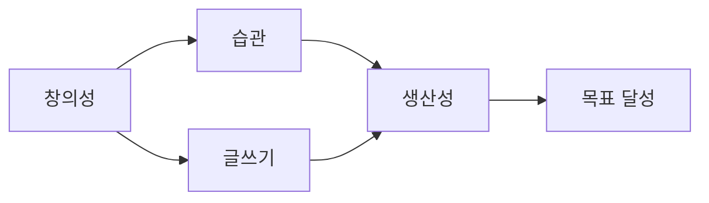

# Part 4: 개인 문서 관리

일기, 메모, 지식 베이스 구축하기

---

## 개인 문서 관리의 중요성

**왜 개인 문서 시스템이 필요한가?**

- 아이디어를 잃어버리지 않기
- 배운 것을 체계적으로 정리
- 나중에 쉽게 찾기
- 생각의 연결고리 발견
- 개인 성장 추적

**Claude Code의 역할**

흩어진 메모를 구조화하고, 연결하고, 활용하기

---

## 추천 시스템 구조

**Zettelkasten 방식 기반**

```
personal-docs/
├── inbox/                 # 빠른 메모
│   ├── 2024-01-15.md
│   ├── 2024-01-16.md
│   └── ...
├── permanent/            # 정제된 노트
│   ├── idea-001-ai-writing.md
│   ├── idea-002-habit-tracking.md
│   └── ...
├── projects/             # 프로젝트별
│   ├── blog/
│   ├── book-reading/
│   └── learning-python/
├── journal/              # 일기
│   ├── 2024-01.md
│   └── ...
└── index.md              # 전체 인덱스
```

---

## 빠른 메모: Inbox

**아이디어가 떠오를 때**

터미널에서 Claude Code 실행:

```
"오늘 읽은 책에서 좋은 문장을 발견했어.
inbox/ 에 메모해줘:

'창의성은 연결하는 능력이다 - 스티브 잡스'

태그: #creativity #quotes
출처: Steve Jobs Interview, 1996"
```

**자동 생성**

- 파일명: `inbox/2024-01-15.md`
- 타임스탬프 포함
- 태그 자동 추가

---

## Inbox 메모 예시

**생성된 파일**

```markdown
# 메모 - 2024-01-15 14:30

## 내용

"창의성은 연결하는 능력이다" - 스티브 잡스

## 태그

#creativity #quotes

## 출처

Steve Jobs Interview, 1996

## 메타데이터

- 작성일: 2024-01-15
- 카테고리: Quotes
```

---

## Custom Command: 빠른 메모

**`.claude/commands/quick-note.md`**

```markdown
# 빠른 메모

사용자가 제공한 내용을 inbox/ 에 저장

형식:
- 파일명: inbox/YYYY-MM-DD-HHMM.md
- 타임스탬프 포함
- 태그 추출 (# 으로 시작하는 단어)
- 메타데이터 자동 추가
```

**사용**

```
/quick-note

"오늘 배운 것: Python의 list comprehension은
성능이 좋다. #python #programming"
```

---

## Inbox 정리: 주간 리뷰

**매주 일요일 루틴**

```
"inbox/ 폴더의 이번 주 메모를 검토하고:

1. 비슷한 주제끼리 그룹화
2. 각 그룹에 대해 permanent/ 노트 제안
3. 어떤 메모는 프로젝트에 연결 제안
4. 버릴 메모 식별

결과를 reviews/2024-W03-review.md로 저장"
```

---

## 주간 리뷰 결과

**Agent 분석 보고서**

```markdown
# 주간 리뷰: 2024년 3주차

## 창의성 관련 (5개 메모)

permanent/idea-creativity.md 생성 권장:
- inbox/2024-01-15.md (잡스 인용)
- inbox/2024-01-17.md (창의적 사고법)
- inbox/2024-01-18.md (아이디어 연결)

## Python 학습 (3개 메모)

projects/learning-python/week-03.md에 추가 권장:
- list comprehension
- decorators
- generators

## 버릴 메모

- inbox/2024-01-16.md (중복)
```

---

## Permanent Note 생성

**정제된 영구 노트**

```
"inbox/의 창의성 관련 메모 3개를 통합해서
permanent/creativity-connection.md를 만들어줘.

내 생각과 배운 것을 정리하고,
다른 노트와의 연결 링크 추가"
```

**생성된 Permanent Note**

```markdown
# 창의성과 연결의 힘

## 핵심 아이디어

창의성은 기존 아이디어들을 새로운 방식으로
연결하는 능력이다.

## 관련 인용

> "창의성은 연결하는 능력이다" - 스티브 잡스

## 실천 방법

1. 다양한 분야 공부
2. 메모 간 연결 찾기
3. 패턴 인식 훈련

## 관련 노트

- [[idea-002-habit-tracking]] - 습관이 창의성에 미치는 영향
- [[projects/blog/creative-writing]] - 글쓰기에 적용
```

---

## 일기 작성

**매일 저녁 루틴**

```
"오늘 하루를 일기로 작성해줘.
journal/2024-01.md에 추가.

오늘의 하이라이트:
- 새 프로젝트 시작
- 좋은 책 발견
- 친구와 깊은 대화

형식: 날짜별 섹션"
```

---

## 생성된 일기

**journal/2024-01.md**

```markdown
# 2024년 1월 일기

## 2024-01-15 (월)

### 오늘의 하이라이트

새 프로젝트를 시작했다. Claude Code를 활용한
개인 문서 시스템 구축. 설레는 마음으로 시작.

### 배운 것

- Zettelkasten 방식의 메모 관리
- 아이디어를 빠르게 기록하는 중요성

### 감사한 일

친구와 나눈 깊은 대화. 서로의 목표를 응원.

### 내일 할 일

- [ ] Permanent note 3개 작성
- [ ] Python 학습 1시간
```

---

## 프로젝트 문서 관리

**독서 프로젝트 예시**

```
projects/book-reading/
├── 2024-books.md          # 올해 읽은 책 목록
├── the-lean-startup/      # 책별 폴더
│   ├── summary.md
│   ├── quotes.md
│   └── action-items.md
└── atomic-habits/
    ├── summary.md
    ├── quotes.md
    └── action-items.md
```

---

## 책 요약 자동 생성

**새 책을 읽었을 때**

```
"'린 스타트업' 책을 읽었어.
projects/book-reading/the-lean-startup/summary.md
를 만들고 다음 내용 정리:

- 책의 핵심 메시지 (3-5 문장)
- 주요 개념 (불릿 리스트)
- 인상 깊었던 인용구
- 내 삶에 적용할 점

그리고 2024-books.md에도 추가해줘"
```

---

## 지식 연결: 그래프 생성

**노트 간 연결 찾기**

```
"permanent/ 폴더의 모든 노트를 분석해서
주제별로 연결 관계를 찾아줘.

Mermaid 다이어그램으로 시각화:
graph/knowledge-graph.md로 저장"
```

**생성된 그래프**



---

## 태그 시스템

**태그별 노트 찾기**

```
"#python 태그가 있는 모든 노트를 찾아서
python-notes-index.md로 정리해줘.

각 노트의:
- 제목
- 파일 경로
- 작성 날짜
- 간단한 요약"
```

**자동 생성 인덱스**

```markdown
# Python 관련 노트 모음

## inbox/2024-01-15.md
- 작성: 2024-01-15
- List comprehension 성능 이점

## permanent/python-decorators.md
- 작성: 2024-01-10
- 데코레이터 패턴 이해와 활용
...
```

---

## 검색 기능

**특정 주제 찾기**

```
"전체 personal-docs/ 에서 '생산성'이라는
단어가 포함된 모든 노트를 찾아줘.

관련성 높은 순으로 정렬하고
각 노트의 관련 문장 발췌"
```

**Grep + Agent 활용**

- 모든 마크다운 파일 검색
- 컨텍스트 포함 결과 제공
- 관련성 순 정렬

---

## 아이디어 클러스터링

**비슷한 아이디어 묶기**

```
"permanent/ 폴더의 모든 노트를 읽고
주제별로 클러스터링해줘.

각 클러스터에:
- 대표 주제명
- 포함된 노트 목록
- 클러스터 간 연결 관계

clusters/2024-Q1.md로 저장"
```

**예상 클러스터**

- 개인 성장
- 기술/프로그래밍
- 창의성/글쓰기
- 습관/생산성

---

## 정기 리포트 생성

**월간 회고**

```
"journal/2024-01.md를 분석해서
월간 회고 리포트를 만들어줘.

포함 내용:
- 이달의 하이라이트
- 가장 많이 배운 것
- 감사한 일들
- 다음 달 목표

reports/2024-01-retrospective.md로 저장"
```

---

## 생성된 월간 회고

**reports/2024-01-retrospective.md**

```markdown
# 2024년 1월 회고

## 이달의 하이라이트

1. 개인 문서 시스템 구축 시작
2. Python 학습 프로젝트 20시간 투자
3. '린 스타트업' 완독

## 배운 것

가장 많이 등장한 주제:
- 생산성 (15회)
- 창의성 (12회)
- 습관 (10회)

## 감사 일기 통계

감사한 일을 기록한 날: 28/31일
주요 감사 대상: 가족, 친구, 좋은 책

## 다음 달 목표

일기에서 추출한 미완료 목표:
- [ ] Python 프로젝트 1개 완성
- [ ] 블로그 글 4개 발행
- [ ] 운동 습관 정착
```

---

## To-Do 관리

**프로젝트별 할 일**

```
projects/
└── blog/
    ├── ideas.md           # 글감 목록
    ├── drafts/            # 초안
    │   ├── post-01.md
    │   └── post-02.md
    └── published/         # 발행
        └── 2024-01-15-first-post.md
```

**할 일 추출**

```
"projects/ 폴더 전체에서 [ ] 로 표시된
미완료 할 일을 모두 찾아서
todo-master.md로 정리해줘.

프로젝트별로 그룹화"
```

---

## 습관 추적

**일일 체크인**

```
habits/
└── 2024-01-tracking.md
```

**내용**

```markdown
# 2024년 1월 습관 추적

| 날짜 | 운동 | 독서 | 글쓰기 | 명상 |
|-----|-----|-----|-------|-----|
| 01  | ✓   | ✓   | -     | ✓   |
| 02  | ✓   | -   | ✓     | ✓   |
| 03  | -   | ✓   | ✓     | ✓   |
...
```

**통계 생성**

```
"habits/2024-01-tracking.md를 분석해서
이달의 습관 통계를 만들어줘"
```

---

## 습관 통계 예시

**자동 생성**

```markdown
# 2024년 1월 습관 통계

## 달성률

- 운동: 24/31일 (77%)
- 독서: 28/31일 (90%)
- 글쓰기: 20/31일 (65%)
- 명상: 30/31일 (97%)

## 연속 기록

- 명상: 최장 25일 연속
- 독서: 최장 18일 연속
- 운동: 최장 12일 연속

## 개선 제안

글쓰기 습관이 가장 낮습니다.
시간대를 아침으로 변경 고려
```

---

## 개인 위키 구축

**index.md - 전체 지도**

```
"personal-docs/ 전체를 분석해서
위키 스타일 index.md를 생성해줘.

포함 내용:
- 주요 주제별 노트 개수
- 최근 업데이트된 노트 5개
- 가장 많이 연결된 노트 5개
- 태그별 분류

자동으로 매일 업데이트되도록
Custom Command도 만들어줘"
```

---

## Custom Command: 인덱스 갱신

**`.claude/commands/update-index.md`**

```markdown
# 인덱스 업데이트

1. personal-docs/ 전체 스캔
2. 주제별 노트 개수 계산
3. 최근 수정 파일 확인 (git log 또는 mtime)
4. 태그 추출 및 분류
5. index.md 갱신

실행 시 타임스탬프 표시
```

**매일 실행**

```
/update-index
```

---

## 백업 및 버전 관리

**Git으로 안전하게**

```
"personal-docs/ 폴더를 Git 저장소로 만들고
현재 상태를 커밋해줘.

앞으로 매일 저녁 자동으로 커밋하는
Hook을 설정해줘"
```

**자동 백업**

- 매일 저녁 9시에 자동 커밋
- 커밋 메시지: "Daily backup: YYYY-MM-DD"
- GitHub/GitLab에 자동 push

---

## 검색 및 발견

**우연한 발견 (Serendipity)**

```
"personal-docs/permanent/ 에서
무작위로 노트 하나를 골라서 보여줘.

오늘의 재발견 노트!"
```

**잊고 있던 아이디어 재발견**

3개월 전 메모가 오늘의 문제 해결에 도움이 될 수도!

---

## 통합 대시보드

**dashboard.md 자동 생성**

```
"다음 정보를 모아서 dashboard.md 생성:

1. 이번 주 작성한 노트 개수
2. 미완료 To-Do 개수
3. 이달의 습관 달성률
4. 최근 일기 요약
5. 다음 Action Items

매일 아침 업데이트"
```

---

## 대시보드 예시

**dashboard.md**

```markdown
# 개인 대시보드

**마지막 업데이트**: 2024-01-15 08:00

## 이번 주 활동

- 새 노트: 8개
- 정제한 영구 노트: 3개
- 블로그 글 초안: 1개

## 할 일 (긴급)

- [ ] 프로젝트 제안서 제출 (D-2)
- [ ] 책 리뷰 작성 완료

## 이달 습관

- 운동: 15/15 (100%) 🎉
- 독서: 14/15 (93%)
- 글쓰기: 10/15 (67%)

## 오늘의 추천 노트

[[permanent/creativity-connection]]
→ 최근 3일간 연결되지 않은 노트
```

---

## 시간 절약 효과

**기존 방식 (수동 정리)**

- 메모 찾기: 5-10분/회
- 주간 리뷰: 2시간
- 월간 회고: 3시간
- 연관 노트 찾기: 불가능

**Claude Code 시스템**

- 메모 찾기: 30초
- 주간 리뷰: 30분 (자동 분류)
- 월간 회고: 45분 (자동 추출)
- 연관 노트: 즉시 확인

---

## 실전 팁

| 작업 | Claude Code 활용 |
|-----|-----------------|
| 빠른 메모 | Custom Command로 즉시 저장 |
| 주간 리뷰 | Agent로 자동 분류 |
| 영구 노트 | 여러 메모 통합 및 정제 |
| 일기 작성 | 템플릿 기반 자동 포맷 |
| 검색 | Grep + 컨텍스트 추출 |
| 연결 발견 | 태그 및 키워드 분석 |
| 통계 생성 | 자동 집계 및 시각화 |

---

## 추가 활용 사례

**금전 출납 관리**

```
finance/
├── 2024-01-transactions.csv
├── monthly-reports/
│   └── 2024-01-report.md
└── budget.md
```

```
"2024-01-transactions.csv를 분석해서
카테고리별 지출 통계와 예산 대비 현황을
monthly-reports/2024-01-report.md로 만들어줘"
```

---

## 앨범 가사 관리

**가사 작성 프로젝트**

```
lyrics/
├── album-01/
│   ├── song-01.md
│   ├── song-02.md
│   └── themes.md
├── archive/
└── ideas/
    └── phrases.md
```

```
"album-01/ 폴더의 모든 가사를 읽고
공통 테마와 반복되는 표현을 분석해줘.
앨범 전체의 일관성을 확인"
```

---

## 개인 문서 시스템 정리

**Claude Code가 제공하는 것**

- 빠른 메모 캡처
- 자동 분류 및 정리
- 노트 간 연결 발견
- 통계 및 인사이트
- 검색 및 재발견
- 버전 관리 및 백업

**사용자가 얻는 것**

- 잃어버린 아이디어 제로
- 체계적인 지식 축적
- 생각의 진화 추적
- 창의적 연결 발견
- 개인 성장 가시화

---

## 마무리

**문서 중심 작업의 핵심**

Claude Code는 코딩 도구가 아니라
**생각을 정리하고 연결하는 도구**

**누구나 활용 가능**

- 작가, 연구자, 학생
- 프로젝트 매니저
- 개인 생산성에 관심 있는 모두

**시작하기**

1. 간단한 메모부터
2. 점진적으로 시스템 구축
3. 꾸준히 기록하고 리뷰

---

# 전체 요약

핵심 메시지

---

## 4가지 실전 사례

**Part 1: 소설 집필**

- 챕터 일관성 유지
- 캐릭터 추적
- 플롯 구조 관리

**Part 2: 강의 자료**

- Marp 슬라이드 제작
- 모듈화 및 통합
- 버전 관리

**Part 3: 논문 작업**

- PDF 분석
- 문헌 비교
- 참고문헌 관리

**Part 4: 개인 문서**

- 메모 시스템
- 지식 연결
- 습관 추적

---

## Claude Code의 강점

**문서 작업에서**

- 구조화된 관리
- 파일 간 일관성 유지
- 자동화된 정리
- 검색 및 분석
- 버전 관리

**모든 작업에 공통**

- 반복 작업 자동화
- 시간 절약 (50-70%)
- 창의적 작업에 집중
- 체계적 프로젝트 관리

---

## 시작하는 방법

**1단계: 작은 프로젝트**

- 메모 시스템부터
- 또는 블로그 글 하나
- 또는 짧은 보고서

**2단계: Custom Command**

- 자주 하는 작업 파악
- 명령어로 만들기
- 점진적으로 추가

**3단계: 시스템 구축**

- 프로젝트 구조 설계
- Agent 활용
- 자동화 확대

---

## 핵심 원칙

**1. 마크다운으로 작성**

- 간단하고 보편적
- Git으로 버전 관리
- 어떤 형식으로든 변환 가능

**2. 파일 기반 조직**

- 디렉토리 구조로 분류
- 파일명 규칙 준수
- 검색 가능하게 유지

**3. Claude는 조수**

- 아이디어는 사람의 몫
- 정리와 구조화는 AI
- 최종 결정은 항상 사람

---

## 다음 단계

**오늘부터 시작**

```bash
mkdir my-docs
cd my-docs
claude
```

```
"개인 문서 시스템을 시작하고 싶어.
inbox, permanent, journal 폴더를
만들고 README.md도 작성해줘"
```

**한 걸음씩**

- 완벽한 시스템보다 시작이 중요
- 필요에 따라 점진적 개선
- 꾸준함이 핵심

---

# Q&A

질문이 있으신가요?

---

# 감사합니다!

**Claude Code와 함께하는 문서 작업**

여러분의 생각을 체계화하고
창의성을 발휘하는 데
도움이 되기를 바랍니다.

**공식 문서**

- [docs.claude.com/claude-code](https://docs.claude.com/claude-code)

**피드백 환영**

- GitHub Issues
- 이메일
- 직접 대화
