<style>
section {
  padding: 60px 80px;
}

section.lead {
  padding: 60px 80px;
}
</style>

<!-- _class: lead -->

# Claude Code 고급 활용법

실전 프로젝트를 위한 고급 기능과 자동화 전략

---

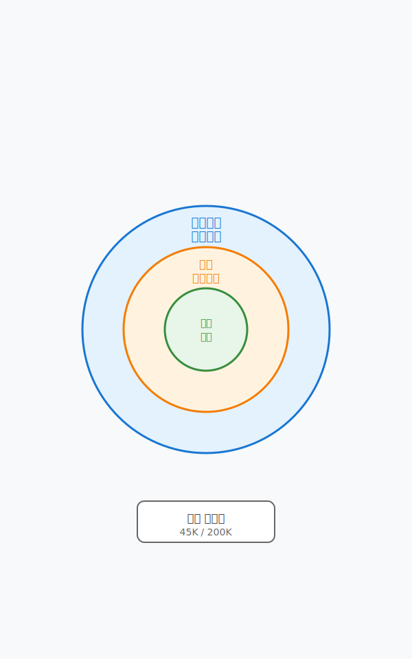

## 강의 목표

- CLAUDE.md 파일 작성법 이해
- 컨텍스트 관리 전략 습득
- Hooks와 Skills 활용
- MCP 서버 개발 원칙
- 엔터프라이즈급 자동화 구축

---

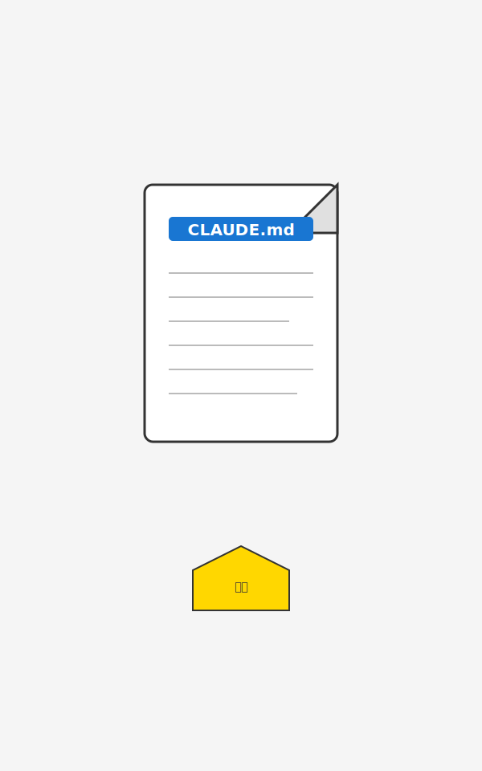

## CLAUDE.md: 에이전트의 헌법

**CLAUDE.md 파일의 역할**

- 에이전트의 행동 규칙 정의
- 도구 사용법 명시
- 프로젝트별 컨텍스트 제공
- 코딩 스타일 가이드

---

## CLAUDE.md 작성 원칙

| 원칙 | 설명 | 예시 |
|------|------|------|
| 간결성 | 핵심만 담기 | 200-500줄 권장 |
| 가드레일 우선 | 금지사항부터 | "절대 X하지 말 것" |
| 점진적 확장 | 필요시 추가 | 기본 → 고급 |
| 구체성 | 명확한 지시 | "2칸 들여쓰기 사용" |

---


## CLAUDE.md 구조 예시

```markdown
# 프로젝트 컨텍스트

## 디렉토리 구조
[프로젝트 구조 설명]

## 코딩 규칙
- 네이밍 컨벤션
- 들여쓰기 규칙
- 금지 패턴

## 작업 흐름
1. 계획 수립
2. 구현
3. 테스트
4. 커밋
```

---

## CLAUDE.md 실전 팁

**효과적인 작성 방법**

- 반복되는 실수를 문서화
- 프로젝트 특화 규칙 명시
- 외부 도구 사용법 안내
- 예시 코드 포함

**주의사항**

- 너무 길면 효과 감소
- 모호한 표현 지양
- 정기적 업데이트 필요

---

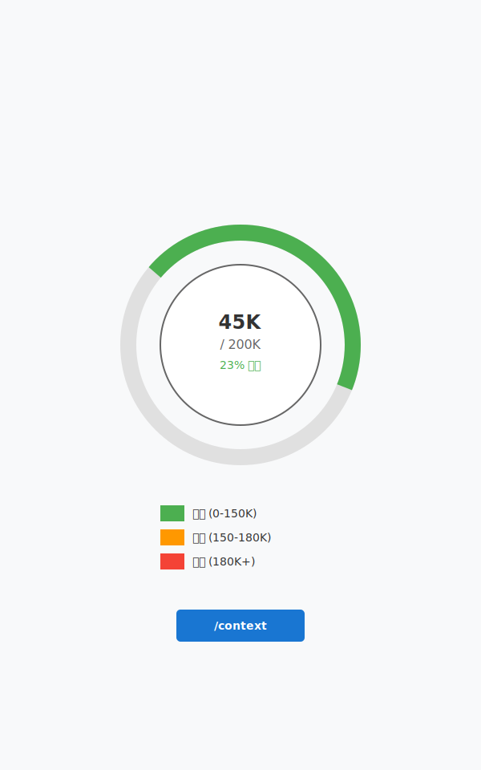

## 컨텍스트 관리 전략

**토큰 사용량 모니터링**

```bash
# 현재 컨텍스트 확인
/context

# 출력 예시
Token usage: 45231/200000
```

**목표: 200K 한도 내 효율적 작업**

---

## 컨텍스트 관리 명령어

| 명령어 | 용도 | 사용 시점 |
|--------|------|-----------|
| `/context` | 토큰 확인 | 수시로 |
| `/clear` | 세션 초기화 | 150K 이상 |
| `/catchup` | 요약 복원 | `/clear` 후 |
| `/compact` | 자동 압축 | ⚠️ 비권장 |

---

## 효과적인 세션 재시작

**추천 패턴: `/clear` + `/catchup`**

1. `/context`로 토큰 사용량 확인
2. 150K 근접 시 `/clear` 실행
3. `/catchup` 으로 진행상황 요약
4. 작업 재개

**`/compact` 회피 이유**

- 정보 손실 위험
- 예측 불가능한 동작
- 디버깅 어려움

---

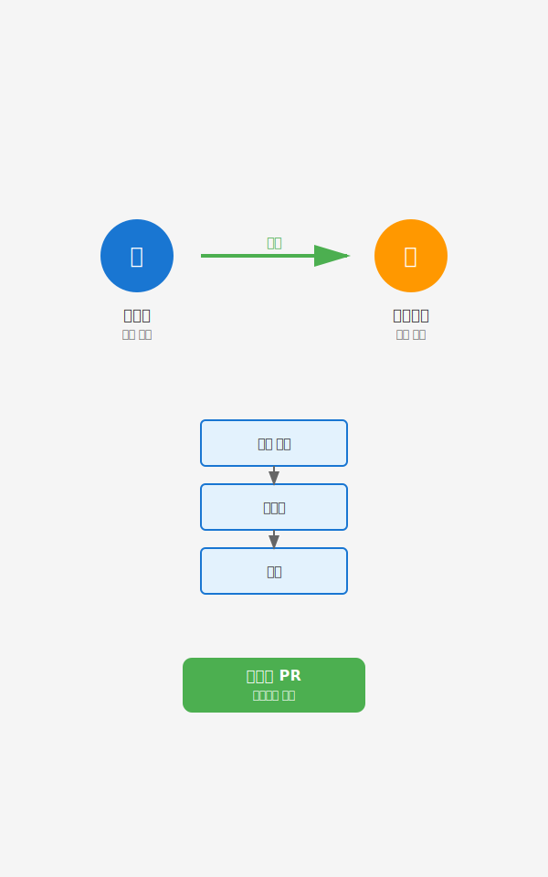

## "Shoot and Forget" 철학

**과정보다 결과 중심**

- 중간 과정 세세히 확인 ✗
- 최종 PR 품질로 판단 ✓
- 에이전트에 자율성 부여 ✓

**이점**

- 생산성 극대화
- 반복 작업 자동화
- 인간은 전략에 집중

---

## Hooks: 자동 검증 시스템

**Pre-commit Hook 예시**

```bash
# .claude/hooks/pre-commit
#!/bin/bash

# 린팅 검사
npm run lint || exit 1

# 테스트 실행
npm test || exit 1

echo "✓ 모든 검증 통과"
```

**작동 방식**: 커밋 직전 자동 실행, 실패 시 차단

---

## Hooks 활용 사례

| Hook 유형 | 검증 항목 | 효과 |
|-----------|----------|------|
| pre-commit | 린팅, 포맷 | 코드 품질 |
| pre-push | 테스트 통과 | 배포 안정성 |
| post-merge | 의존성 업데이트 | 환경 일관성 |

**설정 위치**: `.claude/hooks/` 디렉토리

---

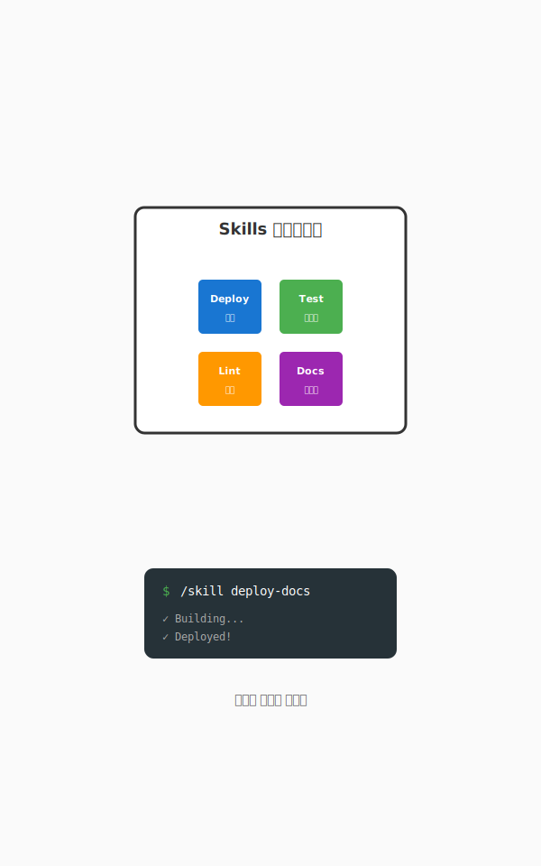

## Skills: 재사용 가능한 에이전트

**Skills의 개념**

- 스크립트 기반 자동화
- 공식화된 에이전트 모델
- 프로젝트 간 재사용 가능

**예시**

```bash
/skill deploy-docs
/skill run-e2e-tests
/skill generate-changelog
```

---

## Skills 작성 가이드

**기본 구조**

```yaml
# .claude/skills/deploy.yml
name: deploy-docs
description: 문서 사이트 배포
steps:
  - npm run build
  - npm run deploy
  - git tag v${version}
```

**장점**: 복잡한 워크플로우 단순화

---

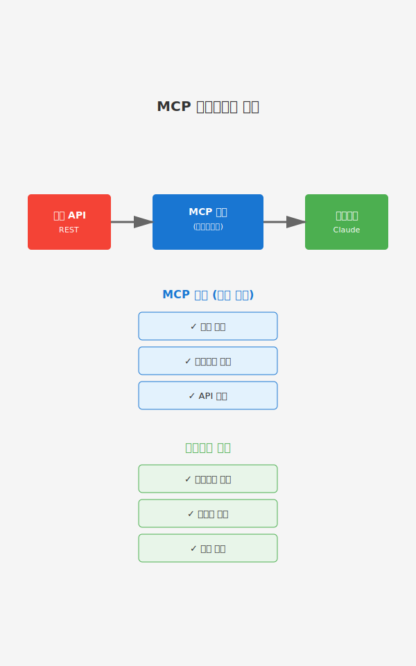

## MCP: Model Context Protocol

**전통적 접근 (✗)**

- REST API 전체 미러링
- 복잡한 비즈니스 로직 포함
- 유지보수 부담 증가

**현대적 접근 (✓)**

- 간결한 게이트웨이 역할
- 인증, 보안, 네트워킹만 처리
- 나머지는 에이전트에 위임

---

## MCP 서버 설계 원칙

**최소 책임 원칙**

| MCP 역할 | 에이전트 역할 |
|----------|--------------|
| 인증 토큰 관리 | 비즈니스 로직 |
| API 엔드포인트 접근 | 데이터 가공 |
| 네트워크 보안 | 결과 해석 |

**결과**: 단순하고 유지보수 쉬운 MCP

---

## MCP 서버 예시

**간결한 게이트웨이**

```python
# mcp_server.py
def get_user_data(token, user_id):
    """인증 및 API 호출만 담당"""
    headers = {"Authorization": f"Bearer {token}"}
    response = requests.get(
        f"https://api.example.com/users/{user_id}",
        headers=headers
    )
    return response.json()  # 원본 데이터 반환
```

**에이전트가 데이터 처리 담당**

---

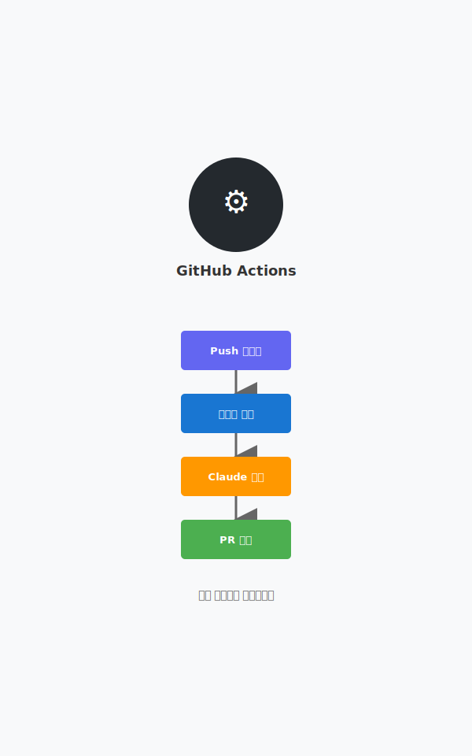

## GitHub Actions 통합

**맞춤형 자동화**

- PR 자동 생성 도구
- 코드 리뷰 자동화
- 배포 파이프라인

**데이터 기반 개선**

- 에이전트 성능 측정
- 반복 패턴 분석
- 지속적 최적화

---

## GitHub Actions 예시

```yaml
# .github/workflows/claude-pr.yml
name: Claude Auto PR
on:
  push:
    branches: [feature/*]
jobs:
  create-pr:
    runs-on: ubuntu-latest
    steps:
      - uses: actions/checkout@v2
      - name: Run Claude
        run: claude-code --auto-pr
      - name: Create PR
        run: gh pr create --auto
```

---

## 엔터프라이즈 규모 적용

**확장 전략**

1. 팀 전체 CLAUDE.md 공유
2. 공통 Hooks 저장소 구축
3. Skills 라이브러리 관리
4. MCP 서버 중앙화

**거버넌스**

- 버전 관리
- 접근 권한 통제
- 감사 로그 기록

---

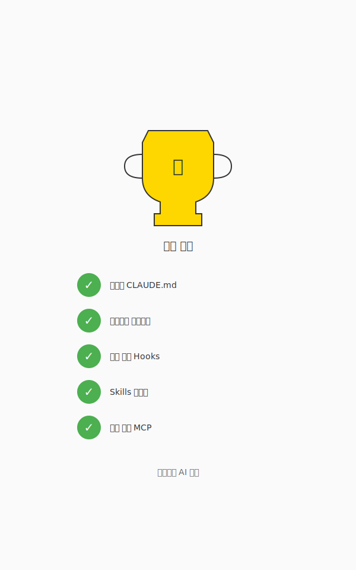

## 모범 사례 요약

| 영역 | 핵심 원칙 |
|------|----------|
| CLAUDE.md | 간결하게, 가드레일 우선 |
| 컨텍스트 | `/clear` + `/catchup` 패턴 |
| 위임 | "Shoot and Forget" |
| Hooks | 자동 검증, 실패 시 차단 |
| MCP | 최소 책임, 게이트웨이 역할 |

---

## 안티패턴 피하기

**피해야 할 실수**

- CLAUDE.md 너무 길게 작성
- `/compact`에 과도한 의존
- 에이전트 과정 세세히 관리
- MCP에 비즈니스 로직 포함
- 토큰 사용량 무시

**결과**: 효율성 저하, 오류 증가

---

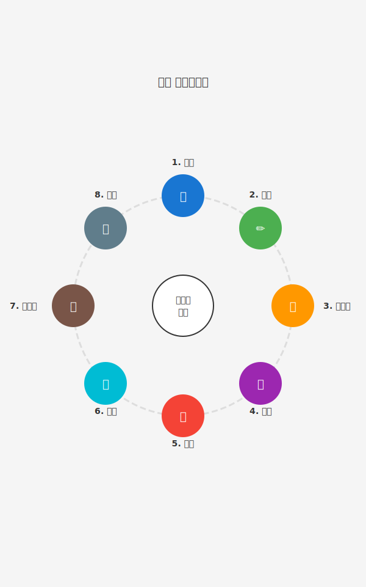

## 통합 워크플로우

**단계별 실전 적용**

1. **시작**: CLAUDE.md 작성
2. **작업**: 에이전트 위임
3. **검증**: Hooks 자동 실행
4. **관리**: 컨텍스트 모니터링
5. **확장**: Skills 재사용
6. **통합**: MCP 연결

---

## 실습: CLAUDE.md 작성

**과제**

1. 현재 프로젝트용 CLAUDE.md 초안 작성
2. 핵심 가드레일 3가지 정의
3. 디렉토리 구조 문서화
4. 코딩 규칙 명시

**검증**: Claude에게 CLAUDE.md 읽게 하고 반응 확인

---

## 실습: Hook 구현

**과제**

1. `.claude/hooks/pre-commit` 생성
2. 린팅 검사 추가
3. 실패 시 커밋 차단 구현
4. 성공 메시지 출력

**테스트**: 의도적으로 린팅 오류 만들어 차단 확인

---

## 실습: MCP 서버 설계

**과제**

1. 간단한 API 게이트웨이 설계
2. 인증 처리만 포함
3. 비즈니스 로직 제외
4. 원본 데이터 반환

**비교**: 기존 복잡한 래퍼와 비교 분석

---

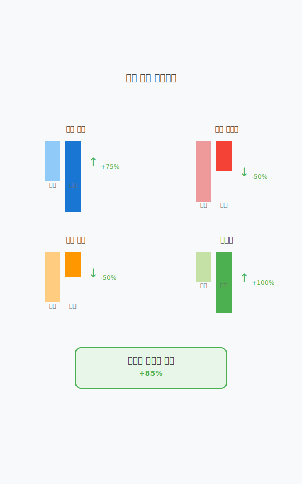

## 성과 측정

**측정 지표**

- 커밋 빈도 증가
- PR 리뷰 시간 감소
- 버그 발생률 저하
- 개발자 만족도 상승

**데이터 수집**: GitHub Actions, 로그 분석

---

## 지속적 개선

**피드백 루프**

1. 에이전트 행동 관찰
2. CLAUDE.md 업데이트
3. Hooks 개선
4. Skills 추가
5. 반복

**목표**: 팀에 최적화된 워크플로우

---

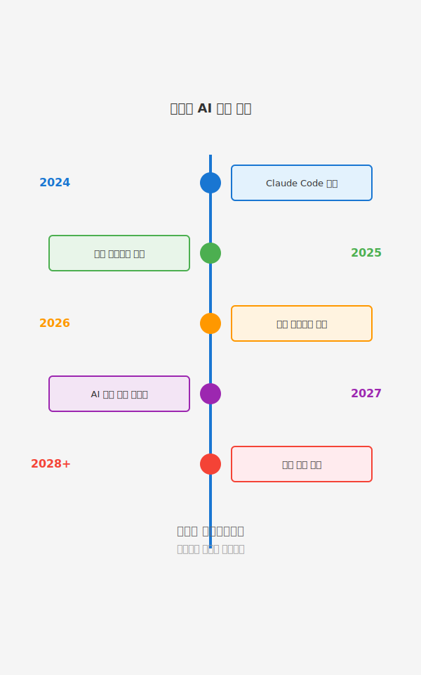

## 미래 전망

**발전 방향**

- 더 강력한 컨텍스트 관리
- 멀티 에이전트 협업
- 자율적 프로젝트 관리
- AI 코드 리뷰 고도화

**준비 사항**: 기본기 탄탄히, 자동화 습관화

---

## 학습 자료

**추천 리소스**

- Claude Code 공식 문서
- Anthropic 블로그
- 커뮤니티 사례 연구
- GitHub 예제 저장소

**실습**: 작은 프로젝트부터 시작

---

## 커뮤니티 참여

**지식 공유**

- CLAUDE.md 템플릿 공유
- Skills 라이브러리 기여
- MCP 서버 오픈소스화
- 블로그 포스팅

**혜택**: 집단 지성, 빠른 학습

---

## 질문과 답변

**자주 묻는 질문**

- Q: CLAUDE.md 얼마나 자주 업데이트?
  A: 반복 실수 발견 시마다

- Q: `/compact` 언제 사용?
  A: 가능한 사용하지 않기

- Q: MCP 개발 어려움?
  A: 최소 책임 원칙 지키면 쉬움

---

<!-- _class: lead -->

# 감사합니다

**실전에서 적용해보세요!**

다음 강의: 프로젝트별 심화 사례 연구
