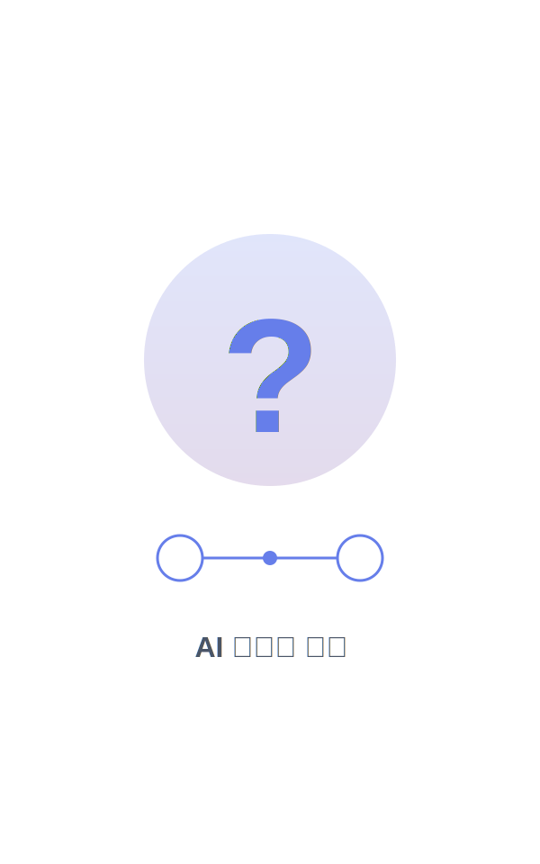
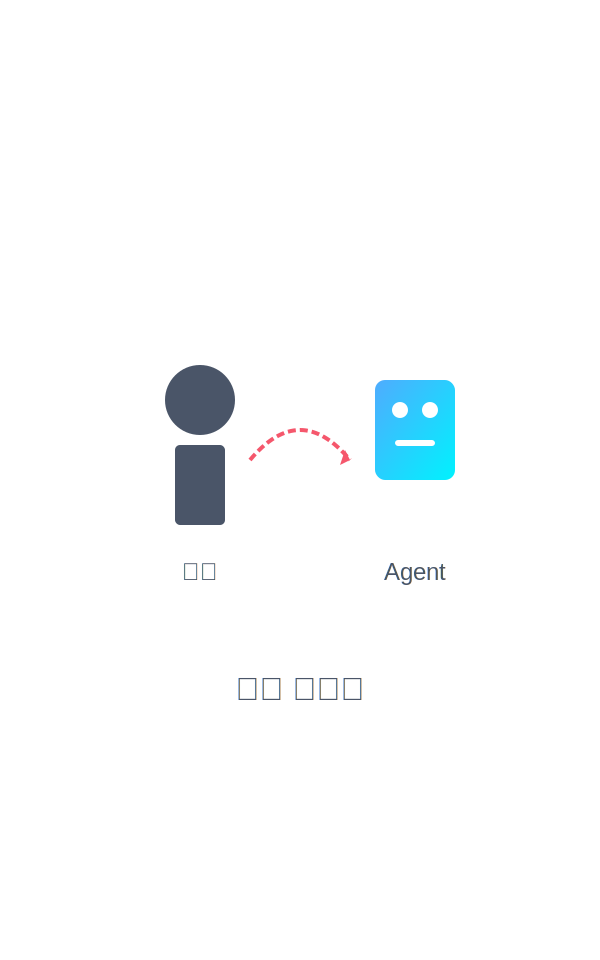
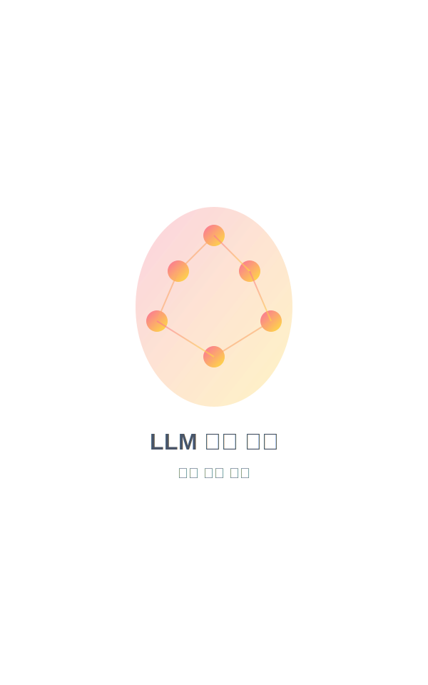
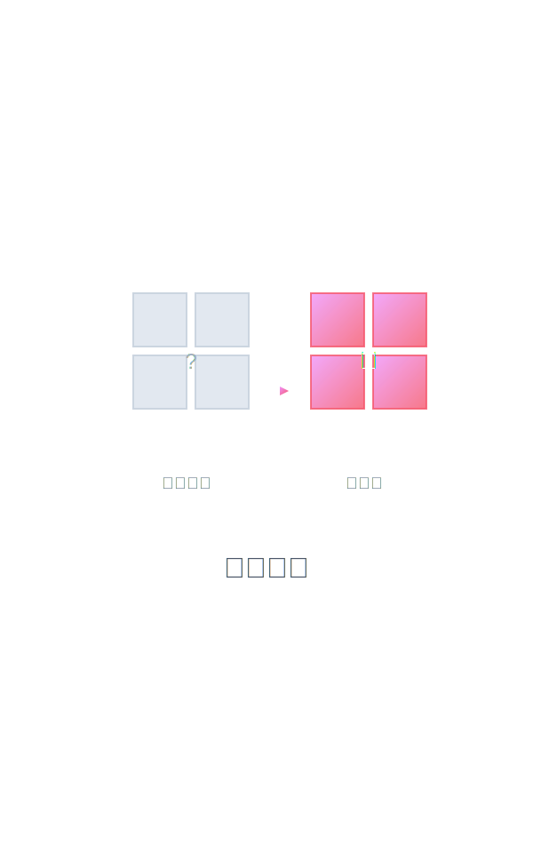
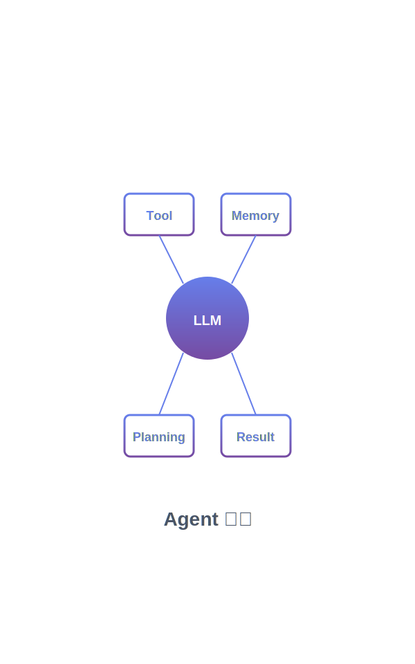
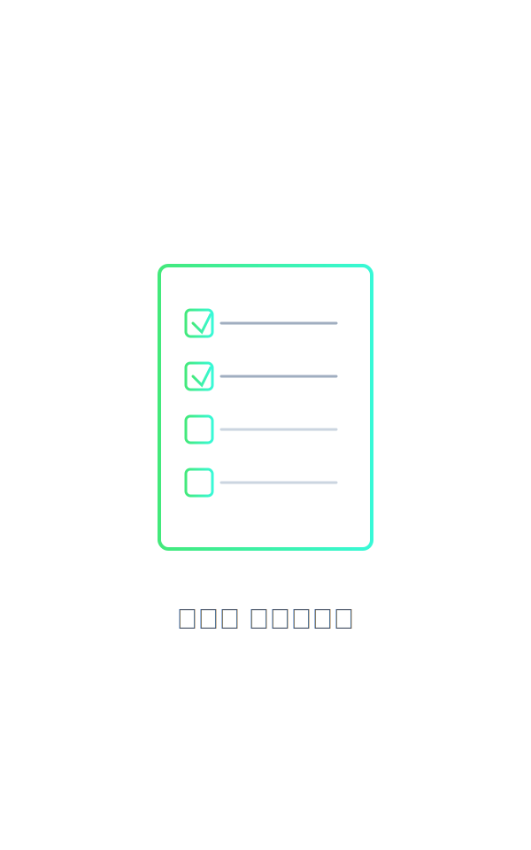
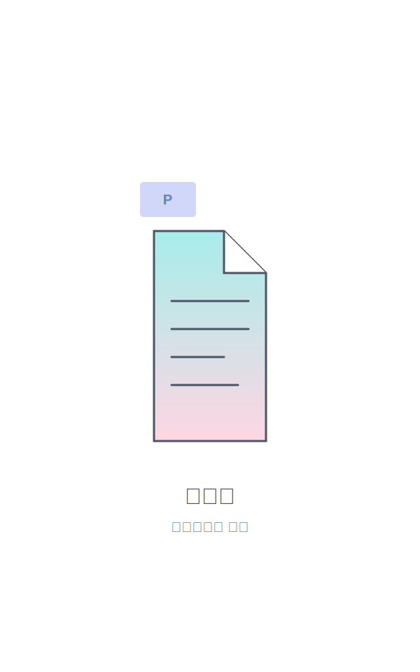
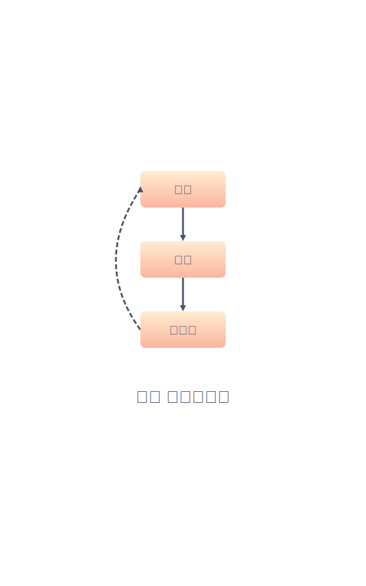
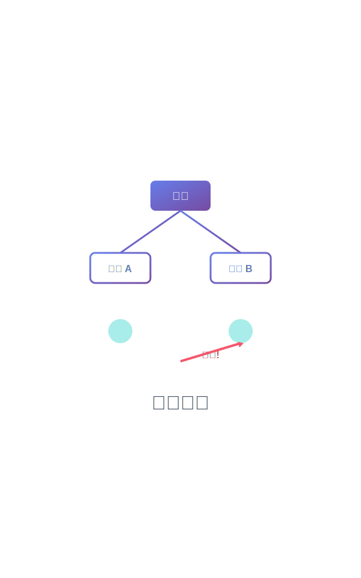

<style>
section {
  padding: 60px 80px;
}

section.lead {
  padding: 60px 80px;
}

/* 타이틀 -2pt, 본문 -1pt */
section h1 {
  font-size: 42px;
}

section h2 {
  font-size: 30px;
}

section h3 {
  font-size: 24px;
}

section p, section li {
  font-size: 23px;
}

section code {
  font-size: 20px;
}

section table {
  font-size: 20px;
}
</style>

<!-- _class: lead -->



# AI 에이전트로 자동화 시작하기

CLI 실습으로 배우는 기초 활용법

**키워드:** 선택, 계획, 문서화

---


# 질문: AI가 모든 것을 할 수 있다면?

- 글쓰기도 AI가
- 코딩도 AI가
- 분석도 AI가
- 디자인도 AI가

**그렇다면 인간에게 남는 것은?**

---


# 답: 선택

인간의 본질은 **선택하는 존재**

- 무엇을 할 것인가? (어떤 문제를 풀 것인가?)
- 왜 하는가? (어떤 가치를 추구할 것인가?)
- 책임질 수 있는가? (어떤 결과를 받아들일 것인가?)

**AI는 선택지를 제공, 선택은 당신의 몫**

---

# AI 시대의 고통

| 과거 | 현재 (AI 시대) |
|------|----------------|
| 정보 부족 | 정보 과잉 |
| 선택지 제한 | 무한한 선택지 |
| 실행이 어려움 | 실행은 쉬움 |
| **결정이 쉬움** | **결정이 어려움** |

더 많은 선택지 = 더 어려운 선택

→ **더 나은 선택을 위한 도구가 필요**

---



# Agent: 선택을 돕는 조력자

**Agent가 하는 일:**
- 정보 수집 및 정리
- 대안 비교 및 분석
- 결과 시뮬레이션

**당신이 하는 일:**
- **최종 결정**
- **가치 판단**
- **책임**

---

# 오늘의 세 가지 키워드

## 🎯 선택 (Choice)

AI 시대에도 인간의 역할은 최종 선택

## 📋 계획 (Planning)

컨텍스트를 채우는 것이 실행보다 중요

## 📝 문서화 (Documentation)

문서는 프로젝트의 진짜 결과물

---

# 오늘 배울 것

## 이론 (50%)

- LLM과 Agent의 작동 원리
- 왜 계획이 중요한가?
- 문서화의 가치

## 실습 (50%)

- Claude Code CLI 환경 세팅
- Plan 모드 활용
- Agent로 문서 만들기
- 의사결정 실습
- 종합 미니 프로젝트

---

# Part 1 정리

**핵심 메시지:**

AI가 모든 것을 할 수 있어도, 최종 선택은 당신의 몫입니다.

**오늘의 목표:**

더 나은 선택을 위해 Agent를 활용하는 방법을 배웁니다.

**다음 Part:**

LLM과 Agent는 어떻게 작동하는가?

---

<!-- _class: lead -->



# Part 2

LLM의 작동 원리와 한계 이해

---


# LLM은 정말 '생각'하는가?

**직관적 느낌:**
- 자연스러운 대화
- 복잡한 문제 해결
- 창의적인 제안

**실제로는:**
- 패턴 인식 기계
- 확률 기반 예측
- 학습 데이터의 통계적 조합

**중요:** 이해하고 쓰는 것 vs 모르고 쓰는 것

---

# LLM의 작동 방식

| 개념 | 설명 |
|------|------|
| **토큰** | 단어/문자 단위. "안녕하세요" → 3-4 토큰 |
| **확률 예측** | "날씨가 ___" → 좋다(40%), 맑다(25%), 흐리다(20%) |
| **컨텍스트** | Claude 약 200K 토큰 (영문 15만 단어) |

**핵심:** 다음 단어를 확률로 예측하는 패턴 인식 기계

---



# 컨텍스트의 중요성

## 같은 질문, 다른 답변

**컨텍스트 없음:**
"함수 만들어줘" → ???

**컨텍스트 있음:**
"Python으로 두 수를 더하는 함수를 만들어줘" → ✓

## LLM의 특성

비어있는 컨텍스트를 자기가 알아서 채움
→ 예상치 못한 결과

**핵심:** 컨텍스트를 명확히 제공해야 함

---



# Agent 구조

## LLM (Large Language Model)

핵심 언어 처리 엔진

## Tool (도구)

파일 읽기/쓰기, 코드 실행, 검색 등

## Memory (기억)

대화 히스토리, 컨텍스트 유지

## Planning (계획)

작업 분해, 단계별 실행

**Agent = LLM + Tools + Memory + Planning**

---

# Claude Code CLI의 특별함

| 일반 Chatbot | Claude Code CLI |
|-------------|-----------------|
| 대화만 가능 | 파일 읽기/쓰기 |
| 정보만 제공 | 실제 작업 수행 |
| 단발성 | 지속적 컨텍스트 |
| 계획 없음 | **Plan 모드** |

## Plan 모드의 힘

1. 작업 이해 및 분석
2. 단계별 계획 수립
3. 사용자 확인
4. 실행

**→ 예측 가능하고 안전한 자동화**

---

# LLM과 Agent의 한계

## 환각 (Hallucination)

없는 정보를 그럴듯하게 만들어냄

## 일관성

같은 질문에 다른 답변

## 컨텍스트 제약

200K 토큰 한도 (대용량 프로젝트 어려움)

## 최신 정보 부족

학습 데이터 기준 이후 정보 모름

**→ 항상 검증하고, 확인하고, 테스트하기**

---

# Part 2 정리

**핵심 메시지:**

1. LLM은 '생각'하지 않음, 패턴 인식 기계
2. 컨텍스트가 핵심 - 비어있으면 예측 불가
3. Agent = LLM + Tools + Memory + Planning
4. Claude Code CLI의 Plan 모드가 강력함
5. 한계를 인정하고 검증 필수

**다음 Part:**

계획: 컨텍스트를 채우는 기술 + 실습

---

<!-- _class: lead -->



# Part 3

계획: 컨텍스트를 채우는 기술

**키워드: 계획**

---


# 왜 계획이 결과보다 중요한가?

## LLM의 특성

비어있는 컨텍스트를 채우는 능력

## 문제

컨텍스트가 비어있으면 → LLM이 임의로 채움 → 예측 불가능

## 해결

**계획으로 컨텍스트를 미리 채운다**

→ 명확한 계획 = 명확한 결과

---

# 비어있는 컨텍스트의 문제

| 모호한 지시 | 비어있는 것 | 결과 |
|------------|------------|------|
| "웹사이트 만들어줘" | 기술/기능/디자인/대상 | 매번 다른 결과 |
| "함수 리팩토링해줘" | 어떤 함수/왜/어떻게 | 의도와 다름 |
| "보고서 작성해줘" | 형식/내용/분량/목적 | 엉뚱한 문서 |

**핵심:** LLM은 비어있는 부분을 임의로 채움 → 예측 불가

---

# 나쁜 계획 vs 좋은 계획

| 나쁜 계획 | 좋은 계획 |
|----------|----------|
| "웹사이트 만들어줘" | "React로 할일 관리 웹앱 만들어줘. 기능: 추가/삭제/완료. 스타일: 미니멀. 저장: localStorage" |
| "보고서 작성해줘" | "주간 보고서 작성. 포함: 1) 완료 작업 2) 다음 주 계획 3) 이슈. 형식: 마크다운, 1페이지" |
| "코드 리팩토링" | "auth.js 로그인 함수 리팩토링. 목표: 1) 에러 핸들링 2) async/await 3) 주석. API 호환성 유지" |

**차이점:** 구체성, 단계, 검증 가능성

---


# Claude Code의 Plan 모드

## 일반 모드

즉시 실행 → 빠르지만 위험할 수 있음

## Plan 모드

1. 작업 분석
2. 단계별 계획 수립
3. **사용자 확인**
4. 승인 후 실행

**장점:** 예측 가능, 안전, 학습 효과

---

# 실습 1: Claude Code CLI 환경 세팅

## 설치 (Node.js 필요)

```bash
npm install -g @anthropic/claude-code
```

## 초기화

```bash
claude-code init
```

## 실행

```bash
claude-code
```

**함께 따라해봅시다!**

---

# 실습 2: Plan 모드로 계획 세우기

## 시나리오

간단한 할일 관리 앱 만들기

## 실습 과정

1. Claude Code 실행
2. `/plan` 명령어 입력
3. 작업 요청:

```
간단한 할일 관리 앱을 만들어줘.
- HTML 파일 하나
- CSS 스타일링
- JavaScript로 추가/삭제 기능
```

4. Agent의 계획 확인
5. 승인 또는 수정

---

# 좋은 계획의 세 가지 조건

| 조건 | 나쁜 예 | 좋은 예 |
|------|---------|---------|
| **구체성** | "예쁘게 만들어줘" | "미니멀 디자인, 흰색 배경, 파란색 버튼" |
| **단계성** | "프로젝트 완성해줘" | "1)파일구조 2)기본기능 3)스타일 4)테스트" |
| **검증성** | "잘 동작하게 해줘" | "버튼 클릭 시 항목 추가, 삭제 동작" |

**핵심:** 명확하고, 단계적이고, 확인 가능하게

---

# 실습 3: 계획 비교 실습

## 나쁜 지시

```
README 파일 만들어줘
```

## 좋은 지시

```
프로젝트 README.md를 만들어줘.

포함 내용:
1. 프로젝트 제목 및 설명
2. 설치 방법
3. 사용 방법
4. 라이선스

형식: 마크다운, 한글
```

**실제로 두 가지를 실행해서 결과 비교해봅시다**

---

# 계획 체크리스트

작업을 요청하기 전에 확인하세요:

| 항목 | 질문 |
|------|------|
| **구체성** | 모호한 표현이 없는가? |
| **기술 스택** | 사용할 도구/언어를 명시했는가? |
| **범위** | 어디까지 할 것인지 명확한가? |
| **형식** | 결과물의 형태가 명확한가? |
| **제약사항** | 지켜야 할 규칙이 있는가? |
| **검증** | 성공 여부를 어떻게 확인하나? |

**Plan 모드를 활용하면 Agent가 함께 체크해줍니다**

---

# Part 3 정리

**핵심 메시지:**

1. 계획으로 컨텍스트를 채워야 함
2. 비어있는 컨텍스트 = 예측 불가능한 결과
3. 좋은 계획의 조건: 구체성, 단계성, 검증성
4. Claude Code의 Plan 모드가 도와줌

**실습 완료:**
- CLI 환경 세팅 ✓
- Plan 모드 체험 ✓
- 계획 비교 실습 ✓

**다음 Part:**

문서화: 프로젝트의 진짜 결과물

---

<!-- _class: lead -->



# Part 4

문서화: 프로젝트의 진짜 결과물

**키워드: 문서화**

---


# 왜 문서화는 실패하는가?

## 전통적인 문제

| 문제 | 설명 |
|------|------|
| ⏰ 시간 부족 | 개발도 바쁜데 문서까지? |
| 💰 비용 과다 | 문서 작성 = 개발 시간의 30-50% |
| 📉 우선순위 밀림 | 동작하는 코드가 먼저 |
| 😫 작성 귀찮음 | 반복적이고 지루한 작업 |

## 결과

인수인계 실패, 컨텍스트 손실, 중복 작업, 품질 저하

---

# Agent가 바꾸는 문서화의 경제학

| 과거 | Agent 시대 |
|------|------------|
| 문서 작성 = 높은 비용 | 문서 작성 = 낮은 비용 |
| 개발자가 직접 작성 | Agent가 자동 생성 |
| 유지보수 어려움 | 지속적 업데이트 쉬움 |
| 문서 vs 코드 우선순위 | 문서 = 코드 동등 |

**핵심 변화:**

이제는 비용 때문이 아니라 **비전 때문에** 문서를 만듭니다

---


# 문서는 프로젝트의 진짜 결과물

## 코드만 있는 프로젝트

- 동작은 하지만 이해 불가
- 인수인계 실패
- 확장 어려움
- 유지보수 비용 증가

## 코드 + 문서가 있는 프로젝트

- 동작 + 이해 가능
- 원활한 협업
- 지속 가능한 성장
- 새 팀원 빠른 적응

**문서 = 프로젝트의 지식 자산**

---

# 실습 4: README.md 자동 생성

**시나리오:** 할일 관리 앱의 README.md 작성

**Agent에게 요청:**

```
todo-app 프로젝트의 README.md를 작성해줘.
포함: 소개, 파일구조, 기능, 사용법, 기술스택
형식: 마크다운, 한글, 간결하게
```

**→ Agent가 코드 분석하고 자동으로 README 생성**

---

# 실습 5: 프로젝트 상태 문서화

## 시나리오

주간 프로젝트 상태 보고서

## 실습 과정

```
이번 주 작업 내용을 정리한 보고서를 작성해줘.

포함 내용:
1. 완료한 작업 (구체적으로)
2. 진행 중인 작업
3. 다음 주 계획
4. 이슈 및 해결 방안

형식: 마크다운, 1페이지 이내
```

**정기적인 문서화를 Agent가 도와줌**

---



# CLAUDE.md 입문

## CLAUDE.md란?

Agent에게 프로젝트 컨텍스트를 제공하는 파일

## 포함 내용

- 프로젝트 개요
- 디렉토리 구조
- 코딩 규칙
- 작업 흐름
- 주의사항

## 효과

Agent가 프로젝트를 이해하고 일관된 작업 수행

**→ 팀 전체가 같은 컨텍스트 공유**

---


# 문서 중심 워크플로우

## 전통적 방식

코드 작성 → 테스트 → (문서 작성 건너뜀)

## 새로운 방식

1. **문서 작성** (계획, 설계)
2. **코드 작성** (구현)
3. **테스트** (검증)
4. **문서 업데이트** (결과 반영)

**문서가 프로젝트를 이끕니다**

---

# 실습 6: 나만의 CLAUDE.md 작성

## 시나리오

현재 프로젝트를 위한 기본 CLAUDE.md

## 실습 과정

```
프로젝트 루트에 CLAUDE.md를 만들어줘.

포함 내용:
1. 프로젝트 개요 (todo-app)
2. 디렉토리 구조
3. 파일 설명
4. 개발 규칙 (간단하게)

형식: 마크다운, 읽기 쉽게
```

**프로젝트마다 CLAUDE.md를 만드는 습관**

---

# 문서화 실천 가이드

| 단계 | 문서 | 내용 |
|------|------|------|
| **시작** | README.md | 프로젝트 소개, 설치, 사용법 |
| | CLAUDE.md | Agent용 컨텍스트 |
| **진행** | 주간 보고서 | 진행 상황, 이슈 |
| | 회의록 | 결정 사항, 액션 아이템 |
| **완료** | 최종 보고서 | 결과, 학습, 개선점 |
| | 아카이브 | 모든 문서 정리 |

---

# Part 4 정리

**핵심 메시지:**

1. 문서화는 비용 문제가 아니라 비전 문제
2. Agent가 문서화의 경제학을 바꿈
3. 문서는 프로젝트의 진짜 결과물
4. CLAUDE.md로 Agent에게 컨텍스트 제공
5. 문서 중심 워크플로우가 프로젝트를 이끔

**실습 완료:**
- README.md 자동 생성 ✓
- 프로젝트 상태 문서화 ✓
- CLAUDE.md 작성 ✓

**다음 Part:**

선택: Agent와 함께 더 나은 결정하기

---

<!-- _class: lead -->



# Part 5

선택: Agent와 함께 더 나은 결정하기

**키워드: 선택**

---


# 선택 과정에서 Agent의 역할

## Agent가 도와주는 것

| 단계 | Agent의 역할 |
|------|-------------|
| **정보 수집** | 다양한 옵션 조사 |
| **비교 분석** | 장단점 정리 |
| **결과 예측** | 시나리오 시뮬레이션 |
| **문서화** | 결정 근거 기록 |

## 당신이 하는 것

**최종 결정, 가치 판단, 책임**

---

# 실습 7: 의사결정 실습

## 시나리오

새 프로젝트의 기술 스택 선택하기

**상황:**
- 간단한 블로그 플랫폼 개발
- 빠른 개발 속도 필요
- 유지보수 용이성 중요
- 팀은 JavaScript에 익숙

**고민:**
React vs Vue vs Svelte?

**목표:**
Agent를 활용해 정보를 모으고, 최종 선택은 내가 한다

---

# Agent에게 정보 요청

## 요청 예시

```
블로그 플랫폼 개발을 위한 프론트엔드 프레임워크를
선택하려고 합니다.

React, Vue, Svelte를 비교해주세요.

비교 기준:
1. 학습 곡선
2. 개발 속도
3. 커뮤니티 규모
4. 성능
5. 유지보수 용이성

각 항목을 표로 정리하고,
우리 상황 (JavaScript 팀, 빠른 개발, 간단한 블로그)에
어떤 것이 적합한지 의견을 제시해주세요.
```

---


# Agent의 분석과 나의 선택

## Agent가 제공하는 것

- 각 프레임워크의 특징
- 비교표
- 우리 상황에 맞는 추천

## 내가 고려하는 것

- 팀의 실제 역량
- 프로젝트 장기 비전
- 리스크 감수 의지
- 기업 문화 fit

**→ 최종 선택은 나의 몫**

---

# Agent는 도구, 결과는 당신의 몫

## 잘못된 사용

❌ "Agent가 추천한 거니까 그냥 선택"
❌ "결과가 안 좋으면 Agent 탓"
❌ "생각 없이 전부 맡김"

## 올바른 사용

✅ "Agent의 정보를 참고해서 내가 판단"
✅ "여러 옵션을 검토하고 책임지고 선택"
✅ "Agent는 조력자, 나는 의사결정자"

**책임은 항상 사용자에게**

---


# 선택의 책임

## AI 시대의 진실

더 좋은 도구 ≠ 더 쉬운 선택

더 많은 정보 = 더 큰 책임

## 당신의 역할

- 가치 판단
- 우선순위 설정
- 트레이드오프 결정
- 결과에 대한 책임

**Agent는 당신의 선택을 돕지만, 대신하지 않습니다**

---

# 미래의 작업 방식: Human in the loop

## 순환 구조

```
1. 인간: 문제 정의 및 선택
   ↓
2. Agent: 계획 수립
   ↓
3. 인간: 계획 검토 및 승인
   ↓
4. Agent: 실행 및 문서화
   ↓
5. 인간: 결과 검증 및 선택
   ↓
(반복)
```

**핵심:** 인간이 루프 안에 항상 존재

---

# Part 5 정리

**핵심 메시지:**

1. Agent는 정보 제공, 선택은 인간의 몫
2. 정보 수집/비교/분석은 Agent가 도와줌
3. 최종 결정과 책임은 항상 당신에게
4. Human in the loop: 인간이 루프의 중심

**실습 완료:**
- 의사결정 실습 (기술 스택 선택) ✓

**다음 Part:**

종합 실습 - 선택·계획·문서화 전체 사이클

---

<!-- _class: lead -->


# Part 6

종합 실습 및 정리

선택 → 계획 → 문서화 전체 사이클

---


# 종합 실습: 전체 워크플로우 체험

## 시나리오

개인 포트폴리오 웹사이트 만들기

## 목표

오늘 배운 세 가지 키워드를 모두 적용

1. **선택**: 어떤 웹사이트를 만들 것인가?
2. **계획**: 어떻게 만들 것인가?
3. **문서화**: 결과를 어떻게 기록할 것인가?

---

# 실습 8 - 1단계: 선택

## Agent에게 요청

```
개인 포트폴리오 웹사이트를 만들려고 합니다.

다음 옵션을 비교해주세요:
1. 단순 HTML/CSS/JS (정적)
2. React 기반 SPA
3. Next.js 기반 SSG

비교 기준:
- 구현 난이도
- 배포 방식
- SEO
- 유지보수

초보자가 하루 안에 완성할 수 있는 것을 추천해주세요.
```

**→ Agent의 분석 확인 → 내가 선택**

---

# 실습 8 - 2단계: 계획

## Plan 모드 활용

```
/plan

선택한 방식으로 포트폴리오 웹사이트를 만들어줘.

요구사항:
- 메인 페이지 (자기소개)
- 프로젝트 목록 페이지
- 연락처 페이지
- 반응형 디자인
- 깔끔한 스타일

단계별 계획을 세워주세요.
```

**→ Agent의 계획 검토 → 승인**

---

# 실습 8 - 3단계: 실행

## Agent가 작업 수행

1. 파일 구조 생성
2. HTML 파일 작성
3. CSS 스타일링
4. JavaScript 인터랙션
5. 테스트

## 중간 확인

- 각 단계마다 결과 확인
- 수정 사항 있으면 피드백
- Agent가 반영하여 재작업

---

# 실습 8 - 4단계: 문서화

## README.md 생성

```
포트폴리오 웹사이트의 README.md를 작성해줘.

포함:
1. 프로젝트 소개
2. 파일 구조
3. 로컬에서 실행하는 방법
4. 배포 방법
5. 커스터마이징 가이드
```

## CLAUDE.md 업데이트

프로젝트 컨텍스트 추가

---

# 실습 8 - 5단계: 검증 및 회고

## 검증

- 모든 페이지 동작 확인
- 반응형 테스트
- 브라우저 호환성

## 회고 문서 작성

```
이번 프로젝트의 회고 문서를 작성해줘.

포함:
1. 무엇을 만들었나
2. 어떤 과정을 거쳤나
3. 잘한 점
4. 개선할 점
5. 배운 것
```

---


# 회고: 선택

## 오늘 우리가 한 선택들

- 어떤 도구를 쓸 것인가 (Agent)
- 어떤 기술 스택을 쓸 것인가
- 어떤 기능을 구현할 것인가
- 어떤 디자인을 적용할 것인가

## 배운 것

Agent는 정보를 주지만, **선택은 내가** 한다

선택에는 **책임**이 따른다

---


# 회고: 계획

## 오늘 우리가 세운 계획들

- 명확한 요구사항 정의
- 단계별 작업 분해
- Plan 모드로 Agent와 협의

## 배운 것

**컨텍스트를 채우면** 결과가 명확해진다

좋은 계획 = 구체성 + 단계성 + 검증성

---


# 회고: 문서화

## 오늘 우리가 만든 문서들

- README.md (프로젝트 소개)
- CLAUDE.md (Agent용 컨텍스트)
- 프로젝트 회고 (학습 기록)

## 배운 것

**문서는 프로젝트의 진짜 결과물**

Agent 덕분에 문서화가 쉬워졌다

---

# 다음 단계 학습 로드맵

| 기간 | 목표 |
|------|------|
| **단기 (1-2주)** | 매일 작은 실습, Plan 모드 익히기, CLAUDE.md 습관화 |
| **중기 (1-2개월)** | 실제 업무 적용, 문서 워크플로우, 팀 공유 |
| **장기 (3개월+)** | Lecture 06 학습, Hooks/Skills/MCP, 자동화 구축 |

---

# 추천 실습 과제

## 과제 1: 일상 자동화

매주 반복하는 작업을 Agent로 자동화

예: 주간 보고서, 회의록, 데이터 정리

## 과제 2: 미니 프로젝트

관심 있는 주제로 작은 프로젝트 진행

선택 → 계획 → 실행 → 문서화 전체 사이클

## 과제 3: CLAUDE.md 컬렉션

다양한 프로젝트의 CLAUDE.md 작성 및 비교

어떤 컨텍스트가 효과적인지 학습

---

# Part 6 정리

**오늘의 여정:**

1. AI 시대, 선택의 중요성 이해
2. LLM과 Agent 작동 원리 학습
3. 계획으로 컨텍스트 채우기
4. Agent로 문서화 자동화
5. 의사결정에서 Agent 활용
6. 전체 워크플로우 종합 실습

**핵심 메시지:**

**선택**하고, **계획**하고, **문서화**하세요.
그것이 AI 시대를 준비하는 방법입니다.

---

<!-- _class: lead -->

# 핵심 메시지

**AI가 모든 것을 할 수 있어도,**
**선택은 당신의 몫입니다.**

**더 나은 선택을 위해**
**Agent를 활용하세요.**

**선택하고, 계획하고, 문서화하세요.**
**그것이 AI 시대를 준비하는 방법입니다.**

---

# 질문과 답변

## 궁금한 점이 있으신가요?

- Agent 사용법
- 실습 내용
- 다음 학습 방향
- 실전 적용 사례
- 기타 등등

**자유롭게 질문해주세요!**

---

<!-- _class: lead -->

# 감사합니다

**AI 에이전트로 자동화 시작하기**
**CLI 실습으로 배우는 기초 활용법**

**키워드:** 선택, 계획, 문서화

---

**다음 강의:**
Lecture 06 - Claude Code 고급 활용법

**연락처:**
[여기에 연락처 정보]
