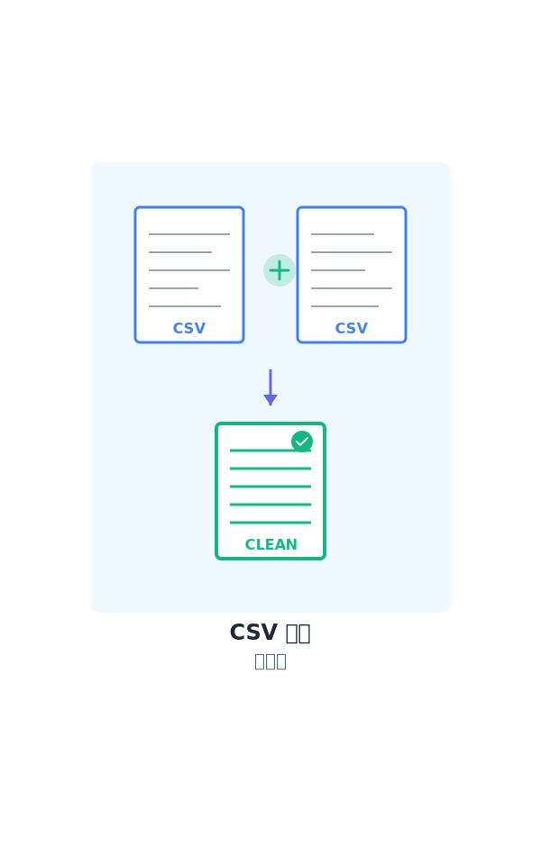
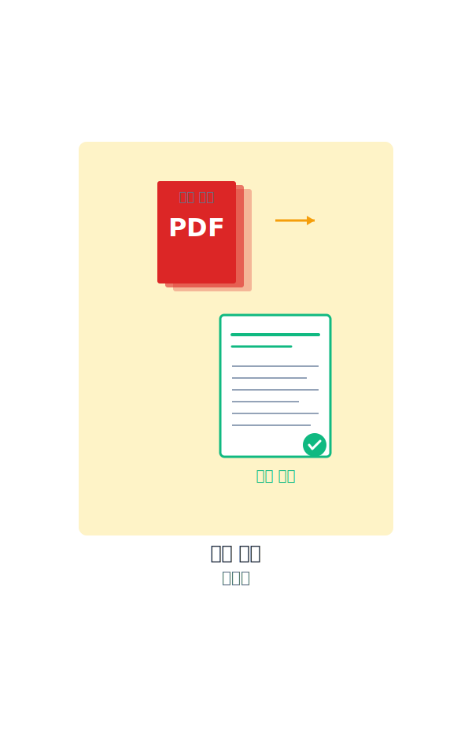
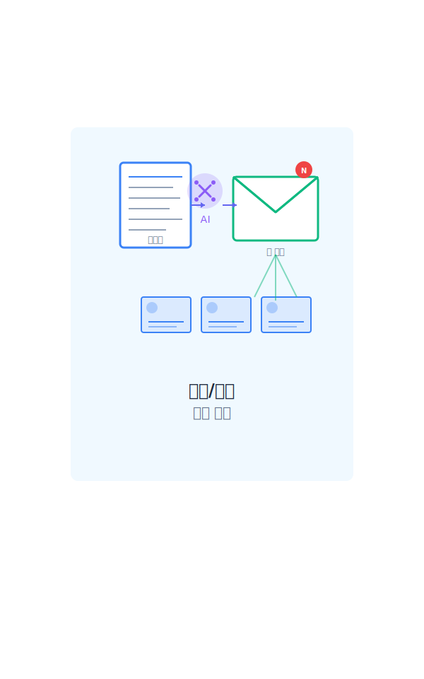
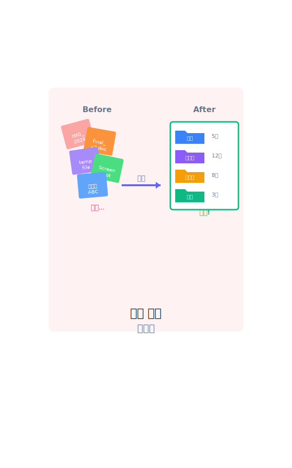

<style>
section {
  padding: 60px 80px;
}

section.lead {
  padding: 60px 80px;
}
</style>

<!-- _class: lead -->

# AI 에이전트 해커톤
## 실무 자동화 실습

---

# 오늘 할 일

4가지 실무 자동화 과제를 AI 에이전트로 해결하기

| 실습 | 주제 | 난이도 | 소요시간 |
|------|------|--------|----------|
| 1 | CSV/엑셀 정리 자동화 | ⭐⭐ | 20-30분 |
| 2 | 문서 요약 및 통합 | ⭐⭐ | 20-30분 |
| 3 | 메일/공지 자동 생성 | ⭐⭐⭐ | 25-35분 |
| 4 | 파일 정리 자동화 | ⭐⭐⭐ | 30-40분 |

---

# 실습 목표

## 이런 반응을 이끌어내는 것

- "어? 이거 원래 내가 1시간 걸리던 건데...?"
- "회사에서 바로 써먹을 수 있겠는데?"
- "이거 우리 팀에도 적용하면 좋겠다!"

**핵심:** 비개발자도 감탄할 만한 실용적인 자동화

---

# 실습 환경 준비

## 필요한 것

1. Claude Code (또는 다른 AI 코딩 도구)
2. 샘플 파일 (제공됨)
3. 텍스트 에디터 / 터미널

## 작업 폴더

```bash
cd lectures/lecture-08-hackathon-practice/samples
ls -R
```

---



# 실습 1
## CSV/엑셀 정리 자동화

**문제 상황:**
- 3개월치 매출 데이터가 파일별로 따로따로
- 날짜 포맷 제각각
- 금액에 "원", "₩", 쉼표 섞여있음
- 컬럼명도 다 다름

**목표:** 깔끔하게 통합된 하나의 파일

---

# 실습 1: 과제

## 1단계 - 기본 통합
- 3개 파일 하나로 합치기
- 날짜 포맷 통일 (YYYY-MM-DD)
- 금액에서 특수문자 제거
- 컬럼명 통일

## 2단계 - 데이터 정제
- 중복 데이터 제거
- 전화번호 포맷 통일
- 등급별 정렬

## 3단계 - 요약 생성
- 담당자별 매출 합계
- 제품별 판매량
- 월별 매출 추이

---

# 실습 1: 프롬프트 예시

```
samples/practice-01-csv/ 폴더에 있는
sales_jan.csv, sales_feb.csv, sales_mar.csv 파일을 읽어서:

1. 컬럼명을 통일 (날짜, 제품명, 수량, 금액, 담당자)
2. 날짜 포맷을 YYYY-MM-DD로 통일
3. 금액에서 "원", "₩", 쉼표 제거하고 숫자만
4. 세 파일을 하나로 합치기
5. 결과를 sales_combined.csv로 저장

완료되면 어떤 작업을 했는지 요약해줘.
```

**핵심:** 구체적으로, 단계별로, 결과물 명시

---

# 실습 1: 체크포인트

완성했다면 확인할 것:

- [ ] 세 파일이 하나로 통합되었는가?
- [ ] 날짜가 모두 같은 형식인가?
- [ ] 금액이 순수 숫자로만 표시되는가?
- [ ] 중복 행이 제거되었는가?
- [ ] 요약 통계가 정확한가?

**Tip:** 결과 파일을 엑셀로 열어서 육안 확인!

---



# 실습 2
## 문서 요약 및 통합

**문제 상황:**
- 보고서 PDF 3개
- 각각 다른 팀에서 작성
- 경영진은 "요약본" 원함
- 표 데이터도 추출 필요

**목표:** 통합 요약본 + CSV 추출

---

# 실습 2: 과제

## 1단계 - 개별 요약
- 영업 보고서 요약
- 핵심 수치 추출
- 액션 아이템 정리

## 2단계 - 통합 요약
- 여러 보고서 비교
- 공통 주제 도출
- 통합 리포트 생성

## 3단계 - 표 추출
- PDF 안의 표를 CSV로
- 금액 계산 검증

---

# 실습 2: 프롬프트 예시

```
samples/practice-02-pdf/report1.txt 파일을 읽고
다음 형식으로 요약해줘:

## 보고서 요약
**작성자:**
**보고 기간:**

**핵심 내용 (3-5줄):**

**주요 수치:**
-

**액션 아이템:**
-

결과를 report1_summary.md로 저장해줘.
```

---

# 실습 2: 기대 결과

```markdown
# 2024년 1분기 통합 보고서

## 팀별 요약

### 영업팀
- 총 매출: 15억원 (목표 대비 120%)
- 신규 고객: 45개사

### 개발팀
- 완료 프로젝트: 2건
- 진행 중: 2건 (AI 챗봇 75%, 결제 시스템 60%)

## 공통 이슈
- 2분기 목표 상향 조정 필요
- 인력 충원 계획 수립 중
```

---



# 실습 3
## 메일/공지 자동 생성

**문제 상황:**
- 회의록이 있는데 공지 메일 써야 함
- 프로젝트 현황을 경영진에게 보고
- 신제품 출시 공지 작성

**목표:** 받는 사람에 맞는 톤으로 자동 작성

---

# 실습 3: 과제

## 1단계 - 회의록 → 공지
- 회의 핵심 요약
- 담당자별 액션 아이템
- 일정 정보 포함

## 2단계 - 현황 → 경영진 보고
- 핵심만 간결하게
- 숫자 명확히
- 이슈 + 해결책

## 3단계 - 상품 → 마케팅 공지
- 매력적인 카피
- 특징 강조
- 행동 유도

---

# 실습 3: 프롬프트 예시

```
samples/practice-03-email/meeting_notes.txt 파일을 읽고:

팀 공지 메일을 작성해줘.

제목: [팀 공지] 주간 회의 액션 아이템 (3/15)

본문에 포함할 것:
- 간단한 회의 요약
- 담당자별 액션 아이템 (마감일 포함)
- 다음 회의 일정

자연스러운 톤으로, 공손하게.
결과를 action_items_email.txt로 저장.
```

---

# 실습 3: 톤 조절의 중요성

**같은 내용, 다른 톤**

| 대상 | 톤 | 특징 |
|------|-----|------|
| 팀원 | 친근하고 명확 | "다음 회의는 3/22 오전 10시입니다" |
| 경영진 | 간결하고 수치 중심 | "진행률 75%, 목표일 준수 중" |
| 고객 | 매력적이고 유익 | "업무 효율을 높이는 프리미엄 IT 기기" |

**AI가 톤을 자동으로 조절하게 하려면?**
→ 받는 사람을 명시하라!

---



# 실습 4
## 파일 정리 자동화

**문제 상황:**
- 다운로드 폴더 엉망
- 파일명 규칙 없음
- 날짜도 포맷 제각각
- 어디에 뭐가 있는지 모름

**목표:** 체계적인 폴더 구조 + 표준 파일명

---

# 실습 4: 과제

## 1단계 - 분석 및 계획
- 파일 유형 파악
- 날짜 추출
- 폴더 구조 설계
- 파일명 규칙 제안

## 2단계 - 리네이밍
- 날짜 YYYY-MM-DD로
- 공백 → 언더스코어
- 소문자로 통일
- 쉘 스크립트 생성

## 3단계 - 자동 분류
- 유형별 폴더로 이동
- 날짜별 하위 분류

---

# 실습 4: 프롬프트 예시

```
samples/practice-04-organizer/ 폴더의 파일들을 분석해줘:

1. 각 파일의 유형 파악 (문서/이미지/데이터/기타)
2. 파일명에서 날짜 추출
3. 적절한 폴더 구조 제안
4. 표준 파일명 규칙 제안

단, 실제 파일 이동은 하지 말고 계획만 작성해줘.
결과를 organize_plan.md로 저장.
```

**주의:** 실제 파일 조작 전에 계획 먼저!

---

# 실습 4: 안전한 자동화

## 파일 조작 시 주의사항

| 단계 | 행동 | 이유 |
|------|------|------|
| 1 | 백업 먼저 | 실수 복구용 |
| 2 | 계획 문서화 | 검토용 |
| 3 | 시뮬레이션 | 테스트용 |
| 4 | 실행 | 확신 후 |

**절대 잊지 말 것:** 파일 시스템 조작은 되돌리기 어렵다!

---

# 실습 진행 방법

## 개인 실습

1. 각 실습 폴더의 README.md 읽기
2. 프롬프트 예시 참고
3. 본인 언어로 재작성
4. Claude에게 요청
5. 결과 검증 및 개선

## 팀 해커톤

- **프롬프트 엔지니어:** 요구사항 정리 및 프롬프트 작성
- **검증자:** 결과 확인 및 피드백
- **문서화 담당:** 과정 기록 및 발표 준비

---

# 프롬프트 작성 팁

## 좋은 프롬프트의 조건

| 요소 | 설명 | 예시 |
|------|------|------|
| 구체성 | 정확한 파일 경로, 포맷 | "YYYY-MM-DD 형식으로" |
| 단계별 | 한 번에 하나씩 | 1. 읽기 2. 변환 3. 저장 |
| 결과물 명시 | 어떤 형태로 받을지 | "sales_combined.csv로 저장" |
| 예시 포함 | 원하는 모습 보여주기 | "제목: [팀 공지] ..." |

**나쁜 예:** "파일 좀 정리해줘"
**좋은 예:** "3개 CSV를 날짜 포맷 통일해서 하나로 합쳐줘"

---

# 막힐 때 대처법

## 문제 해결 전략

1. **프롬프트를 더 구체적으로**
   - 애매한 부분을 명확히
   - 예시 출력 형식 제공

2. **단계를 더 작게**
   - 한 번에 하나씩만 요청
   - 결과 확인 후 다음 단계

3. **다시 시작**
   - 새 대화 시작
   - 컨텍스트 정리

---

# 평가 기준

## 완성도 (40점)
- 요구사항 충족 여부
- 결과의 정확성
- 에러 처리

## 효율성 (30점)
- 프롬프트의 명확성
- 작업 완료 속도
- 반복 횟수

## 창의성 (30점)
- 독창적인 접근
- 추가 기능 구현
- 발전 가능성

---

# 확장 아이디어

## 실습을 넘어서

각 과제를 더 발전시킬 수 있다면?

**CSV 정리** → 실시간 데이터 모니터링 대시보드
**문서 요약** → 자동 주간 리포트 생성
**메일 생성** → 개인화된 대량 메일 발송
**파일 정리** → 지속적인 자동 정리 시스템

**질문:** 여러분의 업무에서는 무엇을 자동화하고 싶은가?

---

# 실습 시작!

## 준비됐나요?

1. 샘플 파일 확인
   ```bash
   cd lectures/lecture-08-hackathon-practice/samples
   ```

2. 프롬프트 가이드 열기
   ```bash
   cat prompts/README.md
   ```

3. 시작!
   - 쉬운 것부터 도전
   - 막히면 가이드 참고
   - 완성하면 다음 단계로

---

<!-- _class: lead -->

# 실습 시작
## "이거 원래 1시간 걸리던 건데...?" 를 경험해보세요

**Tip:** 완벽하게 하려 하지 말고, 일단 작동하게 만드는 게 우선!

---

# 부록: 파일 구조

```
lecture-08-hackathon-practice/
├── samples/
│   ├── practice-01-csv/
│   │   ├── sales_jan.csv
│   │   ├── sales_feb.csv
│   │   ├── sales_mar.csv
│   │   └── customer_data_messy.csv
│   ├── practice-02-pdf/
│   │   ├── report1.txt
│   │   ├── report2.txt
│   │   └── invoice_table.txt
│   ├── practice-03-email/
│   │   ├── meeting_notes.txt
│   │   ├── project_status.txt
│   │   └── product_list.csv
│   ├── practice-04-organizer/
│   │   └── [엉망진창 파일들]
│   └── prompts/
│       ├── README.md
│       ├── practice-01-csv-cleanup.md
│       ├── practice-02-pdf-summary.md
│       ├── practice-03-email-generation.md
│       └── practice-04-file-organizer.md
└── lecture.md (이 파일)
```
