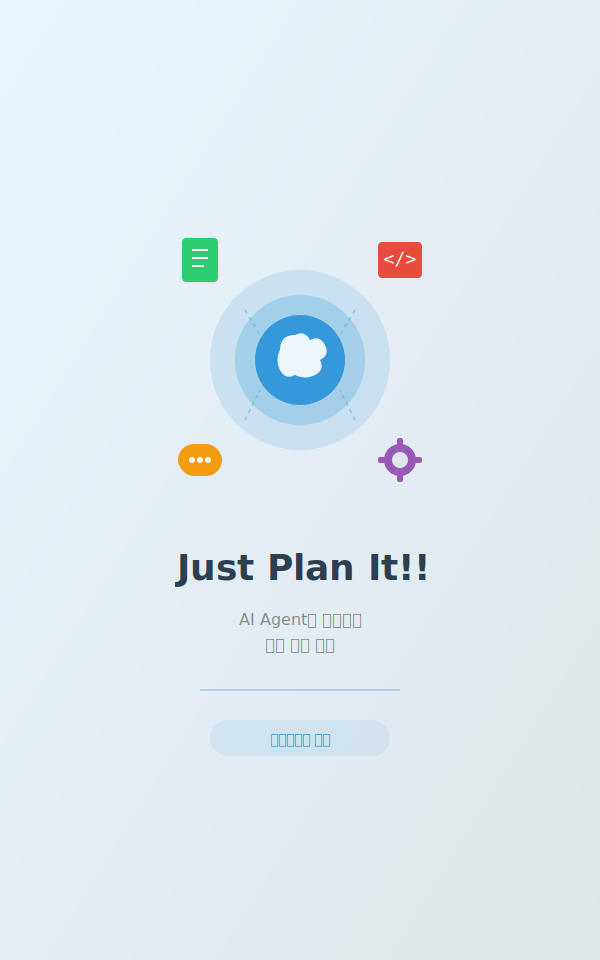
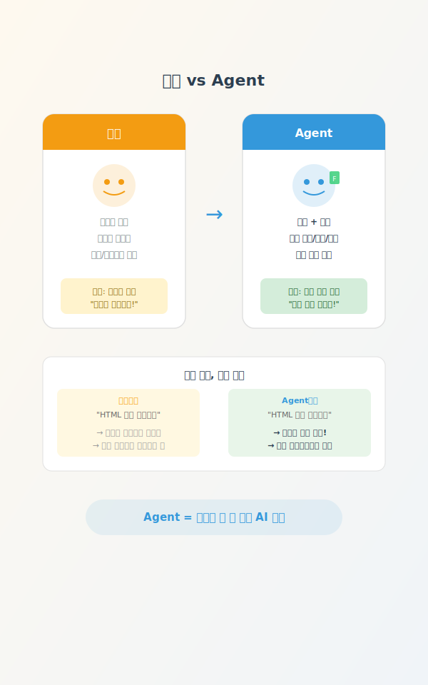
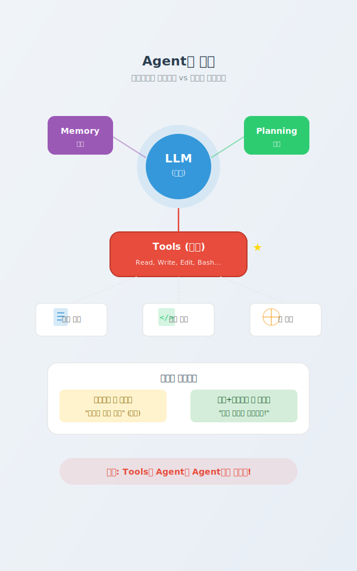

<style>
section {
  padding: 60px 80px;
  font-size: 1.1em;
  display: flex;
  flex-direction: column;
  justify-content: flex-start;
}

section.lead {
  padding: 60px 80px;
  text-align: center;
  justify-content: center;
}

h1 {
  color: #2c3e50;
  font-size: 3.2em;
  margin-top: 0;
  font-weight: 700;
}

h2 {
  color: #3498db;
  font-size: 2.6em;
  margin-top: 0;
  font-weight: 700;
}

h3 {
  font-size: 1.6em;
  font-weight: 600;
}

p, li {
  font-size: 0.95em;
  line-height: 1.5;
  font-weight: 400;
}

code {
  background: #f4f4f4;
  padding: 2px 6px;
  border-radius: 3px;
  font-size: 1.1em;
}

table {
  font-size: 0.95em;
}

.highlight {
  background: #fff3cd;
  padding: 15px;
  border-left: 4px solid #ffc107;
  margin: 15px 0;
  font-size: 1.2em;
}

.success {
  background: #d4edda;
  padding: 15px;
  border-left: 4px solid #28a745;
  margin: 15px 0;
  font-size: 1.2em;
}

.question {
  background: #e3f2fd;
  padding: 20px;
  border-left: 4px solid #2196f3;
  margin: 20px 0;
  font-size: 1.3em;
  font-weight: bold;
  color: #1565c0;
}
</style>



# Just Plan It!!

### AI Agent로 시작하는 일과 삶의 전환

**동명대학교 특강**

---

## 오늘의 여정

### 전체 타임라인 (2시간)

| Part | 주제 | 시간 | 핵심 내용 |
|------|------|------|-----------|
| **1** | 오프닝 | 15분 | AI Agent, 왜 지금인가? |
| **2** | 첫 체험 | 20분 | Agent 설치하고 직접 써보기 |
| **3** | 3가지 키워드 | 25분 | 선택, 계획, 문서화 |
| **4** | 실전 실습 | 35분 | 학업 도우미 + 바이브 코딩 |
| **5** | 마무리 | 15분 | AI 시대 대학생의 경쟁력 |

<div class="highlight">
오늘의 핵심 메시지: <strong>Agent = 도구를 쓸 줄 아는 AI 동료</strong>
</div>

---



## 챗봇 vs Agent

### ChatGPT에게 "파일 만들어줘"라고 해본 적 있나요?

| 구분 | 챗봇 (ChatGPT) | Agent |
|------|----------------|-------|
| **할 수 있는 것** | 대화, 조언, 설명 | 대화 + **파일 생성** + **코드 실행** |
| **도구 사용** | 없음 | 파일 읽기/쓰기, 터미널 명령 실행 |
| **비유** | 똑똑한 친구 | **도구를 쓰는 동료** |
| **결과물** | "이렇게 하면 돼" (텍스트) | 실제 파일이 내 컴퓨터에 생성! |

<div class="highlight">
챗봇: "코드는 이거야, 복사해서 저장해"<br/>
Agent: "파일 만들었어. 브라우저에서 열어봐!"
</div>

---



## Agent의 구조

### Agent = LLM + Memory + Planning + Tools

| 요소 | 역할 | 비유 |
|------|------|------|
| **LLM** (두뇌) | 언어 이해 및 생성 | 요리사의 지식 |
| **Memory** (기억) | 대화 맥락 유지 | 주문 내역 기억 |
| **Planning** (계획) | 단계별 작업 설계 | 조리 순서 결정 |
| **Tools** (도구) | 파일 조작, 코드 실행 | 칼, 불, 냄비 |

<div class="success">
<strong>핵심 차이</strong>: 요리사에게 레시피만 준 것(챗봇) vs 재료와 도구까지 준 것(Agent)<br/>
Tools가 Agent를 Agent답게 만듭니다!
</div>

---

<!-- _class: lead -->

# Part 1 마무리

다음은 **Part 2: 첫 체험**

직접 해보면 달라집니다!

---

<!-- _class: lead -->

# Part 2: 첫 체험

### 직접 해보면 달라집니다

---

## AI Agent CLI 도구 비교

### 어떤 Agent를 선택할까요?

| 도구 | 가격 | CLI 지원 | 특징 |
|------|------|----------|------|
| **Claude Code** | 유료 | O | Plan 모드로 실행 전 계획 검토 가능. 한국어에 강함 |
| **Gemini CLI** | 무료 | O | 완전 무료. 빠른 응답 속도. Google AI Studio 기반 |
| **Codex** | 유료/무료 | O | ChatGPT Plus 구독자 무료. 코드 생성에 특화 |

<div style="display: grid; grid-template-columns: 1fr 1fr; gap: 40px;">

<div>

**오늘 강의**: Claude Code CLI 중심으로 진행

</div>

<div>

**대안**: Gemini CLI (무료) / Codex (ChatGPT Plus 구독자)

</div>

</div>

<div class="highlight">
어떤 도구든 괜찮습니다! 핵심은 <strong>Agent를 직접 체험</strong>하는 것입니다.
</div>

---

## 설치 및 첫 실행

### 설치 가이드: [getclaudecode.com](https://getclaudecode.com/)

<div style="display: grid; grid-template-columns: 1fr 1fr 1fr; gap: 30px;">

<div>

**Claude Code**

```bash
npm install -g \
  @anthropic-ai/claude-code
```

```bash
claude
```

</div>

<div>

**Gemini CLI**

```bash
npm install -g \
  @google/gemini-cli
```

```bash
gemini
```

</div>

<div>

**Codex**

```bash
npm install -g \
  @openai/codex
```

```bash
codex
```

</div>

</div>

**첫 대화**: 프롬프트가 나타나면 입력해보세요

```
안녕? 자기소개 해줘.
```

**종료**: `Ctrl+C` 또는 `/exit`

---

## 실습 2-1: 자기소개 페이지 만들기

### 프롬프트 한 줄로 웹 페이지를!

**입력할 프롬프트**:

```
나를 소개하는 HTML 페이지를 만들어줘.
이름은 [본인 이름], 전공은 [본인 전공], 관심사는 [본인 관심사].
깔끔하고 예쁘게 디자인해줘.
```

**확인 방법**:

1. Agent가 파일을 생성하면 `Y` 를 눌러 승인
2. 생성된 HTML 파일을 브라우저에서 열기
3. 내 정보가 담긴 웹 페이지 확인!

<div class="highlight">
첫 프롬프트에서 결과물이 나오는 경험! <strong>이것이 Agent의 힘</strong>입니다.
</div>

---

## 실습 2-2: Plan 모드 체험

### Agent에게 "계획부터 보여줘"라고 요청하기

**Plan 모드 진입**: `Shift+Tab` 두 번 누르기

**입력할 프롬프트**:

```
자기소개 페이지에 다크모드 토글 버튼을 추가해줘.
버튼을 누르면 배경이 어두워지고 글자가 밝아지게 해줘.
```

**진행 순서**:

1. Agent가 **계획을 먼저 보여줌** (어떤 파일을, 어떻게 수정할지)
2. 계획 확인 후 `Y` 를 눌러 실행 승인
3. 수정된 페이지를 브라우저에서 새로고침

<div class="success">
<strong>학습 포인트</strong>: Plan 모드는 Agent의 안전장치입니다.<br/>
"실행 전에 계획을 검토한다" - 이것이 AI와 협업하는 핵심 습관!
</div>

---

## 중간 체크

<div class="question">
자기소개 페이지, 성공했나요?
</div>

### 잠깐, 생각해봅시다

- 방금 경험에서 **가장 놀라웠던 점**은?
- 이 기능을 **어디에 써먹을 수 있을까?**
  - 과제 발표 자료?
  - 팀프로젝트 페이지?
  - 포트폴리오?

<div class="highlight">
실패해도 괜찮아요. Agent도 실수합니다!<br/>
중요한 것은 <strong>"다시 시도하고, 더 구체적으로 요청하는 것"</strong>입니다.
</div>

---

<!-- _class: lead -->

# Part 2 마무리

다음은 **Part 3: AI 시대 3가지 키워드**

체험했으니, 이제 왜 그런지 이해하기

---

<!-- _class: lead -->

# Part 3: AI 시대, 우리의 3가지 역할

체험했으니, 이제 **왜** 그런지 이해하기

---


<div class="question">
Part 2에서 Agent와 함께 작업해봤습니다. 그런데 한 가지 질문 --
</div>

### Agent가 다 해줬는데, "나"는 뭘 한 거지?

- 코드 작성, 파일 생성, 디자인까지...
- Agent가 다 만들어줬다면, 내 역할은?

### AI 시대 우리에게 필요한 3가지

| 키워드 | 핵심 질문 |
|--------|---------|
| **선택** | 무엇을 만들 것인가? |
| **계획** | 어떻게 지시할 것인가? |
| **문서화** | 어떻게 남길 것인가? |

---

## 키워드 1: 선택 (Choice)

<div class="highlight">
AI가 모든 걸 만들어줘도, <strong>선택은 당신의 몫</strong>입니다
</div>

<div style="display: grid; grid-template-columns: 1fr 1fr; gap: 40px;">

<div>

### AI가 잘하는 것

- 정보를 빠르게 수집
- 여러 옵션을 비교
- 각 선택지의 장단점 분석
- 데이터 기반 추천

</div>

<div>

### 사람만 할 수 있는 것

- **"나에게 맞는 게 뭔지"** 판단
- 가치관에 따른 우선순위 결정
- 맥락과 상황을 고려한 최종 결정
- 책임을 지는 것

</div>

</div>

**대학생 예시**: 전공 선택, 수강신청, 진로 결정 -- AI가 정보를 주지만 **결정은 나**

---

## LLM은 어떻게 작동하나?

### LLM = 확률 기반 "다음 단어" 예측기

<div style="display: grid; grid-template-columns: 1fr 1fr; gap: 40px;">

<div>

### 작동 원리

"오늘 날씨가" 다음에 올 단어는?

- "좋다" (확률 35%)
- "흐리다" (확률 20%)
- "덥다" (확률 15%)
- 기타 (확률 30%)

**비유**: 엄청 많은 책을 읽은 친구가 다음에 올 말을 추측하는 것

</div>

<div>

### 그래서 알아야 할 것

**1. 가끔 틀릴 수 있다 (환각 현상)**
- "정답을 아는 것"이 아니라 "그럴듯한 답을 만드는 것"

**2. 여러 답을 줄 수 있다**
- 같은 질문에도 다른 답이 나올 수 있음

**3. 최종 판단은 사람의 몫**
- AI의 답 = 참고 자료
- 사람의 선택 = 최종 결정

</div>

</div>

<div class="highlight">
AI는 "확률적으로 그럴듯한 답"을 만듭니다. <strong>정답을 검증하고 선택하는 건 나의 역할</strong>입니다.
</div>

---

## 키워드 2: 계획 (Planning)

<div class="highlight">
좋은 프롬프트 = 좋은 계획 = <strong>좋은 결과물</strong>
</div>

### 컨텍스트란?

Agent의 **단기 기억** -- 대화의 맥락을 담고 있는 공간

<div style="display: grid; grid-template-columns: 1fr 1fr; gap: 40px;">

<div>

### 컨텍스트가 비어있으면?

- Agent가 **추론으로 채움**
- 누구를 위한 글? -> "일반 대중용"
- 어떤 톤? -> "중립적"
- 어떤 분량? -> "적당히"

**결과**: 예측 불가능한 결과물

</div>

<div>

### 컨텍스트를 채우면?

- **내 의도가 정확히 전달됨**
- 대상: "교수님 제출용"
- 톤: "학술적, 객관적"
- 분량: "A4 5장"

**결과**: 원하는 결과물

</div>

</div>

**핵심**: 빈 컨텍스트 = Agent가 추측 = 엉뚱한 결과

---


## 좋은 프롬프트 vs 나쁜 프롬프트

### 나쁜 예

```
레포트 써줘
```

### 좋은 예

```
소프트웨어공학 수업 중간 리포트.
주제: 애자일 방법론.
구조: 서론-본론(3장)-결론.
분량: A4 5장.
참고문헌 형식: APA.
```

### 좋은 프롬프트 3원칙

| 원칙 | 설명 | 예시 |
|------|------|------|
| **구체성** | 무엇을 원하는지 명확히 | "A4 5장, APA 형식" |
| **단계성** | 순서를 정해주기 | "서론 -> 본론 -> 결론" |
| **결과물 명시** | 최종 형태를 알려주기 | "PDF로 저장, 표 포함" |

---

## 키워드 3: 문서화 (Documentation)

<div class="highlight">
AI가 <strong>문서화의 경제학</strong>을 바꿨습니다
</div>

<div style="display: grid; grid-template-columns: 1fr 1fr; gap: 40px;">

<div>

### Before AI

- 문서화 = "나중에" (시간 없음)
- 회의록 = "누가 쓸래?" (귀찮음)
- 정리 = "기억나면 하자" (잊어버림)

**비용이 높았기 때문에** 미뤘습니다

</div>

<div>

### After AI

- 문서화 = **"먼저"** (AI가 초안 작성)
- 회의록 = **자동 생성** (검토만 하면 됨)
- 정리 = **실시간** (AI가 바로 정리)

**비용이 거의 0** 이 되었습니다

</div>

</div>

### 대학생활 적용 예시

| 상황 | AI 활용 | 내 역할 |
|------|---------|---------|
| 팀프로젝트 회의 | AI가 회의록 초안 작성 | 핵심 결정사항 확인 |
| 수업 노트 | AI가 강의 내용 정리 | 이해 안 되는 부분 표시 |
| 발표 자료 | AI가 슬라이드 구조 생성 | 메시지와 스토리 검수 |

---

## 3가지 키워드 요약

<div style="display: grid; grid-template-columns: 1fr 1fr 1fr; gap: 30px;">

<div>

### 선택 (Choice)

AI가 정보를 주면,
**내가 판단한다**

- AI = 비교와 분석
- 나 = 가치 판단과 결정
- 책임은 항상 사람의 몫

</div>

<div>

### 계획 (Planning)

구체적으로 지시하면,
**AI가 더 잘 일한다**

- 빈 컨텍스트 = 엉뚱한 결과
- 좋은 프롬프트 = 좋은 결과
- 계획에 시간을 투자하기

</div>

<div>

### 문서화 (Documentation)

AI가 기록하면,
**나는 생각에 집중한다**

- 문서화 비용이 0에 수렴
- AI가 초안, 내가 검수
- 기록이 성장의 기반

</div>

</div>

<div class="success">
이 3가지가 <strong>AI 시대 대학생의 핵심 역량</strong>입니다!
AI를 잘 쓰는 사람 = 선택하고, 계획하고, 기록하는 사람
</div>

---

<!-- _class: lead -->

# 10분 휴식!

잠시 쉬었다 돌아오세요

다음은 **Part 4: 실전 실습**

직접 학업과 생활에 AI Agent를 적용해봅니다

---

<!-- _class: lead -->

# Just Plan It!

**Part 4: 일과 삶의 전환**

대학생활을 바꾸는 실전 실습

---

## 실습 4-1: 학업 도우미

<div class="question">
과제가 막막할 때, Agent에게 물어보기
</div>

### 시나리오

**수업 리포트 작성의 시작점 잡기**

- 주제는 정해졌는데, 어디서부터 시작해야 할지 모르겠다
- 검색하면 정보가 너무 많아서 정리가 안 된다
- 개요부터 잡아주면 좋겠는데...

### Agent 활용 포인트

| 기존 방식 | Agent 활용 |
|----------|-----------|
| 검색 → 탭 20개 → 혼란 | 주제 전달 → 구조화된 개요 |
| 어디서 시작? → 막막 | 핵심 키워드 + 참고 방향 제시 |
| 초안 쓰기 2시간 | 초안 5분 → 수정에 집중 |

---

## 실습 4-1: 과제 리서치 & 정리 (15분)

### 기본 과제 (10분)

**프롬프트 예시:**

```
소프트웨어공학 수업 리포트를 써야 해.
주제는 '애자일 방법론의 장단점'.
리포트 개요와 핵심 키워드를 정리해줘.
research_outline.md로 저장해줘.
```

**결과물**: `research_outline.md`

### 도전 과제 (5분)

```
개요를 바탕으로 서론 초안을 작성해줘.
대학생 리포트에 맞는 학술적인 톤으로 써줘.
```

<div class="highlight">
프롬프트 팁: 과목명 + 주제 + 원하는 형식 + 저장 파일명을 명시하면 정확도가 올라갑니다
</div>

---

## 실습 4-1: 학습 포인트

<div class="success">
AI는 리서치 도우미, 최종 판단은 나
</div>

### Part 3의 3가지 키워드 실전 적용

| 키워드 | 이번 실습에서의 적용 |
|--------|-------------------|
| **선택** | Agent가 준 개요 중 어떤 구조를 쓸지는 내가 결정 |
| **계획** | 구체적 프롬프트(과목, 주제, 형식) = 좋은 결과물 |
| **문서화** | research_outline.md로 저장 = 언제든 재활용 |

### 주의사항

- Agent가 만든 내용을 그대로 제출하면 표절
- **AI 결과물 + 나의 분석/의견 = 진짜 리포트**
- 출처와 사실 확인은 반드시 직접 해야 합니다

---

## 실습 4-2: 바이브 코딩


<div class="question">
개발자가 아니어도, 도구를 만들 수 있다!
</div>

### 3개 중 하나를 선택하세요

| 난이도 | 프로젝트 | 설명 |
|--------|---------|------|
| **쉬움** | 시간표 관리 페이지 | 요일별 수업 시간표 |
| **보통** | 할일 목록 (To-Do) 앱 | 추가/삭제/완료 체크 |
| **도전** | 팀프로젝트 투표 페이지 | 주제 제안 + 투표 |

---

## 실습 4-2: 바이브 코딩 (20분)

### 기본 과제 (15분) - 3개 중 택 1

**템플릿 1: 시간표 관리 페이지**

```
월~금 수업 시간표를 보여주는 HTML 페이지를 만들어줘.
표 형식으로, 시간대별로 과목명과 강의실을 표시.
예쁜 디자인으로 부탁해. timetable.html로 저장.
```

**템플릿 2: 할일 목록 앱**

```
할일을 추가하고 완료 체크할 수 있는 To-Do 앱을 만들어줘.
HTML, CSS, JavaScript 하나의 파일로 만들어줘.
할일 추가, 완료 표시, 삭제 기능. todo.html로 저장.
```

**템플릿 3: 팀프로젝트 투표 페이지**

```
팀프로젝트 주제를 제안하고 투표할 수 있는 페이지를 만들어줘.
주제 추가, 투표(+1), 순위 정렬 기능.
HTML 하나의 파일로. vote.html로 저장.
```

---

## 실습 4-2: 완성 & 도전

### 완성 확인

- [ ] HTML 파일이 생성됨
- [ ] 브라우저에서 열어서 동작 확인
- [ ] 기본 기능이 작동함

### 도전 과제 (5분)

완성된 파일을 개선해보세요:

```
이 페이지에 다크모드 토글 버튼을 추가해줘.
```

```
디자인을 더 예쁘게 개선해줘. 그라데이션 배경과 그림자 효과 추가.
```

```
데이터를 로컬 스토리지에 저장해서 새로고침해도 유지되게 해줘.
```

<div class="highlight">
완벽보다 작동! 일단 돌아가는 걸 만들고, 하나씩 개선하세요.
</div>

---

## Agent 프로젝트 실전 사례

<div class="highlight">
대학생들이 AI Agent로 만들 수 있는 것들
</div>

<div style="display: grid; grid-template-columns: 1fr 1fr; gap: 40px;">

<div>

### 학업 활용

- **논문 리뷰 도우미** - 논문 PDF 요약 + 핵심 정리
- **학습 노트 자동 정리** - 수업 필기를 구조화된 문서로
- **데이터 분석 자동화** - 과제용 CSV 분석 + 시각화

</div>

<div>

### 커리어 활용

- **개인 포트폴리오 사이트** - HTML/CSS로 나만의 웹사이트
- **면접 준비 도우미** - 예상 질문 + 답변 초안 생성

</div>

</div>

<div class="success">
핵심: Agent는 "시작의 장벽"을 없애줍니다. 아이디어만 있으면 됩니다.
</div>

---

<!-- _class: lead -->

# Part 4 마무리

다음은 **Part 5: 마무리 & 다음 단계**

AI 시대를 준비하는 마지막 이야기

---

<!-- _class: lead -->

# Just Plan It!

**Part 5: 마무리 & 다음 단계**

시작이 반이다!

---

## Agent의 한계와 가능성

<div style="display: grid; grid-template-columns: 1fr 1fr; gap: 40px;">

<div>

### Agent가 잘하는 것

- **파일 조작** - 생성, 수정, 정리, 변환
- **코드 생성** - HTML, Python, 스크립트 등
- **문서 요약** - 긴 텍스트를 핵심만 정리
- **구조화** - 막연한 아이디어를 체계적으로
- **반복 작업** - 같은 패턴 빠르게 처리
- **초안 작성** - 리포트, 메일, 기획서 등

</div>

<div>

### Agent가 못하는 것

- **실시간 검색** - 최신 정보 직접 검색 불가
- **보안 시스템 접근** - 학교 포털, 은행 등 로그인
- **대신 선택하기** - 판단과 결정은 사람의 몫
- **감정/공감** - 진짜 감정을 느끼지 못함
- **사실 보장** - 틀린 정보를 자신있게 말할 수 있음
- **창의적 도약** - 전혀 새로운 발상은 어려움

</div>

</div>

<div class="highlight">
기대치를 조정해야 실망이 없습니다. Agent는 만능이 아니라 "유능한 조교"입니다.
</div>

---

## AI 시대 대학생의 경쟁력

<div class="success">
AI가 바꾸는 건 도구이지, 사람의 가치가 아닙니다
</div>

### 3가지 조언

**1. "도구를 두려워하지 마세요"**
- AI Agent는 경쟁자가 아니라 협업 파트너
- 엑셀이 계산을 대체했듯, AI가 초안을 대체할 뿐
- **도구를 잘 쓰는 사람이 경쟁력을 가집니다**

**2. "선택하는 능력을 키우세요"**
- AI가 10개의 옵션을 만들어도, 고르는 건 사람
- 비판적 사고, 가치 판단은 대체 불가능
- **"왜 이걸 선택했는가"를 설명할 수 있어야 합니다**

**3. "기록하는 습관을 들이세요"**
- AI가 문서화 비용을 0에 가깝게 만들었다
- 과제, 프로젝트, 회의 모두 기록으로 남기기
- **기록하는 사람이 성장하는 사람입니다**

---

## 심화 학습 로드맵

### 단계별 성장 경로

| 시기 | 목표 | 실천 방법 |
|------|------|----------|
| **이번 주** | 첫 적용 | 과제 하나에 Agent 써보기 |
| **1개월** | 습관화 | CLAUDE.md 작성법, 프롬프트 패턴 학습 |
| **3개월** | 심화 활용 | MCP 활용, 개인 프로젝트에 적용 |
| **6개월** | 자기만의 방식 | 워크플로우 구축, 포트폴리오 완성 |

### 추천 리소스

<div style="display: grid; grid-template-columns: 1fr 1fr; gap: 40px;">

<div>

**공식 문서**
- Claude 공식 문서
- Claude Code 사용 가이드

</div>

<div>

**실습 자료**
- GitHub 샘플 프로젝트
- Marp 프레젠테이션 도구

</div>

</div>

---

<!-- _class: lead -->

# Just Plan It!!

**계획하세요. Agent가 실행합니다.**

오늘 배운 3가지: **선택 · 계획 · 문서화**

이 3가지만 기억하면, AI 시대를 주도할 수 있습니다.

---

## Q&A

<div class="question">
궁금한 점이 있으신가요?
</div>

### 오늘의 핵심 정리

| Part | 배운 것 | 핵심 메시지 |
|------|--------|------------|
| **Part 1** | AI Agent 개념 | Agent = 도구를 쓸 줄 아는 AI 동료 |
| **Part 2** | 첫 체험 | "와, 이게 되네!" |
| **Part 3** | 3가지 키워드 | 선택 + 계획 + 문서화 |
| **Part 4** | 실전 실습 | 학업 도우미 + 바이브 코딩 |
| **Part 5** | 다음 단계 | 시작이 반이다! |

### 감사합니다!

**Just Plan It!! - AI Agent로 시작하는 일과 삶의 전환**
