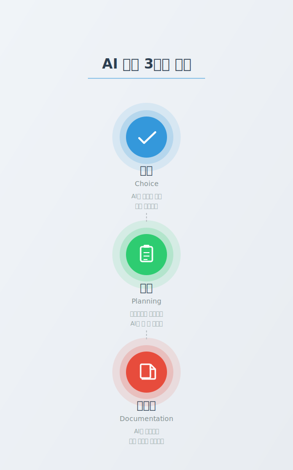
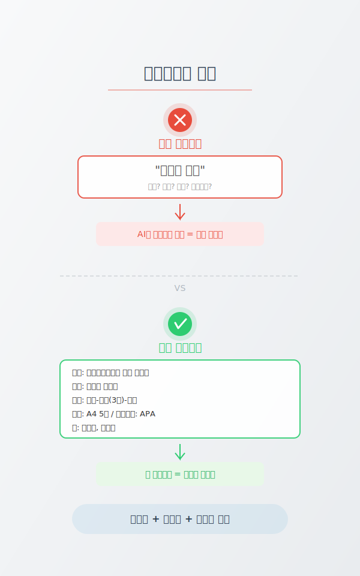

<style>
section {
  padding: 60px 80px;
  font-size: 1.1em;
  display: flex;
  flex-direction: column;
  justify-content: flex-start;
}

section.lead {
  padding: 60px 80px;
  text-align: center;
  justify-content: center;
}

h1 {
  color: #2c3e50;
  font-size: 3.2em;
  margin-top: 0;
  font-weight: 700;
}

h2 {
  color: #3498db;
  font-size: 2.6em;
  margin-top: 0;
  font-weight: 700;
}

h3 {
  font-size: 1.6em;
  font-weight: 600;
}

p, li {
  font-size: 0.95em;
  line-height: 1.5;
  font-weight: 400;
}

code {
  background: #f4f4f4;
  padding: 2px 6px;
  border-radius: 3px;
  font-size: 1.1em;
}

table {
  font-size: 0.95em;
}

.highlight {
  background: #fff3cd;
  padding: 15px;
  border-left: 4px solid #ffc107;
  margin: 15px 0;
  font-size: 1.2em;
}

.success {
  background: #d4edda;
  padding: 15px;
  border-left: 4px solid #28a745;
  margin: 15px 0;
  font-size: 1.2em;
}

.question {
  background: #e3f2fd;
  padding: 20px;
  border-left: 4px solid #2196f3;
  margin: 20px 0;
  font-size: 1.3em;
  font-weight: bold;
  color: #1565c0;
}
</style>

<!-- _class: lead -->

# Part 3: AI 시대, 우리의 3가지 역할

체험했으니, 이제 **왜** 그런지 이해하기

---



<div class="question">
Part 2에서 Agent와 함께 작업해봤습니다. 그런데 한 가지 질문 --
</div>

### Agent가 다 해줬는데, "나"는 뭘 한 거지?

- 코드 작성, 파일 생성, 디자인까지...
- Agent가 다 만들어줬다면, 내 역할은?

### AI 시대 우리에게 필요한 3가지

| 키워드 | 핵심 질문 |
|--------|---------|
| **선택** | 무엇을 만들 것인가? |
| **계획** | 어떻게 지시할 것인가? |
| **문서화** | 어떻게 남길 것인가? |

---

## 키워드 1: 선택 (Choice)

<div class="highlight">
AI가 모든 걸 만들어줘도, <strong>선택은 당신의 몫</strong>입니다
</div>

<div style="display: grid; grid-template-columns: 1fr 1fr; gap: 40px;">

<div>

### AI가 잘하는 것

- 정보를 빠르게 수집
- 여러 옵션을 비교
- 각 선택지의 장단점 분석
- 데이터 기반 추천

</div>

<div>

### 사람만 할 수 있는 것

- **"나에게 맞는 게 뭔지"** 판단
- 가치관에 따른 우선순위 결정
- 맥락과 상황을 고려한 최종 결정
- 책임을 지는 것

</div>

</div>

**대학생 예시**: 전공 선택, 수강신청, 진로 결정 -- AI가 정보를 주지만 **결정은 나**

---

## LLM은 어떻게 작동하나?

### LLM = 확률 기반 "다음 단어" 예측기

<div style="display: grid; grid-template-columns: 1fr 1fr; gap: 40px;">

<div>

### 작동 원리

"오늘 날씨가" 다음에 올 단어는?

- "좋다" (확률 35%)
- "흐리다" (확률 20%)
- "덥다" (확률 15%)
- 기타 (확률 30%)

**비유**: 엄청 많은 책을 읽은 친구가 다음에 올 말을 추측하는 것

</div>

<div>

### 그래서 알아야 할 것

**1. 가끔 틀릴 수 있다 (환각 현상)**
- "정답을 아는 것"이 아니라 "그럴듯한 답을 만드는 것"

**2. 여러 답을 줄 수 있다**
- 같은 질문에도 다른 답이 나올 수 있음

**3. 최종 판단은 사람의 몫**
- AI의 답 = 참고 자료
- 사람의 선택 = 최종 결정

</div>

</div>

<div class="highlight">
AI는 "확률적으로 그럴듯한 답"을 만듭니다. <strong>정답을 검증하고 선택하는 건 나의 역할</strong>입니다.
</div>

---

## 키워드 2: 계획 (Planning)

<div class="highlight">
좋은 프롬프트 = 좋은 계획 = <strong>좋은 결과물</strong>
</div>

### 컨텍스트란?

Agent의 **단기 기억** -- 대화의 맥락을 담고 있는 공간

<div style="display: grid; grid-template-columns: 1fr 1fr; gap: 40px;">

<div>

### 컨텍스트가 비어있으면?

- Agent가 **추론으로 채움**
- 누구를 위한 글? -> "일반 대중용"
- 어떤 톤? -> "중립적"
- 어떤 분량? -> "적당히"

**결과**: 예측 불가능한 결과물

</div>

<div>

### 컨텍스트를 채우면?

- **내 의도가 정확히 전달됨**
- 대상: "교수님 제출용"
- 톤: "학술적, 객관적"
- 분량: "A4 5장"

**결과**: 원하는 결과물

</div>

</div>

**핵심**: 빈 컨텍스트 = Agent가 추측 = 엉뚱한 결과

---



## 좋은 프롬프트 vs 나쁜 프롬프트

### 나쁜 예

```
레포트 써줘
```

### 좋은 예

```
소프트웨어공학 수업 중간 리포트.
주제: 애자일 방법론.
구조: 서론-본론(3장)-결론.
분량: A4 5장.
참고문헌 형식: APA.
```

### 좋은 프롬프트 3원칙

| 원칙 | 설명 | 예시 |
|------|------|------|
| **구체성** | 무엇을 원하는지 명확히 | "A4 5장, APA 형식" |
| **단계성** | 순서를 정해주기 | "서론 -> 본론 -> 결론" |
| **결과물 명시** | 최종 형태를 알려주기 | "PDF로 저장, 표 포함" |

---

## 키워드 3: 문서화 (Documentation)

<div class="highlight">
AI가 <strong>문서화의 경제학</strong>을 바꿨습니다
</div>

<div style="display: grid; grid-template-columns: 1fr 1fr; gap: 40px;">

<div>

### Before AI

- 문서화 = "나중에" (시간 없음)
- 회의록 = "누가 쓸래?" (귀찮음)
- 정리 = "기억나면 하자" (잊어버림)

**비용이 높았기 때문에** 미뤘습니다

</div>

<div>

### After AI

- 문서화 = **"먼저"** (AI가 초안 작성)
- 회의록 = **자동 생성** (검토만 하면 됨)
- 정리 = **실시간** (AI가 바로 정리)

**비용이 거의 0** 이 되었습니다

</div>

</div>

### 대학생활 적용 예시

| 상황 | AI 활용 | 내 역할 |
|------|---------|---------|
| 팀프로젝트 회의 | AI가 회의록 초안 작성 | 핵심 결정사항 확인 |
| 수업 노트 | AI가 강의 내용 정리 | 이해 안 되는 부분 표시 |
| 발표 자료 | AI가 슬라이드 구조 생성 | 메시지와 스토리 검수 |

---

## 3가지 키워드 요약

<div style="display: grid; grid-template-columns: 1fr 1fr 1fr; gap: 30px;">

<div>

### 선택 (Choice)

AI가 정보를 주면,
**내가 판단한다**

- AI = 비교와 분석
- 나 = 가치 판단과 결정
- 책임은 항상 사람의 몫

</div>

<div>

### 계획 (Planning)

구체적으로 지시하면,
**AI가 더 잘 일한다**

- 빈 컨텍스트 = 엉뚱한 결과
- 좋은 프롬프트 = 좋은 결과
- 계획에 시간을 투자하기

</div>

<div>

### 문서화 (Documentation)

AI가 기록하면,
**나는 생각에 집중한다**

- 문서화 비용이 0에 수렴
- AI가 초안, 내가 검수
- 기록이 성장의 기반

</div>

</div>

<div class="success">
이 3가지가 <strong>AI 시대 대학생의 핵심 역량</strong>입니다!
AI를 잘 쓰는 사람 = 선택하고, 계획하고, 기록하는 사람
</div>

---

<!-- _class: lead -->

# 10분 휴식!

잠시 쉬었다 돌아오세요

다음은 **Part 4: 실전 실습**

직접 학업과 생활에 AI Agent를 적용해봅니다
