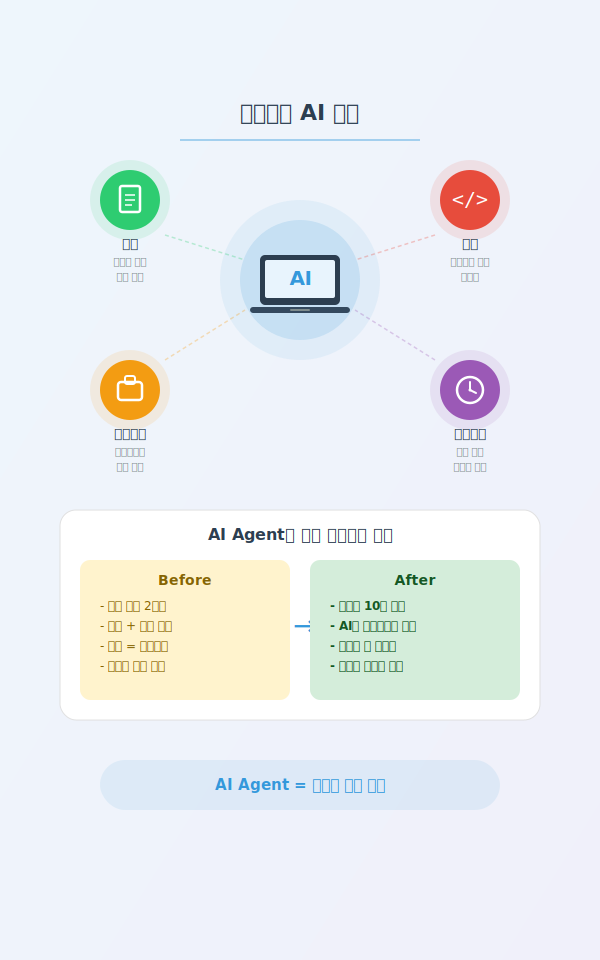

<style>
section {
  padding: 60px 80px;
  font-size: 1.1em;
  display: flex;
  flex-direction: column;
  justify-content: flex-start;
}

section.lead {
  padding: 60px 80px;
  text-align: center;
  justify-content: center;
}

h1 {
  color: #2c3e50;
  font-size: 3.2em;
  margin-top: 0;
  font-weight: 700;
}

h2 {
  color: #3498db;
  font-size: 2.6em;
  margin-top: 0;
  font-weight: 700;
}

h3 {
  font-size: 1.6em;
  font-weight: 600;
}

p, li {
  font-size: 0.95em;
  line-height: 1.5;
  font-weight: 400;
}

code {
  background: #f4f4f4;
  padding: 2px 6px;
  border-radius: 3px;
  font-size: 1.1em;
}

table {
  font-size: 0.95em;
}

.highlight {
  background: #fff3cd;
  padding: 15px;
  border-left: 4px solid #ffc107;
  margin: 15px 0;
  font-size: 1.2em;
}

.success {
  background: #d4edda;
  padding: 15px;
  border-left: 4px solid #28a745;
  margin: 15px 0;
  font-size: 1.2em;
}

.question {
  background: #e3f2fd;
  padding: 20px;
  border-left: 4px solid #2196f3;
  margin: 20px 0;
  font-size: 1.3em;
  font-weight: bold;
  color: #1565c0;
}
</style>

---

<!-- _class: lead -->

# Just Plan It!

**Part 4: 일과 삶의 전환**

대학생활을 바꾸는 실전 실습

---

## 실습 4-1: 학업 도우미

<div class="question">
과제가 막막할 때, Agent에게 물어보기
</div>

### 시나리오

**수업 리포트 작성의 시작점 잡기**

- 주제는 정해졌는데, 어디서부터 시작해야 할지 모르겠다
- 검색하면 정보가 너무 많아서 정리가 안 된다
- 개요부터 잡아주면 좋겠는데...

### Agent 활용 포인트

| 기존 방식 | Agent 활용 |
|----------|-----------|
| 검색 → 탭 20개 → 혼란 | 주제 전달 → 구조화된 개요 |
| 어디서 시작? → 막막 | 핵심 키워드 + 참고 방향 제시 |
| 초안 쓰기 2시간 | 초안 5분 → 수정에 집중 |

---

## 실습 4-1: 과제 리서치 & 정리 (15분)

### 기본 과제 (10분)

**프롬프트 예시:**

```
소프트웨어공학 수업 리포트를 써야 해.
주제는 '애자일 방법론의 장단점'.
리포트 개요와 핵심 키워드를 정리해줘.
research_outline.md로 저장해줘.
```

**결과물**: `research_outline.md`

### 도전 과제 (5분)

```
개요를 바탕으로 서론 초안을 작성해줘.
대학생 리포트에 맞는 학술적인 톤으로 써줘.
```

<div class="highlight">
프롬프트 팁: 과목명 + 주제 + 원하는 형식 + 저장 파일명을 명시하면 정확도가 올라갑니다
</div>

---

## 실습 4-1: 학습 포인트

<div class="success">
AI는 리서치 도우미, 최종 판단은 나
</div>

### Part 3의 3가지 키워드 실전 적용

| 키워드 | 이번 실습에서의 적용 |
|--------|-------------------|
| **선택** | Agent가 준 개요 중 어떤 구조를 쓸지는 내가 결정 |
| **계획** | 구체적 프롬프트(과목, 주제, 형식) = 좋은 결과물 |
| **문서화** | research_outline.md로 저장 = 언제든 재활용 |

### 주의사항

- Agent가 만든 내용을 그대로 제출하면 표절
- **AI 결과물 + 나의 분석/의견 = 진짜 리포트**
- 출처와 사실 확인은 반드시 직접 해야 합니다

---

## 실습 4-2: 바이브 코딩



<div class="question">
개발자가 아니어도, 도구를 만들 수 있다!
</div>

### 3개 중 하나를 선택하세요

| 난이도 | 프로젝트 | 설명 |
|--------|---------|------|
| **쉬움** | 시간표 관리 페이지 | 요일별 수업 시간표 |
| **보통** | 할일 목록 (To-Do) 앱 | 추가/삭제/완료 체크 |
| **도전** | 팀프로젝트 투표 페이지 | 주제 제안 + 투표 |

---

## 실습 4-2: 바이브 코딩 (20분)

### 기본 과제 (15분) - 3개 중 택 1

**템플릿 1: 시간표 관리 페이지**

```
월~금 수업 시간표를 보여주는 HTML 페이지를 만들어줘.
표 형식으로, 시간대별로 과목명과 강의실을 표시.
예쁜 디자인으로 부탁해. timetable.html로 저장.
```

**템플릿 2: 할일 목록 앱**

```
할일을 추가하고 완료 체크할 수 있는 To-Do 앱을 만들어줘.
HTML, CSS, JavaScript 하나의 파일로 만들어줘.
할일 추가, 완료 표시, 삭제 기능. todo.html로 저장.
```

**템플릿 3: 팀프로젝트 투표 페이지**

```
팀프로젝트 주제를 제안하고 투표할 수 있는 페이지를 만들어줘.
주제 추가, 투표(+1), 순위 정렬 기능.
HTML 하나의 파일로. vote.html로 저장.
```

---

## 실습 4-2: 완성 & 도전

### 완성 확인

- [ ] HTML 파일이 생성됨
- [ ] 브라우저에서 열어서 동작 확인
- [ ] 기본 기능이 작동함

### 도전 과제 (5분)

완성된 파일을 개선해보세요:

```
이 페이지에 다크모드 토글 버튼을 추가해줘.
```

```
디자인을 더 예쁘게 개선해줘. 그라데이션 배경과 그림자 효과 추가.
```

```
데이터를 로컬 스토리지에 저장해서 새로고침해도 유지되게 해줘.
```

<div class="highlight">
완벽보다 작동! 일단 돌아가는 걸 만들고, 하나씩 개선하세요.
</div>

---

## Agent 프로젝트 실전 사례

<div class="highlight">
대학생들이 AI Agent로 만들 수 있는 것들
</div>

<div style="display: grid; grid-template-columns: 1fr 1fr; gap: 40px;">

<div>

### 학업 활용

- **논문 리뷰 도우미** - 논문 PDF 요약 + 핵심 정리
- **학습 노트 자동 정리** - 수업 필기를 구조화된 문서로
- **데이터 분석 자동화** - 과제용 CSV 분석 + 시각화

</div>

<div>

### 커리어 활용

- **개인 포트폴리오 사이트** - HTML/CSS로 나만의 웹사이트
- **면접 준비 도우미** - 예상 질문 + 답변 초안 생성

</div>

</div>

<div class="success">
핵심: Agent는 "시작의 장벽"을 없애줍니다. 아이디어만 있으면 됩니다.
</div>
