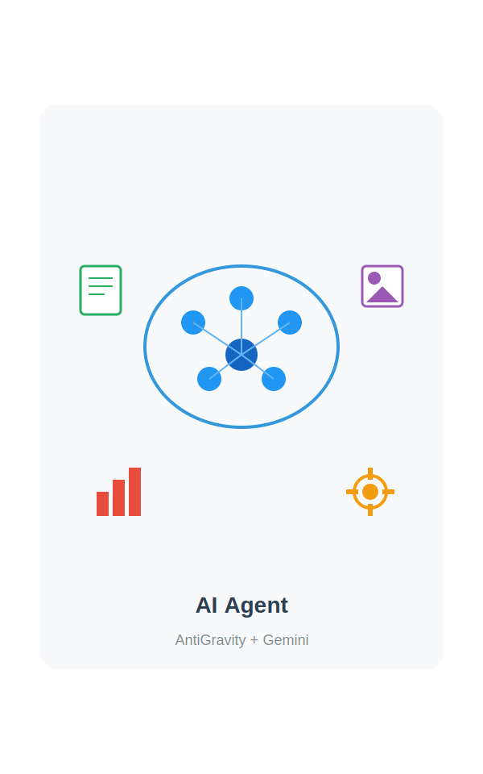

<style>
section {
  padding: 60px 80px;
  font-size: 1.1em;
}

section.lead {
  padding: 60px 80px;
  text-align: center;
}

h1 {
  color: #2c3e50;
  font-size: 2.5em;
}

h2 {
  color: #3498db;
  font-size: 1.8em;
}

h3 {
  font-size: 1.4em;
}

p, li {
  font-size: 1.1em;
  line-height: 1.5;
}

code {
  background: #f4f4f4;
  padding: 2px 6px;
  border-radius: 3px;
  font-size: 1.1em;
}

table {
  font-size: 1.1em;
}

.highlight {
  background: #fff3cd;
  padding: 15px;
  border-left: 4px solid #ffc107;
  margin: 15px 0;
  font-size: 1.2em;
}

.success {
  background: #d4edda;
  padding: 15px;
  border-left: 4px solid #28a745;
  margin: 15px 0;
  font-size: 1.2em;
}

.question {
  background: #e3f2fd;
  padding: 20px;
  border-left: 4px solid #2196f3;
  margin: 20px 0;
  font-size: 1.3em;
  font-weight: bold;
  color: #1565c0;
}
</style>



# AntiGravity & Gemini
## AI 에이전트 활용 마스터 클래스

**비개발자를 위한 실무 자동화**

---

## 오늘의 여정

### 전체 일정 (6시간)

| Part | 주제 | 시간 | 핵심 내용 |
|------|------|------|-----------|
| **1** | 생성형 AI 이해 및 시작하기 | 60분 | AI 개념, AntiGravity/Gemini 설치, 첫 대화 |
| **2** | 문서 자동화 실습 | 60분 | 프롬프트 기초, 회의록 요약, 보고서 작성 |
| **3** | 이미지·영상 콘텐츠 제작 | 60분 | 멀티모달 AI, Nano Banana, Canva 활용 |
| **4** | 데이터 분석 및 시각화 | 60분 | No-Code 분석, 차트 생성, Sheets 연동 |
| **5** | AI 윤리 및 책임 있는 활용 | 60분 | 저작권, 개인정보, 할루시네이션 대처 |
| **6** | 종합 실습 및 Q&A | 60분 | 자유 실습, 질의응답, 마무리 |

**오늘의 핵심 메시지**: "AI Agent = 도구를 쓸 줄 아는 똑똑한 동료"

---

## 이번 시간에 배울 내용 (Part 1)

### Part 1: 생성형 AI 이해 및 시작하기 (60분)

- 생성형 AI란 무엇인가?
- Google Gemini 소개 및 특징
- AntiGravity 설치 및 환경 구축
- Gemini와 첫 대화 나누기

**핵심 메시지**: "AI는 창작하고, 우리는 방향을 정한다"

---

<!--
_class: lead
-->

# Part 1

## 생성형 AI 이해 및 Gemini 시작하기

---

## 생성형 AI란?

<div style="display: grid; grid-template-columns: 1fr 1fr; gap: 40px;">

<div>

### 기존 AI vs 생성형 AI

| 구분 | 기존 AI | 생성형 AI |
|------|---------|-----------|
| **역할** | 분류, 예측 | 창작, 요약, 변환 |
| **예시** | 스팸 필터링 | 이메일 작성 |
| **출력** | 라벨, 숫자 | 텍스트, 이미지, 코드 |

</div>

<div>

### Generative AI의 특징

- **텍스트 생성**: 글쓰기, 번역, 요약
- **이미지 생성**: 그림, 디자인
- **코드 생성**: 프로그래밍 보조
- **멀티모달**: 여러 형식 동시 처리

</div>

</div>

---

## Google Gemini 소개

<div style="display: grid; grid-template-columns: 1fr 1fr; gap: 40px;">

<div>

### 핵심 특징

**멀티모달 (Multimodal)**
- 텍스트, 이미지, 영상, 오디오 동시 이해
- 복합적인 입력 처리 가능

**최신 성능**
- 빠르고 정확한 추론 능력
- 대규모 컨텍스트 지원

</div>

<div>

### 활용 분야

| 분야 | 활용 예시 |
|------|-----------|
| **글쓰기** | 보고서, 기획안, 이메일 |
| **분석** | 데이터 해석, 인사이트 도출 |
| **창작** | 이미지 생성, 아이디어 발상 |
| **번역** | 다국어 문서 처리 |

</div>

</div>

---

## 실습 환경: AntiGravity

### AntiGravity란?

- AI 에이전트를 쉽고 강력하게 사용할 수 있는 도구
- Gemini와 같은 최신 모델을 손쉽게 연결
- 로컬 파일 제어 및 자동화 기능 내장
- **공식 사이트**: https://antigravity.google/

### 왜 AntiGravity인가?

| 장점 | 설명 |
|------|------|
| **간편한 설치** | 복잡한 설정 없이 바로 시작 |
| **모델 통합** | Gemini 등 최신 AI 모델 연동 |
| **파일 제어** | 로컬 파일 읽기/쓰기 자동화 |
| **직관적 UI** | 비개발자도 쉽게 사용 |

---

## 실습: AntiGravity 설치 및 설정

### 설치 순서

1. **설치**: https://antigravity.google/ 접속 후 AntiGravity 설치
2. **로그인**: Google 계정으로 로그인
3. **모델 확인**: 설정 메뉴에서 'Gemini' 선택 확인

### 체크리스트

| 단계 | 확인 사항 | 완료 |
|------|-----------|------|
| 1 | AntiGravity 설치 완료 | ☐ |
| 2 | Google 계정 로그인 | ☐ |
| 3 | 10페이지의 첫번째 대화 완료 | ☐ |

> **체크포인트**: 모든 참가자가 설치를 완료했나요?

---

## 대안: Gemini CLI 설치 (개발자용)

### 터미널에서 직접 Gemini 사용하기

CLI(Command Line Interface)를 선호하는 분들을 위한 대안

### 설치 방법

```bash
# Node.js가 설치되어 있어야 합니다
npm install -g @google/gemini-cli
```

### 실행 및 인증

```bash
gemini          # Gemini CLI 실행
gemini --version  # 버전 확인
```

- 처음 실행 시 브라우저에서 Google 계정 인증
- **비용**: 완전 무료 (Google AI Studio API 기반)

<div class="highlight">

**참고**: CLI는 개발자/고급 사용자용입니다. 일반 사용자는 AntiGravity를 권장합니다.

</div>

---

## 첫 번째 대화: Hello Gemini!

### AntiGravity 채팅창에 입력해보세요

```
안녕, 너는 누구니? 어떤 모델을 사용하고 있어?
```

### 확인할 점

| 항목 | 기대 결과 |
|------|-----------|
| 한국어 응답 | 자연스러운 한국어 답변 |
| 모델 정보 | 사용 중인 모델 이름 확인 |
| 응답 속도 | 빠른 응답 시간 |

<div class="success">

**성공!** AI와의 첫 대화를 완료했습니다.

</div>

---

<!--
_class: lead
-->

# Part 2

## Gemini를 활용한 문서 자동화 실습

---

## 프롬프트 엔지니어링 기초

### 프롬프트(Prompt)란?

AI에게 내리는 지시어 - 명확할수록 좋은 결과

### 좋은 프롬프트의 3요소

| 요소 | 설명 | 예시 |
|------|------|------|
| **페르소나** | AI의 역할 정의 | "너는 10년차 마케터야" |
| **맥락** | 상황 설명 | "이번 신제품 출시를 위한 기획안이야" |
| **출력 형식** | 원하는 형태 | "개조식으로 작성해줘" |

<div class="highlight">

**팁**: 구체적으로 요청할수록 원하는 결과를 얻을 수 있습니다!

</div>

---

# AI 시대의 3가지 핵심 키워드

> **"AI가 모든 걸 해도, 우리의 역할은 더 중요해집니다"**

| 키워드 | 핵심 개념 | 왜 중요한가? |
|--------|---------|------------|
| **1. 선택 (Selection)** | **의미** - 나의 가치와 선호 반영 | AI 결과물에 "나"를 담아야 내 것이 됨 |
| **2. 계획 (Planning)** | **의도** - 비어있는 컨텍스트 채우기 | 계획 없으면 엉뚱한 결과 / 계획에 시간 투자 필수 |
| **3. 문서화 (Documentation)** | **결과물** - 문서 = 프로젝트 | 문서화로 성찰하고 반복하며 성장 |

---

# 1. 선택 (Selection): 의미 담기

- **과거**: 정보 부족으로 제한된 선택
- **AI 시대**: Agent가 정교한 비교 제공 → **더 나은 선택 가능**
- **핵심**:
    - Agent는 정보와 옵션을 제공할 뿐, **최종 선택은 인간의 몫**
    - 나의 가치관과 선호가 반영된 선택이 결과물에 **"영혼"**을 불어넣음

> **Tip**: "A안과 B안의 장단점을 비교해줘"라고 요청하고, 최종 결정은 내가 내리세요.

---

# 2. 계획 (Planning): 의도 전달

- **문제**: "보고서 써줘" (모호함) → AI가 마음대로 추론 → 엉뚱한 결과
- **해결**: **계획에 시간 투자 (Work의 70%)**
- **좋은 계획의 3원칙**:
    1. **구체성**: "누가, 무엇을, 어떻게" 명시
    2. **단계성**: "1단계는 조사, 2단계는 작성..."
    3. **결과물 명시**: "마지막엔 PDF로 저장해줘"

---

# 3. 문서화 (Documentation): 성장 도구

- **Before AI**: 시간 부족으로 문서화 포기 ("일하기도 바쁜데...")
- **After AI**: **Agent가 문서화 대행 (거의 무료)**
- **문서 중심 사고**:
    - **문서 = 프로젝트 그 자체**
    - 시작(계획서) → 진행(로그) → 완료(회고)
    - 문서화를 통해 프로젝트를 성찰하고, 다음 번에 더 잘할 수 있게 됨

> **Action**: 작업을 마칠 때 항상 "오늘 한 내용을 요약해서 회고 문서로 만들어줘"라고 하세요.

---

## 실습 1: 회의록 요약 및 보고서 작성

### 상황

1시간 분량의 회의 녹취록(텍스트)이 있음

### 프롬프트 예시

```
이 회의 내용을 바탕으로:
1. 핵심 안건 3가지를 요약하고
2. 다음 주 실행 계획을 표로 정리해줘
```

### AntiGravity 활용 방법

| 단계 | 동작 |
|------|------|
| 1 | 텍스트 파일 드래그 앤 드롭 |
| 2 | 요약 프롬프트 입력 |
| 3 | 결과 확인 및 수정 요청 |

---

## 실습 2: Google Docs 연동

### 목표

AntiGravity에서 작성한 내용을 Google Docs로 바로 내보내기

### 실습 순서

1. AntiGravity에게 기획안 초안 작성 요청
2. "이 내용을 내 Google Docs에 '신제품_기획안_초안'이라는 제목으로 저장해줘"
3. Google Docs에서 생성된 문서 확인

<div class="success">

**Tip**: 반복적인 문서 작업은 템플릿을 만들어두고 AI에게 채워달라고 하면 효율적입니다.

</div>

---

<!--
_class: lead
-->

# Part 3

## 이미지·영상 콘텐츠 제작

---

## 멀티모달 AI와 콘텐츠 제작

<div style="display: grid; grid-template-columns: 1fr 1fr; gap: 40px;">

<div>

### 텍스트 to 이미지

글로 묘사한 장면을 그림으로 생성

### 비주얼 프롬프트 팁

- 구체적인 묘사 (조명, 스타일, 화풍)
- 참조할 스타일 언급
- 해상도/비율 지정

</div>

<div>

### 프롬프트 예시

```
사이버펑크 스타일의 서울 야경,
네온 사인이 빛나고,
비 오는 거리,
8k 해상도
```


</div>

</div>

---

## 실습 1: Gemini 이미지 생성

### AntiGravity에서 요청하기

```
미래적인 친환경 도시의 모습을 그려줘.
수직 정원이 있는 고층 빌딩과
날아다니는 전기차가 보여야 해.
```

### 실습 체크리스트

| 단계 | 내용 | 완료 |
|------|------|------|
| 1 | 이미지 생성 프롬프트 입력 | ☐ |
| 2 | 생성된 이미지 확인 | ☐ |
| 3 | 원하는 폴더에 저장 | ☐ |
| 4 | 다른 스타일로 재요청 | ☐ |

---

## 실습 2: Nano Banana 활용

### Nano Banana란?

쉽고 빠른 AI 콘텐츠 생성 도구

### 실습 순서

| 단계 | 동작 |
|------|------|
| 1 | Nano Banana 실행 |
| 2 | "커피를 내리는 바리스타의 짧은 영상" 요청 |
| 3 | 스타일 필터 적용 (시네마틱, 애니메이션 등) |
| 4 | 결과물 다운로드 |

---

## 실습 3: Canva로 완성하기

### 워크플로우

```
Gemini/Nano Banana (소스 생성) → Canva (편집/완성)
```

### 제작 가능 콘텐츠

| 유형 | 활용 예시 |
|------|-----------|
| **카드뉴스** | 인스타그램, 블로그 |
| **썸네일** | 유튜브, 프레젠테이션 |
| **배너** | 웹사이트, 광고 |
| **포스터** | 이벤트, 홍보 |

<div class="question">

결과물 공유: 각자 만든 콘텐츠를 슬랙/채팅방에 공유해봅시다!

</div>

---

<!--
_class: lead
-->

# Part 4

## Gemini 기반 데이터 분석 및 시각화

---

## 코딩 없는 데이터 분석

### No-Code Data Analysis

파이썬/R 코드를 몰라도 자연어로 데이터 분석 가능!

### Gemini + AntiGravity의 역할

| 기능 | 설명 |
|------|------|
| **데이터 이해** | 구조 파악, 컬럼 설명 |
| **코드 자동 생성** | Python 분석 코드 생성 및 실행 |
| **인사이트 도출** | 핵심 발견점 요약 |
| **시각화** | 차트, 그래프 자동 생성 |

<div class="highlight">

**핵심**: 복잡한 엑셀 수식 대신, 원하는 결과를 말로 설명하면 됩니다!

</div>

---

## 실습 1: 데이터 로드 및 파악

### 데이터

`sales_data.csv` (월별 매출, 품목, 지역 등 포함)

### 프롬프트 예시

```
이 데이터를 분석해줘.
어떤 컬럼들이 있고, 데이터의 전반적인 특징은 뭐야?
```

### 기대 결과

| 항목 | 내용 |
|------|------|
| 컬럼 목록 | 날짜, 지역, 품목, 매출액 등 |
| 데이터 크기 | 행/열 개수 |
| 기초 통계 | 평균, 최대, 최소값 |

---

## 실습 2: 인사이트 도출 및 시각화

### 프롬프트 예시

```
가장 매출이 높은 지역은 어디야?
그리고 월별 매출 추이를 꺾은선 그래프로 그려줘.
```

### 결과물

| 유형 | 내용 |
|------|------|
| **텍스트 분석** | "서울 지역이 전체 매출의 35%로 1위" |
| **그래프** | 월별 매출 추이 꺾은선 차트 |
| **인사이트** | "3분기에 급격한 성장세 관찰" |

---

## 실습 3: Google Sheets 연동

### 확장 워크플로우

```
CSV 데이터 → AntiGravity 분석 → Google Sheets 저장
```

### 프롬프트 예시

```
지역별 매출 합계를 계산해서 region_summary.csv로 저장해줘.
그리고 이걸 Google Sheets로 열 수 있게 해줘.
```

<div class="success">

**핵심**: 복잡한 피벗 테이블, VLOOKUP 대신 자연어로 요청!

</div>

---

<!--
_class: lead
-->

# Part 5

## AI 윤리 및 책임 있는 활용

---

## AI 시대의 윤리

### "힘에는 책임이 따른다"

강력한 도구일수록 신중하게 사용해야 함

### 주요 이슈

| 이슈 | 설명 |
|------|------|
| **저작권** | AI가 학습한 데이터와 생성물의 권리 관계 |
| **편향성** | 학습 데이터의 사회적 편견이 결과에 반영 |
| **책임 소재** | AI 결과물에 대한 책임은 누구에게? |
| **투명성** | AI 사용 여부 공개 필요성 |

---

## 개인정보 보호 (Privacy)

<div style="display: grid; grid-template-columns: 1fr 1fr; gap: 40px;">

<div>

### 절대 입력 금지

- 주민등록번호, 여권번호
- 신용카드 번호
- 회사 기밀 문서
- 비공개 소스 코드
- 고객 개인정보

</div>

<div>

### Safe AI 습관

| 습관 | 설명 |
|------|------|
| **마스킹** | 민감 정보 가리기 |
| **옵션 확인** | 학습 제외 설정 |
| **기업용 도구** | 보안 인증된 버전 사용 |
| **로그 관리** | 대화 기록 정기 삭제 |

</div>

</div>

---

## 할루시네이션 (Hallucination)

### AI의 환각

사실이 아닌 내용을 그럴듯하게 지어내는 현상

### 대처법

| 방법 | 설명 |
|------|------|
| **팩트 체크** | 통계, 법률, 의학 정보는 원본 출처 확인 |
| **교차 검증** | 다른 검색 엔진이나 도구로 더블 체크 |
| **출처 요청** | "출처를 알려줘"라고 직접 요청 |
| **전문가 확인** | 중요한 결정은 전문가 검토 필수 |

<div class="highlight">

**기억하세요**: AI는 "확신에 찬 거짓말"을 할 수 있습니다!

</div>

---

## 마무리: 지속 가능한 AI 활용

### 핵심 원칙

| 원칙 | 설명 |
|------|------|
| **AI는 도구** | 주체는 항상 사용자(Human) |
| **지속 학습** | AI 기술은 빠르게 변화 → 계속 관심 가지기 |
| **공유 문화** | 좋은 프롬프트와 활용 사례를 동료와 나누기 |
| **윤리 의식** | 책임감 있는 사용 |

<div class="success">

**오늘 배운 것**: AntiGravity + Gemini로 문서, 이미지, 데이터 작업을 자동화하는 방법

</div>

---

<!--
_class: lead
-->

# Part 6

## 종합 실습 및 Q&A

---

## 자유 실습 시간

### 실습 아이디어

| 분야 | 실습 예시 |
|------|-----------|
| **문서** | 주간 보고서 초안 작성 |
| **데이터** | 팀 실적 데이터 분석 및 시각화 |
| **콘텐츠** | 팀 소개 카드뉴스 제작 |
| **자동화** | 반복 업무 프로세스 설계 |

### 도움이 필요하면

- 손을 들어 질문하세요!
- 동료와 함께 문제 해결해보세요
- 화면 공유로 함께 고민해봅시다

---

## 오늘 배운 내용 정리

### 핵심 요약

| Part | 배운 내용 |
|------|-----------|
| **1** | 생성형 AI 개념, AntiGravity/Gemini 설치 |
| **2** | 프롬프트 3요소, 문서 자동화 |
| **3** | 이미지/영상 생성, Canva 활용 |
| **4** | No-Code 데이터 분석, 시각화 |
| **5** | AI 윤리, 할루시네이션 대처 |

### 다음 단계

- 실무에 하나씩 적용해보기
- 동료와 활용 사례 공유하기
- 새로운 AI 도구 탐색하기

---

<!--
_class: lead
-->

# 감사합니다

## Q&A

질문이 있으시면 언제든 물어보세요!
