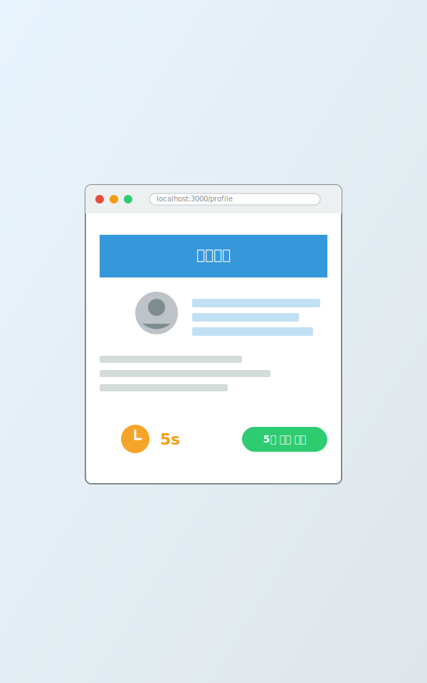
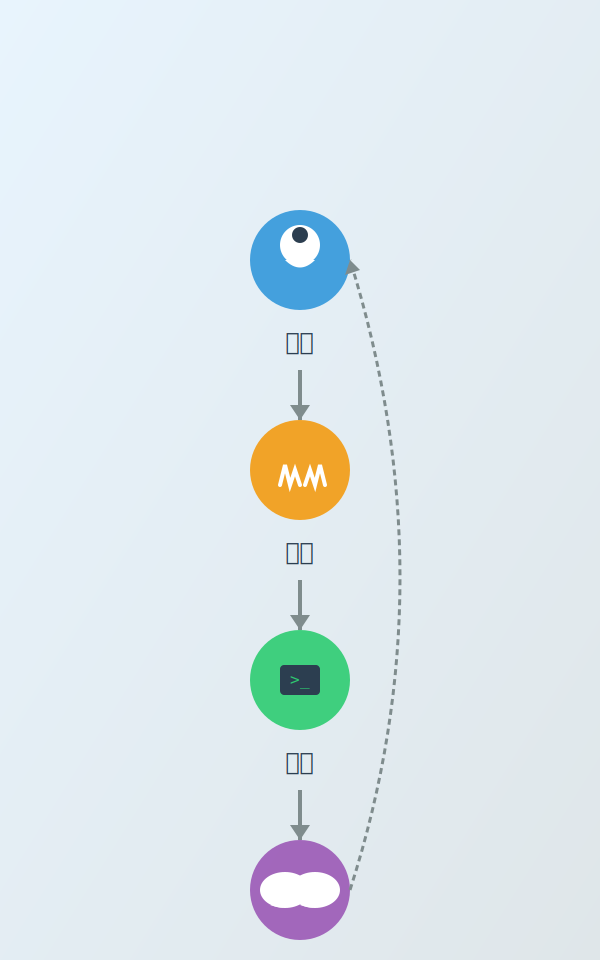
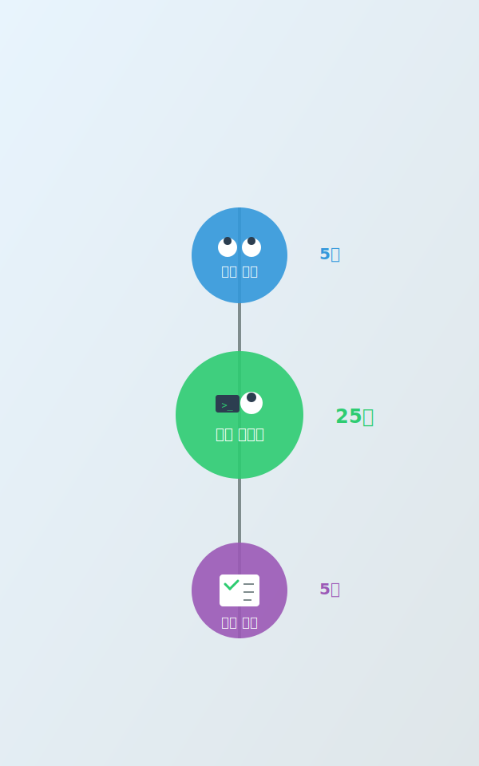

<!-- _class: lead -->

# AI Agent 활용 생활/업무 전환

**동명대학교 특강**
2026년 2월

5분 안에 웹사이트를 만들 수 있을까요?

---

## 오늘의 여정

| 시간 | 주제 | 활동 |
|------|------|------|
| 00:00-00:05 | Opening: 라이브 Hook | 시연 |
| 00:05-00:25 | Act 1: Agent란 무엇인가? | 이론+그룹 프롬프팅 |
| 00:25-00:55 | Act 2: Agent에게 일 맡기는 법 | 시연+그룹 프롬프팅 |
| 00:55-01:00 | 휴식 | - |
| 01:00-01:35 | Act 3: 함께 프로젝트 해보기 | 그룹 프롬프팅 |
| 01:35-01:50 | Act 4: 삶의 전환, 오늘부터 | 정리+마무리 |
| 01:50-02:00 | Q&A | 질의응답 |

목표: AI Agent를 활용한 일상/업무 개선 경험

---

## Opening Hook 결과

**방금 눈앞에서 본 것**:

- 코딩 없이
- 5분 안에
- 웹사이트가 만들어졌습니다

이게 가능하다면, 여러분의 과제/논문/회의록은요?

---

<!-- _class: lead -->

# Act 1

## Agent란 무엇인가?

---

## 챗봇 vs AI Agent

| 구분 | 챗봇 | AI Agent |
|------|------|----------|
| **역할** | 대화 상대 | 작업 수행자 |
| **도구** | 없음 | 파일, 웹, 코드 등 |
| **기억** | 대화만 | 프로젝트 지식 |
| **자율성** | 낮음 | 높음 |

Agent = 도구를 쓸 줄 아는 AI 동료

---

## AI Agent 구조

### 4가지 핵심 요소

1. **LLM**: 언어 이해/생성 엔진
2. **Memory**: 대화 이력 + 프로젝트 지식
3. **Planning**: 작업 분해 + 순서 결정
4. **Tools**: 파일 읽기/쓰기, 웹 검색, 코드 실행 등

핵심: 도구를 쓸 수 있기에 "실행"이 가능하다

---

## Agent를 통한 가속의 의미

### 단순한 "빠름"이 아닙니다

| 가속의 차원 | 의미 | 예시 |
|-------------|------|------|
| **실행 해방** | 반복 작업에서 벗어남 | 회의록 정리, 이메일 초안 |
| **레버리지** | 작은 노력으로 큰 결과 | 1시간 기획 → 완성된 보고서 |
| **아이디어 생존율** | 실행 부담 없이 시도 | "해볼까?" → 바로 프로토타입 |

핵심: 실행력이 아니라 판단력이 경쟁력

---

## 첫 번째 그룹 프롬프팅

**규칙**: 학생 제안 → 투표 → 강사 실행 → 함께 토론

| 역할 | 제안 예시 |
|------|----------|
| **학생** | 우리 조 발표 자료 템플릿 HTML로 |
| **대학원생** | 논문 키워드로 관련 주제 맵 |
| **교직원** | 회의 안건 체크리스트 HTML로 |

Agent에게 뭘 시켜볼까요?

---

<!-- _class: lead -->

# Act 2

## Agent에게 일 맡기는 법

**CLAUDE.md, 스킬, 그리고 위임의 기술**

---

## 페어 프롬프팅이란?

### 페어 프로그래밍에서 착안

| 역할 | 페어 프로그래밍 | 페어 프롬프팅 |
|------|----------------|---------------|
| **드라이버** | 코드 작성 | AI가 실행 |
| **네비게이터** | 방향 제시, 리뷰 | 사람이 판단 |

### 핵심 원칙

- AI가 실행하고, 사람이 방향을 잡는다
- 한 번에 완벽하지 않아도 된다
- **대화를 이어가며** 함께 발전시킨다

---

## 좋은 프롬프트 vs 나쁜 프롬프트

| 나쁜 예 | 좋은 예 |
|---------|---------|
| "논문 써줘" | "서론을 3문단으로 요약 + 핵심 주장 불릿 정리" |
| "코드 고쳐줘" | "12번 라인 TypeError → 타입 확인 + 수정 제안" |
| "회의록 작성" | "결정 사항, 액션 아이템, 다음 주제로 구분" |

큰 작업은 작은 단계로 쪼개서 요청

---

## CLAUDE.md란?

**Before (문서 없음)**:
- "프로젝트 구조 파악해줘" → "어떤 프로젝트인가요?"
- 대화 3-4회 반복

**After (CLAUDE.md 있음)**:
- "새 강의 폴더 만들어줘" → 즉시 올바른 구조 생성
- 1회 프롬프트로 완료

CLAUDE.md = Agent에게 주는 프로젝트 설명서

---

## 스킬(Skills)이란?

**스킬 = 반복 작업을 한 번에 실행하는 자동화 명령어**

예시: `/create-lecture` 입력
→ 6-Phase 파이프라인 자동 실행
→ outline.md 자동 생성

사람은 시작 버튼만 누르면 됨

---

## 두 번째 그룹 프롬프팅

**주제**: 여러분의 프로젝트에 CLAUDE.md를 쓴다면?

| 역할 | 활용 예시 |
|------|----------|
| **학생** | 팀 프로젝트 Git 규칙, 코드 스타일 |
| **대학원생** | 논문 폴더 구조, 참고문헌 포맷 |
| **교직원** | 부서 문서 템플릿, 파일명 규칙 |

이 문서가 있으면 협업이 어떻게 바뀔까?

---

<!-- _class: lead -->

# 휴식

**5분**

---

<!-- _class: lead -->

# Act 3

## 함께 프로젝트 해보기

---

## 주제 후보

**투표로 주제를 정합니다!**

| 역할 | 후보 1 | 후보 2 | 후보 3 |
|------|--------|--------|--------|
| **학생** | 팀 프로젝트 투표 페이지 | 과제 제출 체크리스트 | 스터디 일정표 |
| **대학원생** | 논문 키워드 맵 생성기 | 실험 데이터 시각화 | 문헌 요약 템플릿 |
| **교직원** | 회의 안건 관리 페이지 | 부서 일정 캘린더 | 문서 체크리스트 |

선택된 주제로 25분간 함께 만들어봅니다

---

## 실전 사례: AI Agent 활용

| 분야 | 사례 | 활용 방법 |
|------|------|----------|
| **학생** | 코딩 과제 디버깅 | 코드 파일 + 에러 메시지 전달 |
| **대학원생** | 논문 영문 교정 | 논문 초안 + 스타일 가이드 제공 |
| **교직원** | 행사 기획안 초안 | 과거 기획안 참조 + 요구사항 |
| **공통** | 이메일 답장 초안 | 컨텍스트 + 톤 지정 |

핵심: 맥락(Context) + 구체적 요청 = 높은 품질

---

## 결과 리뷰

**Agent와의 협업을 돌아봅니다**:

Agent가 예상보다 잘한 부분은?

Agent가 놓친 부분은?

다음에 이 작업을 혼자 한다면?

---

<!-- _class: lead -->

# Act 4

## 삶의 전환, 오늘부터

---

## 돌아보기

**오늘 우리가 경험한 4가지 순간**:

| 순간 | 경험한 것 | 메시지 |
|------|----------|--------|
| **Opening** | 5분 만에 웹사이트 | Agent에 대한 믿음 |
| **Act 1** | 무엇을 시킬지 고민 | 시킬지 고민하라 |
| **Act 2** | CLAUDE.md와 스킬 | 문서를 두려워하지 마라 |
| **Act 3** | 함께 프로젝트 만들기 | 읽고 대화하는 시간 |

---

## AI 시대 삶의 전환 3층위

### 1층: 실행의 전환

- 반복 업무를 Agent에게 위임
- 문서 작성, 데이터 정리, 코드 디버깅

### 2층: 결정의 전환

- "어떻게"보다 "무엇을" "왜"에 집중
- 방향 설정과 우선순위가 핵심 역량

### 3층: 시간의 전환

- 확보된 시간을 관계, 경험, 성장에 투자

---

## 사람이 집중해야 할 3가지

### 방향 (Direction)

어디로 갈 것인가
**결정은 사람의 몫**

### 관계 (Relationship)

누구와 함께할 것인가
**인간 고유의 영역**

### 현재 경험 (Experience)

지금 이 순간의 경험
**삶의 본질**

---

## AI Agent로 할 수 있는 것 vs 못하는 것

### 할 수 있는 것

- 정보 요약/정리
- 초안 작성
- 코드 디버깅
- 번역/교정
- 아이디어 브레인스토밍

### 못하는 것

- 100% 정확한 계산
- 최신 정보 (학습 시점 이후)
- 윤리적 판단 대행
- 창의적 결정 (최종)
- 책임 소재

---

## 오늘부터 시작하는 3가지

**1. 작게 시작하기**:
- 학생: 다음 과제에 Claude로 초안 작성
- 대학원생: 논문 1편 요약을 Agent에게
- 교직원: 회의록 템플릿을 Agent로

**2. 기록하는 습관**:
- 프로젝트마다 간단한 README.md 작성
- 반복 작업 발견 시 메모

**3. 경험 공유하기**:
- 팀원/동료에게 오늘 배운 것 공유

오늘 하나만: 내일 할 반복 업무 하나를 Agent에게 맡겨보기

---

## 감성 마무리

**AI는 여러분을 대신하지 않습니다.**
**여러분의 능력을 확장할 뿐입니다.**

- **학생**: 여러분의 학업이 더 창의적이고 즐거워지길
- **대학원생**: 여러분의 연구가 더 깊이 있고 빠르게 진행되길
- **교직원**: 여러분의 업무가 더 효율적이고 의미 있게 바뀌길

오늘 이 자리에 온 것이 첫 걸음입니다.
내일부터는 여러분의 걸음입니다.

---

<!-- _class: lead -->

# 감사합니다

**Q&A**

강의 자료 및 실습 파일:
[강의 자료 배포 링크]

문의: [강사 이메일]

