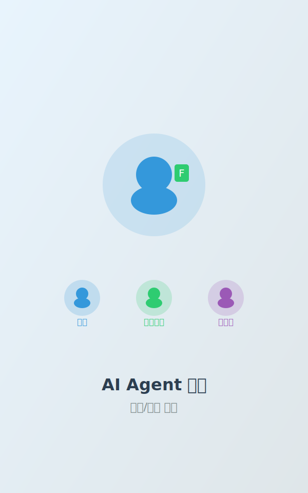
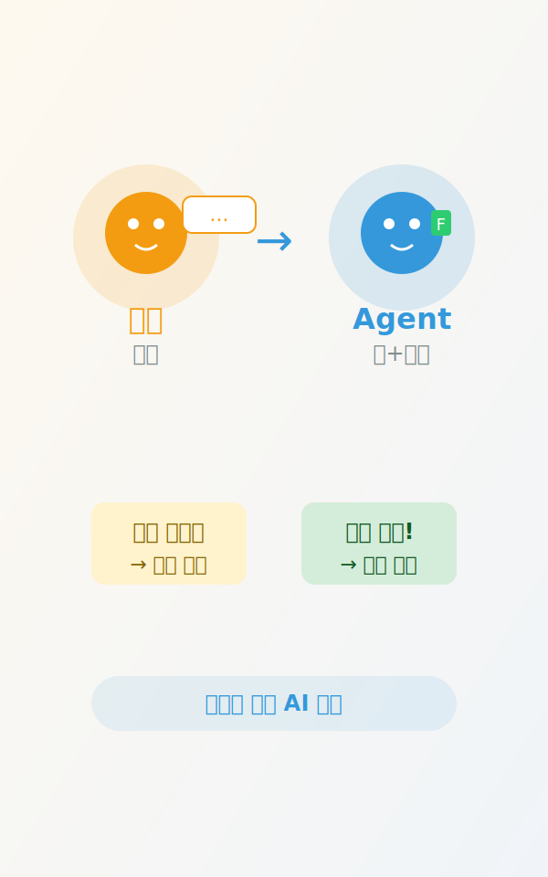
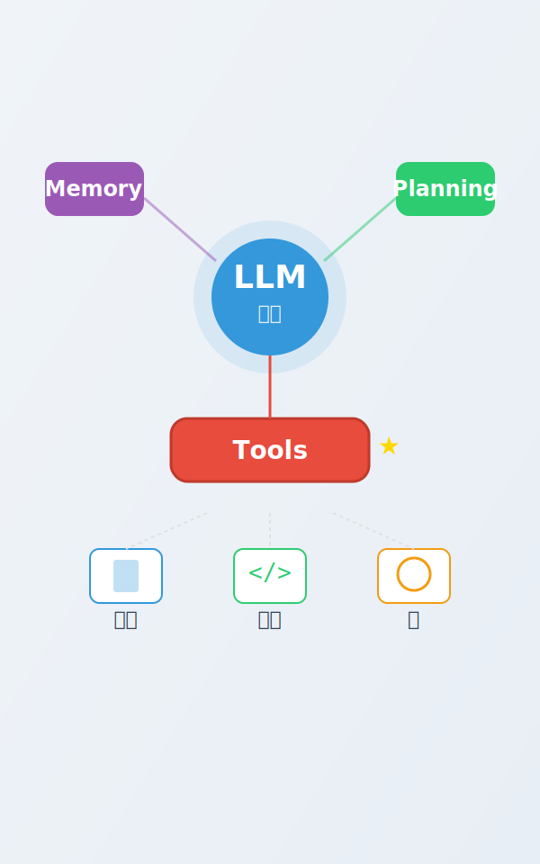
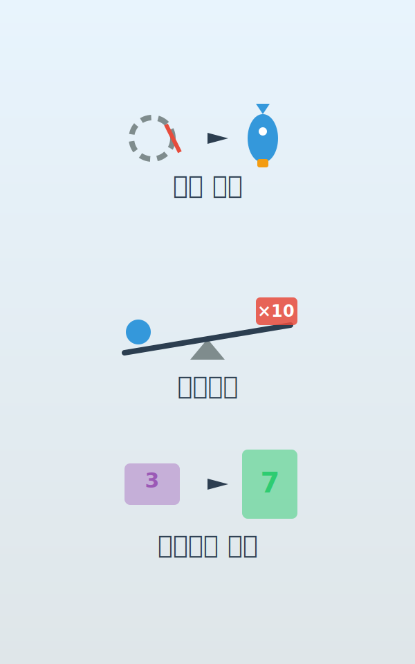
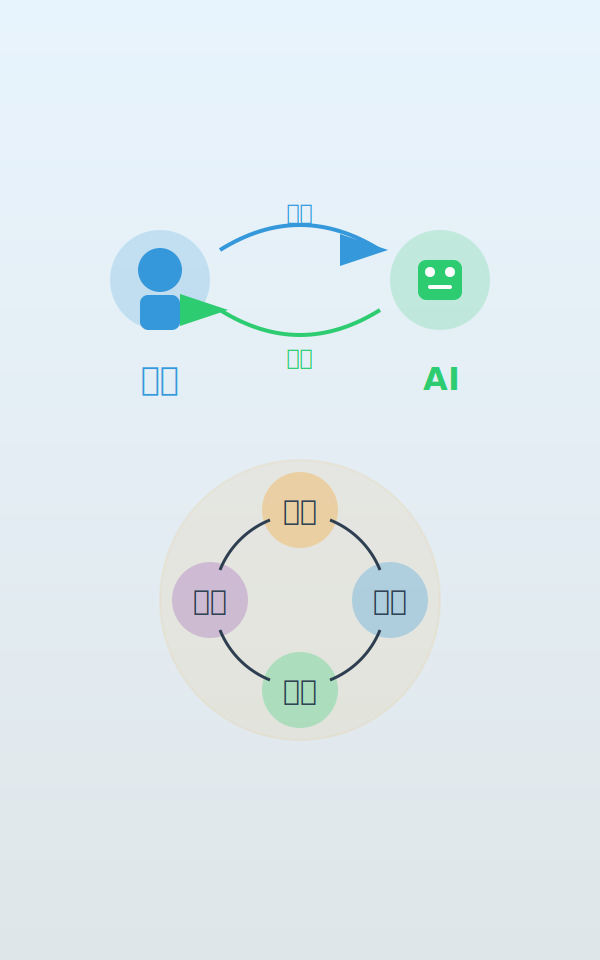
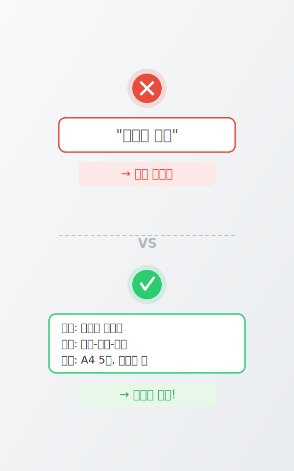
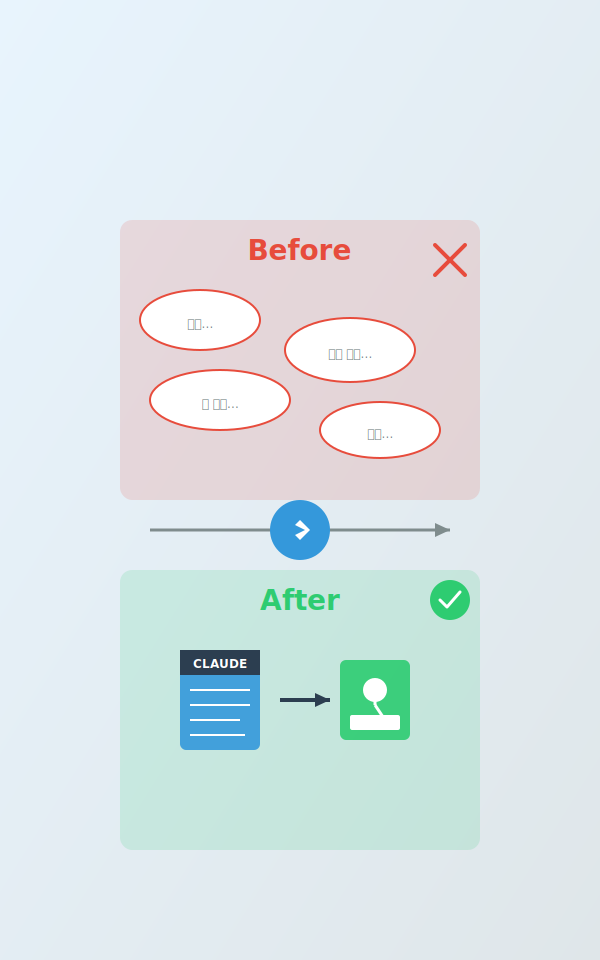
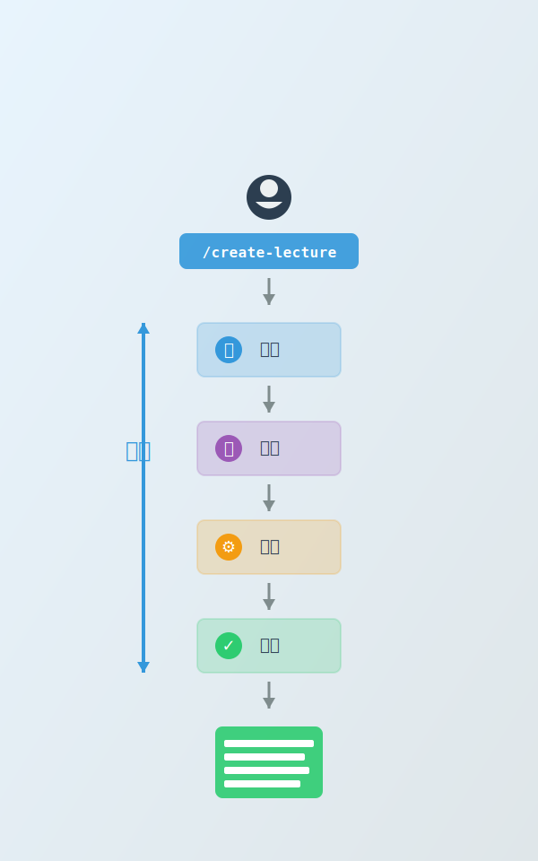
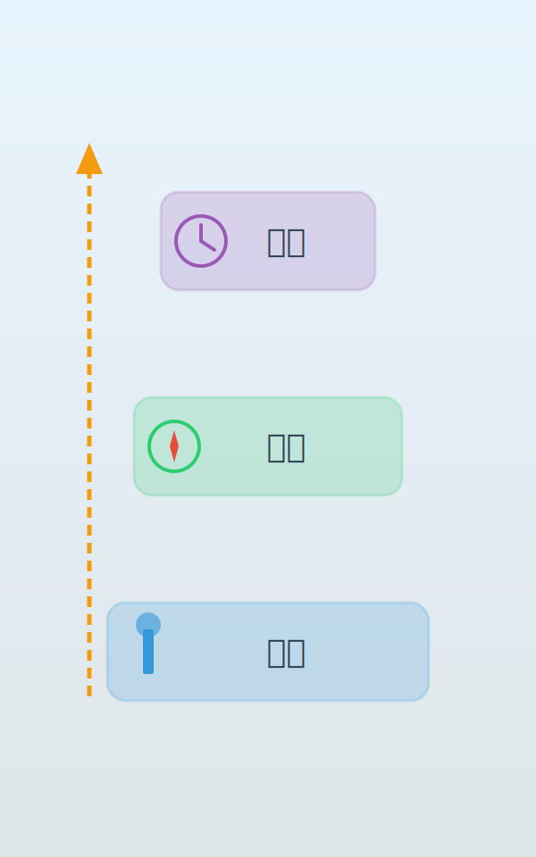

<style>
section {
  padding: 60px 80px;
  font-size: 1.1em;
  display: flex;
  flex-direction: column;
  justify-content: flex-start;
}

section.lead {
  padding: 60px 80px;
  text-align: center;
  justify-content: center;
}

h1 {
  color: #2c3e50;
  font-size: 3.2em;
  margin-top: 0;
  font-weight: 700;
}

h2 {
  color: #3498db;
  font-size: 2.6em;
  margin-top: 0;
  font-weight: 700;
}

h3 {
  font-size: 1.6em;
  font-weight: 600;
}

p, li {
  font-size: 0.95em;
  line-height: 1.5;
  font-weight: 400;
}

code {
  background: #f4f4f4;
  padding: 2px 6px;
  border-radius: 3px;
  font-size: 1.1em;
}

table {
  font-size: 0.95em;
  width: 100%;
}

.highlight, .success, .question {
  padding: 12px 16px;
  margin: 10px 0;
  font-size: 1.2em;
  flex-grow: 0;
  flex-shrink: 0;
}

.highlight p, .success p, .question p,
.highlight strong, .success strong, .question strong {
  margin: 0;
  padding: 0;
}

.highlight {
  background: #fff3cd;
  border-left: 4px solid #ffc107;
}

.success {
  background: #d4edda;
  border-left: 4px solid #28a745;
}

.question {
  background: #e3f2fd;
  border-left: 4px solid #2196f3;
  font-size: 1.3em;
  font-weight: bold;
  color: #1565c0;
}
</style>

<!-- _class: lead -->



# AI Agent 활용<br/>생활/업무 전환

**동명대학교 특강**
2026년 2월

---

## 오늘의 여정

| 시간 | 주제 | 활동 |
|------|------|------|
| 00:00-00:20 | Act 1: Agent란 무엇인가? | 이론 + Agent 가속 체감 |
| 00:25-00:55 | Act 2: Agent에게 일 맡기는 법 | 프롬프트 원칙 + 페어 프롬프팅 |
| 00:55-01:05 | 휴식 | - |
| 01:05-01:40 | Act 3: 함께 프로젝트 해보기 | 역할별 실습 + AI와 함께 만들기 |
| 01:40-01:55 | Act 4: 삶의 전환, 오늘부터 | 3가지 조언 + 로드맵 |
| 01:55-02:00 | Q&A | 질의응답 |

<div class="highlight">

목표: AI Agent를 활용한 일상/업무 개선 경험

</div>

---

## 오늘의 출발점: Agent에 대한 믿음

<div class="question">

AI Agent는 여러분이 생각하는 것보다 훨씬 많은 일을 할 수 있습니다. 한번 믿어보세요.

</div>

| 상황 | 기존 방식 | Agent 활용 |
|------|----------|-----------|
| 보고서 초안 | 2시간 검색+작성 | 5분 프롬프트 → 초안 완성 |
| 데이터 정리 | 엑셀 수작업 | "이 데이터를 정리해줘" 한 줄 |
| 발표자료 | PPT 템플릿 찾기 | "발표자료 만들어줘" → 완성 |

<div class="success">

Agent가 잘 못하는 것처럼 느껴질 때, 그건 Agent의 한계가 아닙니다.
**내가 원하는 걸 시키는 법을 아직 찾지 못한 것**입니다.

</div>

---

<!-- _class: lead -->

# Act 1

## Agent란 무엇인가?

---



## 챗봇 vs AI Agent

| 구분 | 챗봇 | AI Agent |
|------|------|----------|
| **역할** | 대화 상대 | 작업 수행자 |
| **도구** | 없음 | 파일, 웹, 코드 등 |
| **기억** | 대화만 | 프로젝트 지식 |
| **자율성** | 낮음 | 높음 |

<div class="highlight">

Agent = 도구를 쓸 줄 아는 AI 동료

</div>

---



## AI Agent 구조

### 4가지 핵심 요소

1. **LLM**: 언어 이해/생성 엔진
2. **Memory**: 대화 이력 + 프로젝트 지식
3. **Planning**: 작업 분해 + 순서 결정
4. **Tools**: 파일 읽기/쓰기, 웹 검색, 코드 실행 등

<div class="success">

핵심: 도구를 쓸 수 있기에 "실행"이 가능하다

</div>

---



## Agent를 통한 가속의 의미

### 단순한 "빠름"이 아닙니다

| 가속의 차원 | 의미 | 예시 |
|-------------|------|------|
| **실행 해방** | 반복 작업에서 벗어남 | 회의록 정리, 이메일 초안 |
| **레버리지** | 작은 노력으로 큰 결과 | 1시간 기획 → 완성된 보고서 |
| **아이디어 생존율** | 실행 부담 없이 시도 | "해볼까?" → 바로 프로토타입 |

<div class="highlight">

핵심: 실행력이 아니라 판단력이 경쟁력

</div>

---

## 강사의 경험: 1~2월, Agent와 함께한 2개월

| 프로젝트 | 내용 |
|---------|------|
| **논문 연구 + 사이트 제작** | 연구와 웹사이트를 동시에 |
| **강의 자료 제작** | 이 강의를 포함한 여러 강의 |
| **음악 생성 및 배포** | 8곡 작곡·편곡·배포 |
| **멘토링** | 5회 진행 |
| **개인+팀 프로젝트 3개** | otu.oss, 주식 종목 추천, 남해 일자리+빈집 알리미 |

<div class="question">

Agent 사용 전과 비교하면 생산성이 약 10배.
반면 스트레스는 오히려 적고, 쉬고 놀고 운동하고 사람 만날 시간이 생겼습니다.

</div>

---

## Agent 가속 = 삶의 난이도가 바뀌는 경험

### 게임에 비유하면

가챠에서 **프리미엄 등급 아이템**을 뽑았을 때를 떠올려보세요.
그 전까지 어렵게 느껴지던 스테이지가, 아이템 하나로 **완전히 다른 난이도**가 됩니다.

| 구분 | 가챠 아이템 획득 전 | 가챠 아이템 획득 후 |
|------|------------------|------------------|
| **난이도** | 어렵고 시간이 오래 걸림 | 같은 스테이지가 쉬워짐 |
| **전략** | 생존에 집중 | 더 높은 목표에 도전 |
| **여유** | 없음 | 새로운 플레이 방식 탐색 |

### Agent가 바로 그 아이템입니다

- Agent 사용 전: 과제, 보고서, 정리... 하나하나가 **높은 난이도**
- Agent 사용 후: 같은 일이 **쉬워지고**, 더 많은 걸 시도할 여유가 생김

<div class="highlight">

Agent는 삶의 난이도를 바꿔주는 프리미엄 아이템. <strong>이미 여러분의 손에 있습니다.</strong>

</div>

---

## Agent 시대의 감각 — 뽑기

### A.K.A. AI 잘 다루는 법

인형 뽑기를 떠올려보세요. 뽑기는 뽑기인데, **기술이 있는 뽑기**입니다.

| 인형 뽑기 | Agent 활용 |
|----------|-----------|
| 집게 위치와 타이밍 감각 | 어떤 프롬프트가 좋은 결과를 내는지 감각 |
| 많이 해본 사람이 잘 뽑음 | 많이 써본 사람이 잘 시킴 |
| 기계마다 특성이 다름 | 모델마다 특성이 다름 |

### 경험이 쌓이면

- 어떤 **문장의 조합**이 내가 원하는 결과를 만드는지 알게 됩니다
- 모델에 대한 **경험과 이해**가 깊어질수록 뽑기 성공률이 올라갑니다

<div class="success">

좋은 결과를 뽑는 건 운이 아닙니다. <strong>경험과 노하우</strong>입니다.

</div>

---

## 나의 역할: 무엇을 시킬지 선택하는 것

Agent가 일을 대신 해주니, **나의 역할은 어떤 일을 시킬지 결정하는 것**이 되었습니다.

모든 일을 다 시킬 수 있지만 — **제한된 자원** 안에서 선택해야 합니다.

| 병목 | 설명 |
|------|------|
| **토큰** | 원하는 시간에 작업을 끝내지 못하는 이유. 하찮은 작업에 토큰을 쓰는 게 아깝다 |
| **메모리 칩** | AI 산업의 병목이 GPU → 메모리 칩으로 이동. 더 많은 사람이 Agent를 쓸수록 심화 |
| **에너지** | 데이터센터 전력 소비. 지구적 규모의 병목으로 확대 |

<div class="highlight">

Agent에게 시킬 수 있는 일은 무한하지만, 자원은 유한합니다.
<strong>무엇을 시킬지 선택하는 감각</strong>이 중요해집니다.

</div>

---

## Act 1 핵심 메시지

<div class="success">

Agent는 인간 역할의 대부분을 대체하게 될겁니다.
다만, 여전히 사람에겐 **무엇을 시킬지 결정하고 책임지는 역할**이 남습니다.

</div>

### 기억할 것

- Agent = 유능한 조교. 시키면 실행하지만, **방향은 내가 결정**
- Agent는 삶의 난이도를 바꿔주는 **프리미엄 아이템**
- "내가 직접 하지 말고, Agent에게 시킬 수 있는 건 무엇인가?"

<div class="highlight">

핵심: 어떻게 Agent가 원하는 대로 작업하게 할지 고민하라. 잘 안된다고 직접 작업하지 마라.

</div>

---

<!-- _class: lead -->

# Act 2

## Agent에게 일 맡기는 법

**프롬프트 원칙, 문서화, 그리고 위임의 기술**

---



## 페어 프롬프팅이란?

### 하나의 화면, 함께 보는 Agent 작업

| 구분 | 페어 프로그래밍 | 페어 프롬프팅 |
|------|----------------|---------------|
| **화면** | 1대의 컴퓨터 공유 | 1개의 Agent 화면 공유 |
| **참여** | 2명이 함께 코딩 | 2명 이상이 함께 지시 |
| **Agent 작업 중** | 코드 리뷰·토론 | 서로의 AI 경험을 나누는 시간 |

### 왜 함께 하는가?

- **하나의 화면**을 함께 보며 Agent에게 시키고 지켜본다
- Agent가 작업하는 동안이 **서로의 AI 활용 경험을 나누는 시간**이다
- 혼자보다 함께할 때 **더 좋은 질문, 더 다양한 관점**이 나온다

---

## 첫 번째 페어 프롬프팅

**강사 화면을 함께 보며** Agent에게 시키고, 결과를 함께 지켜봅니다.

| 흐름 | 하는 일 |
|------|---------|
| **함께 시키기** | "Agent에게 이걸 시켜보면 어때요?" |
| **함께 지켜보기** | 강사 화면으로 Agent 작업 과정을 관찰 |
| **경험 나누기** | Agent가 작업하는 동안 서로의 AI 경험 공유 |

<div class="question">

하나의 화면을 함께 보겠습니다. Agent에게 뭘 시켜볼까요?

</div>

---

## 컨텍스트: Agent에게 맥락 전달하기

| 항목 | 컨텍스트 비어있을 때 | 컨텍스트 채웠을 때 |
|------|-------------------|-------------------|
| **대상** | "일반 대중용" (추측) | "교수님 제출용" (명시) |
| **톤** | "중립적" (추측) | "학술적, 객관적" (명시) |
| **분량** | "적당히" (추측) | "A4 5장" (명시) |
| **결과** | 예측 불가능 | 원하는 결과물 |

<div class="highlight">

**핵심**: 빈 컨텍스트 = Agent가 추측 = 엉뚱한 결과. 맥락을 채울수록 결과가 좋아집니다.

</div>

---



## 좋은 프롬프트 vs 나쁜 프롬프트

| 구분 | 나쁜 프롬프트 | 좋은 프롬프트 |
|------|-------------|-------------|
| **내용** | "레포트 써줘" | "소프트웨어공학 중간 리포트, 애자일 방법론" |
| **구조** | (없음) | "서론-본론(3장)-결론" |
| **분량** | (없음) | "A4 5장, APA 형식" |
| **결과** | Agent가 추측 → 엉뚱한 결과 | 구체적 지시 → 원하는 결과 |

### 좋은 프롬프트 3원칙

| 원칙 | 설명 | 예시 |
|------|------|------|
| **구체성** | 무엇을 원하는지 명확히 | "A4 5장, APA 형식" |
| **단계성** | 순서를 정해주기 | "서론 → 본론 → 결론" |
| **결과물 명시** | 최종 형태를 알려주기 | "PDF로 저장, 표 포함" |

---

## 역할별 프롬프트 예시

| 역할 | 상황 | 좋은 프롬프트 예시 | 효과 |
|------|------|------------------|------|
| **학부생** | 과제 작성 | "애자일 방법론 리포트, A4 5장, 학술적 톤" | 구체적 지시 → 퀄리티 상승 |
| **대학원생** | 논문 검색 | "딥러닝, 이미지 분류, 2023년 이후, 의료 영상" | 명확한 키워드 → 관련도 높은 결과 |
| **교직원** | 문서 작성 | "회의록: 참석자, 안건, 결정사항, 할 일 목록" | 상세 명시 → 수정 횟수 감소 |

<div class="highlight">

핵심: 구체적으로, 맥락과 함께, 그리고 반복 개선

</div>

---



## CLAUDE.md / Project Instructions란?

**Before (지침 없음)**:
- "회의록 정리해줘" → "어떤 형식으로 작성할까요?"
- 매번 같은 설명을 3-4회 반복

**After (지침 있음)**:
- "이번 주 회의록 정리해줘" → 즉시 표 형식+액션아이템 포함 생성
- 1회 프롬프트로 완료

<div class="success">

Project Instructions = Agent에게 주는 프로젝트 설명서
(Claude Desktop의 Projects 기능에서 설정 가능)

</div>

---

## 문서화: AI가 바꾼 기록의 경제학

| 항목 | Before AI | After AI |
|------|----------|----------|
| **문서화** | "나중에" (시간 없음) | **"먼저"** (AI가 초안 작성) |
| **회의록** | "누가 쓸래?" (귀찮음) | **자동 생성** (검토만 하면 됨) |
| **정리** | "기억나면 하자" (잊어버림) | **실시간** (AI가 바로 정리) |

**비용이 높았기에** 미뤘지만, 이제 **비용이 거의 0**이 되었습니다

---



## 스킬(Skills)이란?

**스킬 = 반복 작업을 한 번에 실행하는 자동화 명령어**

예시: "주간 보고서 만들어줘" 한 마디
→ Agent가 자료 수집 → 초안 작성 → 포맷 정리
→ 완성된 보고서 전달

<div class="highlight">

사람은 시작 버튼만 누르면 됨

</div>

---

## 두 번째 페어 프롬프팅

**이번에는** Agent에게 Project Instructions를 만들게 시켜봅니다.

**함께 화면을 보며** Agent에게 시키고, 작업 과정을 지켜봅니다.

| 흐름 | 하는 일 |
|------|---------|
| **함께 시키기** | "우리 팀 프로젝트 규칙을 정리해줘" |
| **함께 지켜보기** | Agent가 문서를 만드는 과정을 관찰 |
| **경험 나누기** | "나는 이런 식으로 Agent를 써봤는데..." |

<div class="question">

Agent가 작업하는 동안, 여러분의 AI 경험을 나눠주세요!

</div>

---

## Act 2 핵심 메시지

<div class="success">

**맥락을 전달하라.**
구체적으로, 맥락과 함께, 그리고 반복 개선하라.

</div>

### 오늘 배운 위임의 3가지 도구

| 도구 | 역할 | 효과 |
|------|------|------|
| **프롬프트 원칙** | 구체적 지시 | 한 번에 좋은 결과 |
| **CLAUDE.md / Project Instructions** | 프로젝트 맥락 | 반복 설명 불필요 |
| **스킬(Skills)** | 반복 작업 자동화 | 사람은 시작만 |

---

<!-- _class: lead -->

# 휴식

**10분**

---

<!-- _class: lead -->

# Act 3

## 함께 프로젝트 해보기

---

## 실습 안내: 역할별 시나리오

<div class="question">
여러분의 역할에 맞는 실습을 선택하세요
</div>

### 3개 트랙 중 하나를 선택 (각 10분)

| 트랙 | 대상 | 주제 |
|------|------|------|
| **A: 학업 도우미** | 학부생 | 과제 리서치 & 정리 자동화 |
| **B: 논문 탐색** | 대학원생 | 논문 검색 & 요약 도구 활용 |
| **C: 문서 자동 작성** | 교직원 | 업무 문서 자동 생성 체험 |

### 실습 목표

> Agent에게 지시하고, 결과를 검토하고, 수정 요청까지 해보기
> (트랙별 구체적 성공 기준은 각 슬라이드에 있습니다)

---

## 트랙 A: 학업 도우미 (학부생)

### 과제 리서치 & 정리 자동화

**시나리오**:
- 수업 리포트 작성의 시작점 잡기
- 검색하면 정보가 너무 많아서 정리가 안 됨

**프롬프트 예시**:

```
소프트웨어공학 수업 리포트를 써야 해.
주제는 '애자일 방법론의 장단점'.
리포트 개요와 핵심 키워드를 정리해줘.
```

**도전 과제**: 개요를 바탕으로 서론 초안 작성 요청

**성공 기준**: 개요 초안 3개 섹션 이상이 나왔으면 성공

| 키워드 | 적용 |
|--------|------|
| **선택** | Agent가 준 개요 중 어떤 구조를 쓸지는 내가 결정 |
| **계획** | 구체적 프롬프트(과목, 주제, 형식) = 좋은 결과물 |

---

## 트랙 B: 논문 탐색 (대학원생)

### 논문 검색 & 요약 도구 활용

**시나리오**:
- 관련 논문을 빠르게 찾고 싶음
- 핵심만 요약해서 보고 싶음

**추천 도구** (모두 무료):

| 도구 | 기능 |
|------|------|
| **SciSpace** | 2억 8천만 건 논문 검색, 요약·해석 |
| **Connected Papers** | 논문 간 관계 그래프 시각화 |
| **Consensus** | 문헌 리뷰 초안 자동 작성 |

**실습**: SciSpace에서 연구 주제 검색 → 논문 5편 선택 → AI 요약 확인

**성공 기준**: 논문 5편 중 2편 이상의 요약 내용을 설명할 수 있으면 성공

<div class="success">
<strong>효과</strong>: Deep Research 기능 활용 시 리서치 시간 80% 단축
</div>

---

## 트랙 C: 문서 자동 작성 (교직원)

### 업무 문서 자동 생성 체험

**시나리오**:
- 반복되는 업무 문서 작성이 부담
- 자동으로 초안이 만들어지면 좋겠음

**프롬프트 예시**:

```
다음 내용으로 행사 기획안 초안을 작성해줘.

행사명: 2026 AI 활용 워크숍
대상: 교직원 30명
일시: 3월 둘째 주
예산: 200만원

형식: 목적, 일정, 예산 배분, 준비물 포함
```

**결과물**: 행사 기획안 초안

**성공 기준**: 초안이 즉시 수정 없이 참고 가능한 수준이면 성공

<div class="highlight">
핵심: 과거 문서를 참조 자료로 제공하면 품질이 더 올라갑니다
</div>

---

## AI와 함께 만들기: 코딩 없이 도구 제작

<div class="question">
여러분은 "무엇을 만들지"만 결정하세요. 코드는 AI가 작성합니다.
</div>

### 3개 중 하나를 선택하세요

| 난이도 | 프로젝트 | 설명 |
|--------|---------|------|
| **쉬움** | 시간표/일정 관리 페이지 | 요일별 시간표 |
| **보통** | 할일 목록 앱 | 추가/삭제/완료 체크 |
| **도전** | 팀프로젝트 투표 페이지 | 주제 제안 + 투표 |

---

## AI와 함께 만들기: 프롬프트만 입력하세요

**여러분이 하는 것**: 자연어로 원하는 것을 설명
**AI가 하는 것**: 코드 생성 + 완성된 페이지 제공

| 프로젝트 | 프롬프트 예시 |
|---------|-------------|
| **시간표** | "월~금 시간표를 보여주는 예쁜 페이지를 만들어줘. 시간대별로 과목명과 장소를 표시해줘." |
| **할일 목록** | "할일을 추가하고 완료 체크할 수 있는 앱을 만들어줘. 추가, 완료 표시, 삭제 기능." |
| **투표 페이지** | "팀프로젝트 주제를 제안하고 투표할 수 있는 페이지. 주제 추가, 투표(+1), 순위 정렬." |

<div class="highlight">
핵심: 코딩 지식이 필요한 게 아닙니다. <strong>무엇을 원하는지 구체적으로 설명하는 능력</strong>이 필요합니다.
</div>

---

## Agent 프로젝트 실전 사례

| 대상 | 활용 사례 | 도구/방법 |
|------|----------|----------|
| **학부생** | 논문 리뷰 도우미 | PDF 업로드 → 요약 + 핵심 정리 |
| | 학습 노트 자동 정리 | 수업 필기 → 구조화된 노트 |
| | 발표자료 생성 | AiPPT, 미리캔버스 활용 |
| **대학원생** | Deep Research | 리서치 시간 80% 단축 |
| | 문헌 관리 | Typeset.io 자동 형식 정리 |
| | 논문 관계 시각화 | Connected Papers |
| **교직원** | 문서 자동 생성 | 공문서, 보고서 초안 |
| | 회의록 자동화 | 클로바노트 월 600분 무료 |
| | 이메일 답장 | 컨텍스트 + 톤 지정 |

<div class="success">
핵심: Agent는 "시작의 장벽"을 없애줍니다. 아이디어만 있으면 됩니다.
</div>

---

## 결과 리뷰 & 학습 포인트

**Agent와의 협업을 돌아봅니다**:

<div class="question">

Agent가 예상보다 잘한 부분은? 놓친 부분은?

</div>

### 오늘 실습에서 확인한 것

| 키워드 | 실습에서의 적용 |
|--------|----------------|
| **선택** | Agent 결과물 중 무엇을 쓸지는 내가 결정 |
| **계획** | 구체적 프롬프트 = 좋은 결과 (빈 컨텍스트 = 엉뚱한 결과) |
| **문서화** | 프롬프트와 결과물을 기록하면 재활용 가능 |

<div class="highlight">
주의: Agent가 만든 내용을 그대로 제출하면 표절. <strong>AI 결과물 + 나의 분석/의견 = 진짜 결과물</strong>
</div>

---

<!-- _class: lead -->

# Act 4

## 삶의 전환, 오늘부터

---

## 돌아보기

**오늘 우리가 경험한 4가지 순간**:

| 순간 | 경험한 것 | 메시지 |
|------|----------|--------|
| **Act 1** | Agent 개념 + 가속 체감 | 시킬지 고민하라 |
| **Act 2** | 프롬프트 원칙 + 문서화 | 맥락을 전달하라 |
| **Act 3** | 역할별 실습 + AI와 함께 만들기 | 직접 경험이 최고의 학습 |

---



## AI 시대 삶의 전환 3층위

### 1층: 실행의 전환

- 반복 업무를 Agent에게 위임
- 문서 작성, 데이터 정리, 코드 디버깅

### 2층: 결정의 전환

- "어떻게"보다 "무엇을" "왜"에 집중
- 방향 설정과 우선순위가 핵심 역량

### 3층: 시간의 전환

- 확보된 시간을 관계, 경험, 성장에 투자

---

## 사람이 집중해야 할 3가지

| 영역 | 핵심 질문 | 의미 |
|------|----------|------|
| **방향 (Direction)** | 어디로 갈 것인가 | 결정은 사람의 몫 |
| **관계 (Relationship)** | 누구와 함께할 것인가 | 인간 고유의 영역 |
| **현재 경험 (Experience)** | 지금 이 순간의 경험 | 삶의 본질 |

<div class="success">

AI가 실행을 대신해도, <strong>방향·관계·경험</strong>은 사람만이 채울 수 있습니다.

</div>

---

## Agent의 한계와 가능성

| Agent가 잘하는 것 | Agent가 못하는 것 |
|------------------|------------------|
| **파일 조작** - 생성, 수정, 정리, 변환 | **실시간 검색** - 최신 정보 직접 검색 불가 |
| **코드 생성** - HTML, Python, 스크립트 | **보안 시스템 접근** - 학교 포털, 은행 등 |
| **문서 요약** - 긴 텍스트를 핵심만 정리 | **대신 선택하기** - 판단과 결정은 사람의 몫 |
| **구조화** - 막연한 아이디어를 체계적으로 | **감정/공감** - 진짜 감정을 느끼지 못함 |
| **반복 작업** - 같은 패턴 빠르게 처리 | **사실 보장** - 틀린 정보를 자신있게 말할 수 있음 |
| **초안 작성** - 리포트, 메일, 기획서 | **창의적 도약** - 전혀 새로운 발상은 어려움 |

<div class="highlight">
기대치를 조정해야 실망이 없습니다. Agent는 만능이 아니라 "유능한 조교"입니다.
</div>

---

## AI 시대 경쟁력을 위한 3가지 조언

<div class="success">
AI가 바꾸는 건 도구이지, 사람의 가치가 아닙니다
</div>

### 1. "도구를 두려워하지 마세요"

- 학부생: AI Agent는 학업의 협업 파트너
- 대학원생: AI Agent는 연구의 가속기
- 교직원: AI Agent는 업무의 효율화 도구

**핵심**: 도구를 잘 쓰는 사람이 경쟁력을 가집니다

---

## AI 시대 경쟁력을 위한 3가지 조언 (계속)

### 2. "선택하는 능력을 키우세요"

- AI가 10개의 옵션을 만들어도, **고르는 건 사람**
- "왜 이걸 선택했는가"를 설명할 수 있어야 합니다

### 3. "기록하는 습관을 들이세요"

- AI가 문서화 비용을 0에 가깝게 만들었습니다
- 학부생: 학습 일지, 프로젝트 회고
- 대학원생: 실험 노트, 연구 일지
- 교직원: 회의록, 업무 로그

**핵심**: 기록하는 사람이 성장하는 사람입니다

---

## 오늘부터 시작하는 3가지

**1. 작게 시작하기**:
- 학생: 다음 과제에 Claude로 초안 작성
- 대학원생: 논문 1편 요약을 Agent에게
- 교직원: 회의록 템플릿을 Agent로

**2. 기록하는 습관**:
- 프로젝트마다 간단한 README.md 작성
- 반복 작업 발견 시 메모

**3. 경험 공유하기**:
- 팀원/동료에게 오늘 배운 것 공유

<div class="success">

오늘 하나만: 내일 할 반복 업무 하나를 Agent에게 맡겨보기

</div>

---

## 심화 학습 로드맵

### 단계별 성장 경로

| 시기 | 목표 | 실천 방법 |
|------|------|----------|
| **이번 주** | 첫 적용 | 과제/연구/업무 하나에 Agent 써보기 |
| **1개월** | 습관화 | 프롬프트 패턴 학습, 문서화 시작 |
| **3개월** | 심화 활용 | 개인 프로젝트에 적용, 도구 연동 |
| **6개월** | 자기만의 방식 | 워크플로우 구축, 포트폴리오 완성 |

### 추천 리소스

| 대상 | 도구 |
|------|------|
| **공통** | Claude Desktop, ChatGPT, Gemini (무료) |
| **대학원생** | SciSpace, Connected Papers, Consensus |
| **교직원** | 클로바노트 (월 600분 무료), 마음회의록 |

---

## Act 4 핵심 메시지: 오늘부터 시작하자

**AI는 여러분을 대신하지 않습니다.**
**여러분의 능력을 확장할 뿐입니다.**

- **학생**: 여러분의 학업이 더 창의적이고 즐거워지길
- **대학원생**: 여러분의 연구가 더 깊이 있고 빠르게 진행되길
- **교직원**: 여러분의 업무가 더 효율적이고 의미 있게 바뀌길

<div class="success">

오늘 이 자리에 온 것이 첫 걸음입니다. 내일부터는 여러분의 걸음입니다.
**모든 사람의 경험이 다릅니다. 자기 경험을 늘리고, 다른 사람과 공유하세요.**

</div>

---

<!-- _class: lead -->

# 감사합니다

**Q&A**

---

## 오늘의 핵심 정리

| Act | 배운 것 | 핵심 메시지 |
|-----|--------|------------|
| **Act 1** | Agent 개념 + 가속 체감 | 시킬지 고민하라 |
| **Act 2** | 프롬프트 원칙 + 문서화 | 맥락을 전달하라 |
| **Act 3** | 역할별 실습 + AI와 함께 만들기 | 직접 경험이 최고의 학습 |
| **Act 4** | 3가지 조언 + 로드맵 | 오늘부터 시작하자 |

<div class="highlight">

강의 자료 및 실습 파일: [강의 자료 배포 링크]

문의: [강사 이메일]

</div>
