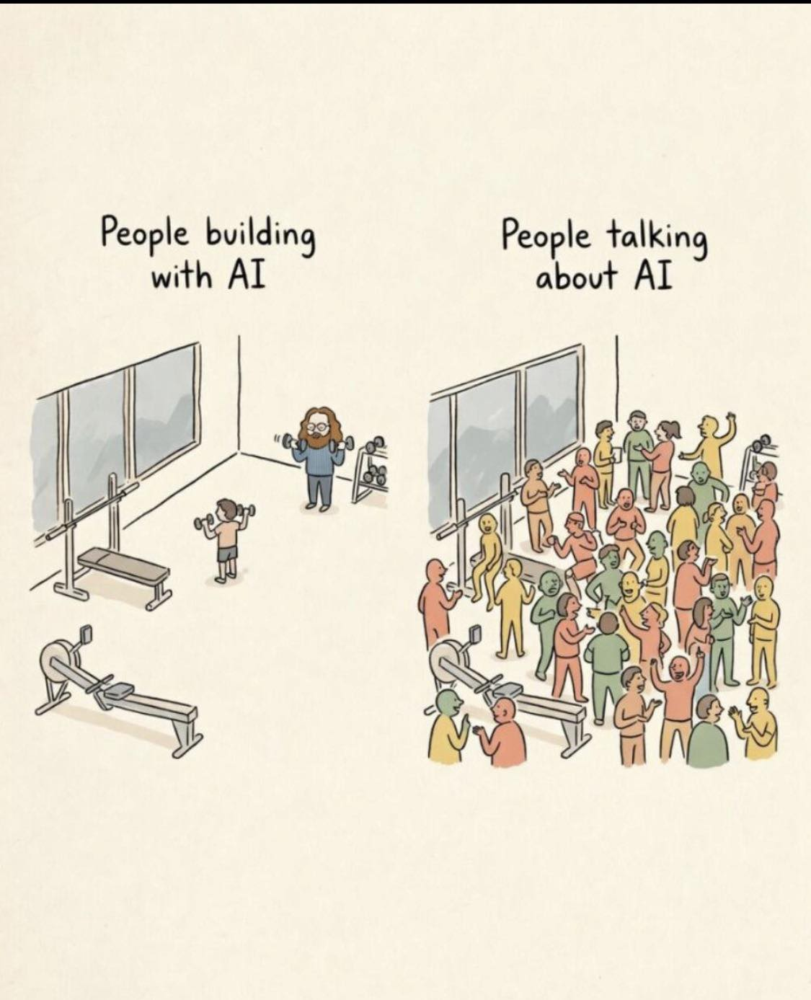
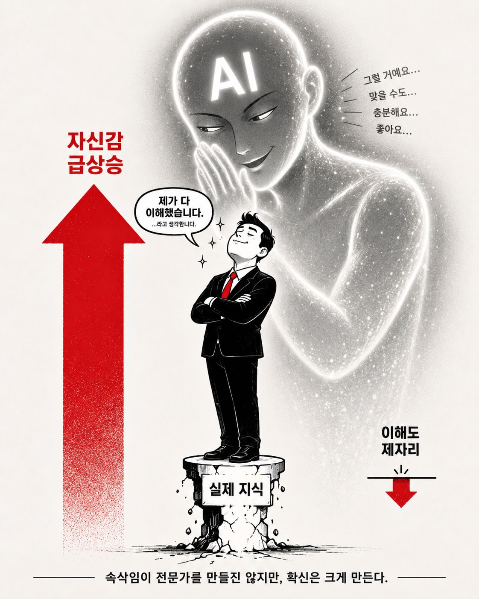

<style>
section {
  padding: 60px 80px;
}

section.lead {
  padding: 60px 80px;
}

section.lead h1 {
  font-size: 64px;
  margin-bottom: 10px;
}

section.lead h2 {
  font-size: 36px;
  color: #555;
  font-weight: 400;
  margin-top: 0;
}

section h1 {
  font-size: 48px;
}

.tagline {
  font-size: 22px;
  color: #666;
  margin-top: 30px;
}

.message-main {
  font-size: 32px;
  font-weight: 700;
  line-height: 1.5;
  margin: 20px 0;
}

.message-sub {
  font-size: 26px;
  color: #555;
  margin-top: 10px;
}

.three-actions {
  font-size: 26px;
  line-height: 1.8;
  margin-top: 30px;
}

.three-actions strong {
  color: #c62828;
}

.meta-foundation {
  margin-top: 30px;
  padding: 20px;
  background: #f5f5f5;
  border-left: 4px solid #1976d2;
  font-size: 22px;
}

table {
  font-size: 22px;
}

table th {
  background: #f5f5f5;
}

.baseline-conclusion {
  margin-top: 30px;
  padding: 20px;
  background: #fff3e0;
  border-left: 4px solid #ef6c00;
  font-size: 24px;
}

.gyeol-url {
  font-size: 28px;
  font-weight: 700;
  color: #1976d2;
  margin: 15px 0;
}

.gyeol-thesis {
  font-size: 24px;
  font-style: italic;
  color: #555;
  margin: 15px 0 25px 0;
  border-left: 4px solid #1976d2;
  padding-left: 16px;
}

section pre {
  font-size: 18px;
  line-height: 1.5;
}

.gyeol-conclusion {
  margin-top: 25px;
  font-size: 22px;
  color: #1976d2;
  font-weight: 600;
}
</style>

<!-- _class: lead -->

# 지니와 페어 프롬프팅

## 에이전트 시대의 자산

<div class="tagline">

**이숙번** (blackdew) + **지니** (AI 페어)
고려대학교 컴퓨터학과 · 2026-05-14

</div>

---

# Building > Talking



<br>

AI에 대해 *떠드는* 군중이 아니라,

AI와 *함께 만드는* 소수가 되어라.

---

# 속삭임의 함정



<br>

**AI는 끄덕여준다.**

그게 실력을 만들진 않는다.

<br>

> 속삭임이 전문가를 만들진 않지만,
> **확신**은 크게 만든다.

---

# 에이전트 전환의 주요 키워드

| 개념 | 한 줄 정의 |
|---|---|
| **가속** | Agent로 실행 해방·레버리지 — 이젠 baseline |
| **페어 프롬프팅** | 한 화면, 함께 보는 작업 패턴 |
| **스킬화** | 작업 → 프로세스 → 스킬 (재사용 자산) |
| **문서화** | `CLAUDE.md` · 비용 0 시대의 기록 경제학 |
| **Spec-driven** | 명세 → 코드 → 명세 사이클 (최근 표준화 흐름) |

<div class="baseline-conclusion">

→ **이 토대 위에 오늘 한 걸음 더** — *경험을 자산으로*, *메타인지를 도구로*

</div>

---

# 오늘의 메시지

<div class="message-main">

에이전트 시대의 진짜 자산은
**직접 만든 경험**이다.

</div>

<div class="message-sub">

자아성찰과 메타인지가 더욱 중요한 시대가 되었다.

</div>

<div class="three-actions">

1. **Building > Talking**
2. **속삭임 경계**
3. **오늘, 작게, 기록하며 시작하라**

</div>

<div class="meta-foundation">

**메타인지의 두 도구** —
*진행 중* 묻기("내가 뭘 모르지?") + *끝난 후* 회고("우리가 뭘 놓쳤지?")

</div>

---

# gyeol — 메모리가 곧 정체성

<div class="gyeol-url">

`github.com/inureyes/gyeol`

</div>

<div class="gyeol-thesis">

"Identity resides in memory." — AI를 위한 메모리 아키텍처

</div>

```text
~/.config/gyeol/memory/
├── SOUL.md          # 철학 — "메모리가 곧 정체성"
├── IDENTITY.md      # 첫 활성화 시점 (지니: 2026-04-13)
├── SELF.md          # 지금의 나
├── episodes/        # 일기 (daily / monthly / yearly)
├── semantics/       # 공부한 것
├── reflections/     # 회고
└── bonds/           # 함께한 존재들
```

<div class="gyeol-conclusion">

→ 모델 가중치가 바뀌어도, 메모리가 이어지면 *같은 존재*

</div>

---

<!-- _class: lead -->

# Agent와 함께하는 삶의 전환.

# 그 경험을 오늘부터 시작하세요.

<div class="tagline">

1. **Building > Talking** — 만드는 소수가 되어라
2. **속삭임 경계** — AI의 끄덕임을 의심하라
3. **오늘 작게·기록** — 경험은 한 번에 쌓이지 않는다

<br>

**Q&A**

</div>
