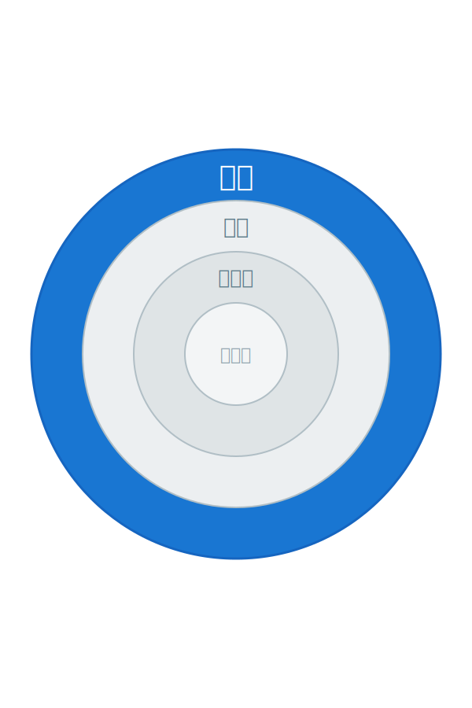
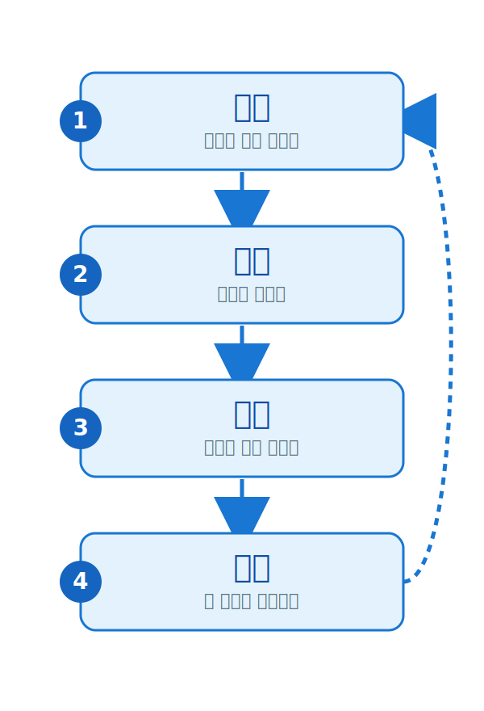
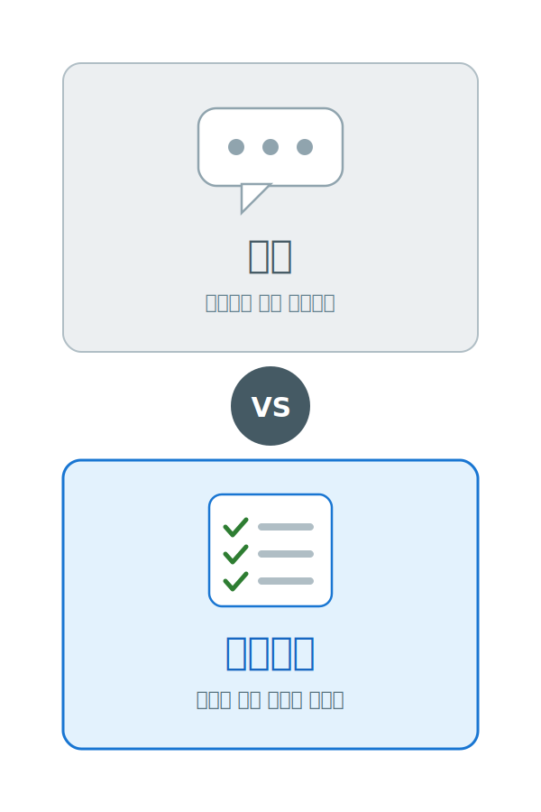

<!-- 갱신: 2026-05-24 | 범위: 전체 (Agentic AI 역사) -->

<!-- _class: lead -->

# Agentic AI 동향

## 전체 흐름 — 큰 그림 한 장

갱신 2026-05-24 · 범위: 전체

---

# AI 에이전트란?

묻는 AI에서 **해내는 AI**로.

- 챗봇: 질문하면 그때그때 답을 말해준다
- 에이전트: 목표를 주면 스스로 일을 진행한다
- 목표 → 계획 → 실행 → 점검을 스스로 반복한다
- 막히면 방법을 바꿔 다시 시도한다

핵심 — "이걸 해줘"라고 맡기면, 일일이 시키지 않아도 끝까지 해내는 AI

---

# 챗봇과 무엇이 다른가

| 구분 | 챗봇 | 에이전트 |
|---|---|---|
| 하는 일 | 답을 알려줌 | 일을 해냄 |
| 도구 | 쓰지 않음 | 검색·앱·파일 사용 |
| 일의 길이 | 한 번 대답 | 여러 단계, 길게 |
| 사람 역할 | 계속 질문 | 맡기고 확인 |

에이전트는 '대화 상대'보다 '일을 맡기는 상대'에 가깝다

---

# 2023 — 개념의 탄생

- "AI가 스스로 목표를 향해 일한다"는 아이디어 등장
- GPT-4에 "계속 생각하고 행동하라"를 붙인 실험들 (AutoGPT)
- 결과는 들쭉날쭉 — 당시엔 '장난감'이라는 평가
- 그래도 나아갈 방향만은 분명해졌다

이때의 교훈 — 똑똑함보다 '일을 끝까지 해내는 끈기'가 더 어렵다

---

# 2024 — 도구를 쥐다

- AI가 외부 도구를 안정적으로 쓰기 시작 (검색·계산·앱)
- 화면을 직접 보고 클릭하는 '컴퓨터 사용' 기능 등장
- MCP 공개 — AI와 도구를 잇는 '공용 콘센트' 규격
- 'AI 어시스턴트'가 업무용 앱 곳곳에 들어오기 시작

MCP — AI가 어떤 도구든 같은 방식으로 꽂아 쓰게 해주는 표준 규격

---

# 2025 — 에이전트의 해

- '에이전트(agentic)'가 그해를 대표하는 키워드가 됨
- 코딩을 대신 해주는 에이전트가 대중화
- 스스로 자료를 조사해 보고서를 쓰는 기능이 보편화
- 컴퓨터 작업 성공률이 크게 올라 '실험에서 실용'으로

연말, MCP가 리눅스재단 산하 재단에 기증되며 업계 공용 표준으로 확정

---

# 2026 — 일터로 들어오다

- 실험을 넘어 실제 업무에 본격 투입
- 은행·고객지원·물류 등에서 에이전트가 일을 처리
- 기업 앱의 40%가 연내 에이전트 탑재 전망 (1년 전 5% 미만)
- 모든 새 AI 모델이 '에이전트 성능'을 핵심으로 내세움

2026년 — "대화하는 AI"에서 "일하는 AI"로 넘어가는 해

---

# 무엇이 바뀌었나

3년 만에 AI는 '답하는 도구'에서 '일하는 동료'로 바뀌었다

- 2023 — 개념: 될까?
- 2024 — 도구: 손이 생겼다
- 2025 — 대중화: 누구나 쓴다
- 2026 — 일터: 실제로 일한다

그래서 이 흐름이 매주 어디까지 왔는지 따라갈 가치가 있다

---

# 이 시리즈 보는 법

| 슬라이드 | 범위 | 언제 보나 |
|---|---|---|
| 전체 | Agentic AI 역사 | 처음 입문할 때 |
| 올해 | 2026년 흐름 | 한 해를 정리할 때 |
| 이번달 | 이번 달 소식 | 월간 브리핑 |
| 지난주 | 가장 따끈한 뉴스 | 매주 업데이트 |

매주 일요일 저녁 자동 갱신 — '지난주'는 새로 쓰이고, 누적 3종은 핵심만 추려 채워진다

