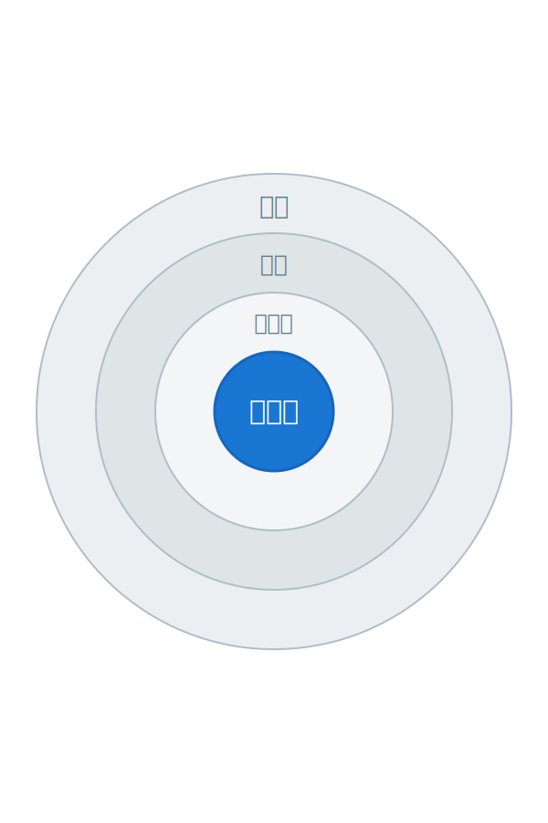

<!-- 갱신: 2026-05-31 | 범위: 지난주 (2026-05-24 ~ 2026-05-30) -->

<!-- _class: lead -->

# Agentic AI 동향

## 지난주 — 2026.05.24 ~ 05.30

갱신 2026-05-31 · 범위: 지난 한 주

---

# 지난주 한눈에

지난주의 중심 — 새 모델 Claude Opus 4.8, 그리고 'AI 동료팀'

- 새 모델 Claude Opus 4.8 — 코딩·정직성에서 한 단계 진전
- OpenAI Codex — Windows PC를 직접 보고 클릭하기 시작
- Salesforce — 여러 에이전트가 팀으로 일하는 기능 출시 임박
- NVIDIA + SAP — 기업 업무에 '안전한 에이전트 런타임' 결합

영상: [Claude Opus 4.8 공개 영상 (YouTube)](https://www.youtube.com/watch?v=1FQyjzdYx18)

---

# 새 모델 — Claude Opus 4.8, 무엇이 좋아졌나

- 5/28 공개 — Anthropic의 새 플래그십 모델
- 에이전트형 코딩 점수 64.3% → 69.2%로 상승
- '잘 모를 때 모른다고 말하기'가 이전보다 늘었다
- 빠른 모드(Fast mode) — 2.5배 속도·약 3배 저렴

핵심 — 더 길게 일하고, 덜 우기는 모델로 진화 중

출처: [Anthropic 공식](https://www.anthropic.com/news/claude-opus-4-8) · [TechCrunch](https://techcrunch.com/2026/05/28/anthropic-releases-opus-4-8-with-new-dynamic-workflow-tool/)

---

# 새 에이전트 — Codex가 Windows를 직접 쓴다

- 5/29 OpenAI — Codex의 'Computer Use'가 Windows 11에 정식 적용
- PC 화면을 보고 직접 클릭·타이핑하며 일을 진행
- 폰(아이폰·안드로이드)에서 PC 작업 상태를 원격 확인
- 사례 — 보고서 양식 채우기, 사내 앱 자동 입력 등

회사 PC를 켜둔 채 외출해도, 폰으로 진행 상황을 보고 멈출 수 있다

출처: [OpenAI 릴리스 노트 정리](https://releasebot.io/updates/openai) · [Codex Changelog](https://developers.openai.com/codex/changelog)

---

# 비즈니스 적용 — 'AI 동료팀'이 들어온다

| 회사 | 무엇을 내놨나 | 푸는 문제 |
|---|---|---|
| Salesforce | 여러 에이전트가 한 팀처럼 일 (6/15 출시) | 고객이 같은 얘기 반복 |
| NVIDIA+SAP | 안전한 에이전트 런타임(OpenShell) | 사내 데이터 새는 위험 |
| Cognizant | 의료 사전승인 자동화(TriZetto) | 보험 승인 대기 며칠 |
| OpenAI Foundation | 일자리 전환 지원 2.5억 달러 | AI로 줄어드는 일자리 |

출처: [Salesforce 공식](https://www.salesforce.com/news/stories/summer-2026-product-release-announcement/) · [NVIDIA·SAP](https://blogs.nvidia.com/blog/sap-specialized-agents/)

---

# 그 외 주목할 소식

- OpenAI — 구형 모델 o3·GPT-4.5 단계 종료 예고 (5/28)
- ChatGPT Enterprise — 스킬·업로드 보안·감사로그 강화
- Anthropic — 거액 자금 조달 협상 보도 (가치 9천억 달러대)
- SAP Sapphire — '자율 기업(Autonomous Enterprise)' 비전 공식화

모델만이 아니라 — 모델을 안전하게 돌릴 '판'까지 빠르게 짜이는 중

출처: [Bloomberg — Anthropic 자금](https://www.bloomberg.com/news/articles/2026-05-12/anthropic-in-talks-to-raise-30-billion-at-900-billion-valuation) · [SAP Sapphire](https://news.sap.com/2026/05/sap-sapphire-sap-unveils-autonomous-enterprise/)

---

# 비개발자에게 무슨 의미인가

지난주가 말해주는 것

- 모델은 '말 잘하는' 단계를 넘어 '오래 일하는' 단계로
- PC를 직접 다루는 AI가 평범한 사무 도구처럼 자리 잡는 중
- 기업의 고민은 "쓸까?"가 아니라 "안전하게 어떻게 굴리나"
- 일자리 변화에 대한 사회적 대응(기금)도 함께 등장

다음 일요일, 이 슬라이드는 새로운 한 주의 소식으로 갱신됩니다

---

# 출처 · 영상으로 더 보기

<a class="card video" href="https://www.youtube.com/watch?v=1FQyjzdYx18">
▶ YOUTUBE
Claude Opus 4.8 공식 소개 영상
youtube.com
</a>

<a class="card" href="https://www.anthropic.com/news/claude-opus-4-8">
ANTHROPIC
Claude Opus 4.8 공식 발표
anthropic.com
</a>

<a class="card" href="https://techcrunch.com/2026/05/28/anthropic-releases-opus-4-8-with-new-dynamic-workflow-tool/">
TECHCRUNCH
Opus 4.8 — '동적 워크플로'로 큰 작업까지
techcrunch.com
</a>

<a class="card" href="https://releasebot.io/updates/openai">
OPENAI 릴리스
Codex Windows Computer Use 출시 (5/29)
releasebot.io
</a>

<a class="card" href="https://www.salesforce.com/news/stories/summer-2026-product-release-announcement/">
SALESFORCE
Summer '26 — 멀티 에이전트 오케스트레이션
salesforce.com
</a>

<a class="card" href="https://blogs.nvidia.com/blog/sap-specialized-agents/">
NVIDIA
SAP와 함께 '안전한 에이전트 런타임' 공개
blogs.nvidia.com
</a>

