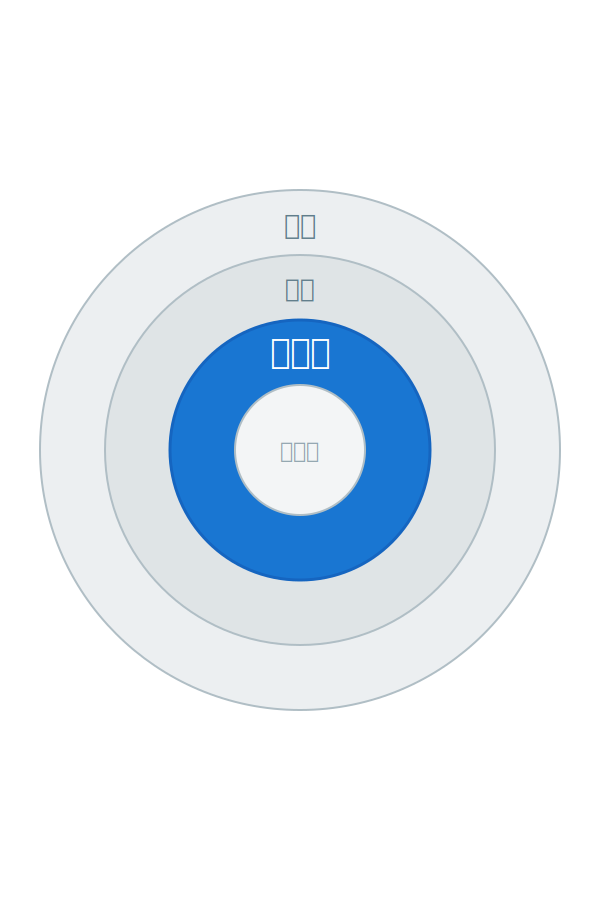

<!-- 갱신: 2026-05-24 | 범위: 이번달 (2026년 5월) -->

<!-- _class: lead -->

# Agentic AI 동향

## 이번달 — 2026년 5월

갱신 2026-05-24 · 범위: 2026년 5월 누적

---

# 5월 한눈에

2026년 5월 — 모델은 강해지고, 일터로 들어갔다

- 새 모델 줄줄이 — 더 빠르고 싸고, '에이전트'에 특화
- Google I/O 2026 — "에이전트 Gemini 시대" 선언
- 금융·광고·쇼핑에서 실제 적용 사례 등장
- 도입 기업들이 두 자릿수 ROI(투자 대비 효과)를 보고

아래에서 새 모델 → 적용 사례 → 성과 순으로 본다

---

# 5월에 나온 모델들

| 모델 | 등장 | 핵심 한 줄 |
|---|---|---|
| Gemini 3.5 Flash | 5/19 | 작고 빠른데 최상위급 성능 |
| GPT-5.5 Instant | 5/5 | ChatGPT 기본 모델, 기억 기능 |
| Claude Opus 4.7 | 4월 말~ | 긴 문서·금융 분석에 강함 |

공통점 — 자랑하는 건 '에이전트로 얼마나 일을 잘하나'

출처: [LLM 업데이트 — llm-stats](https://llm-stats.com/llm-updates)

---

# 모델이 어떻게 강해졌나

- Gemini 3.5 Flash — 작년 최상위 모델을 시험 11/15개에서 앞섬
- Claude Opus 4.7 — 수년치 기업 공시를 한 번에 읽고 분석
- GPT-5.5 — 과거 대화·파일·메일을 기억해 답을 개인화
- 공통 방향 — 더 길게, 더 정확히, 더 싸게 '일하는' 능력

새 버전의 자랑거리가 '대화 솜씨'에서 '일 처리력'으로 옮겨갔다

출처: [Gemini 3.5 — DeepMind](https://deepmind.google/models/gemini/flash/) · [Claude Opus 4.7 — Anthropic](https://www.anthropic.com/news/finance-agents)

---

# 비즈니스 적용 ① — 금융

- Anthropic이 은행용 에이전트 묶음을 출시 (5월)
- Claude Opus 4.7이 한 기업의 수년치 공시를 한 번에 분석
- 푸는 문제 — 애널리스트가 며칠 걸리던 자료 검토를 단축
- 엑셀·PPT·워드·메일을 넘나들며 보고서까지 작성

정밀함이 생명인 금융이 'AI 에이전트 1호 격전지'가 됐다

출처: [Fortune](https://fortune.com/2026/05/05/anthropic-wall-street-financial-services-agents-jamie-dimon/) · [AWS](https://aws.amazon.com/blogs/aws/introducing-anthropics-claude-opus-4-7-model-in-amazon-bedrock/)

---

# 비즈니스 적용 ② — 광고·쇼핑·일상

- Netflix — AI 에이전트가 광고 캠페인을 직접 사고 최적화
- 푸는 문제 — 광고주가 일일이 손보던 운영을 AI가 대신
- Klarna — ChatGPT 안에서 1억 개 넘는 상품을 찾아주는 쇼핑
- Gemini Spark — 청구서 숨은 수수료 찾기 등 개인 일상까지

전문 업무를 넘어, 광고·쇼핑·집안일까지 에이전트가 들어왔다

출처: [PPC Land — 넷플릭스 2026 업프런트](https://ppc.land/netflix-2026-upfront-250m-viewers-ai-agents-and-15-new-ad-markets/)

---

# 숫자로 보는 도입 성과

- 기업 72% — 에이전트를 '실험'이 아닌 '실제 운영'에 사용
- 도입 기업 평균 ROI 171% 보고 (투자보다 효과가 큼)
- Klarna — 고객지원 에이전트로 853명분 업무를 처리
- General Mills — 물류 최적화로 2천만 달러 넘게 절감

'AI가 일을 한다'가 구호가 아니라 숫자로 확인되는 단계

출처: [Agentic AI 도입 ROI 사례집](https://aimonk.com/agentic-ai-examples-enterprise-roi-case-studies/)

---

# 업무 자동화 플랫폼이 쏟아지다

| 회사 | 무엇을 내놨나 |
|---|---|
| Fiserv | 은행용 에이전트 운영체제 |
| Dell | PC에서 직접 도는 에이전트 |
| Camunda | 업무 절차를 스스로 개선하는 도구 |
| Salesforce | 영업 화면에 들어온 'AI 동료' |

'AI를 어디에 붙일까'에서 '이미 붙어 있다'로

출처: [주간 AI 뉴스 정리](https://www.buildfastwithai.com/blogs/ai-news-today-may-18-2026)

---

# 5월, 여기까지

5월 요약 — 모델은 강해지고, 사례는 구체적이 됐다

- 새 모델들이 더 길게·정확히·싸게 '일하는' 능력으로 경쟁
- 금융·광고·쇼핑에서 실제 적용 사례가 등장
- 도입 성과가 ROI 숫자로 확인되기 시작

다음은 '지난주' — 가장 최근 일주일을 본다

---

# 출처 · 영상으로 더 보기

<a class="card video" href="https://www.youtube.com/live/wYSncx9zLIU">
▶ YOUTUBE
Google I/O '26 키노트 풀영상
youtube.com/live/wYSncx9zLIU
</a>

<a class="card" href="https://blog.google/innovation-and-ai/sundar-pichai-io-2026/">
GOOGLE 블로그
에이전트 Gemini 시대 — I/O 2026 키노트
blog.google
</a>

<a class="card" href="https://fortune.com/2026/05/05/anthropic-wall-street-financial-services-agents-jamie-dimon/">
FORTUNE
Anthropic, 은행용 AI 에이전트로 월街 진출
fortune.com
</a>

<a class="card" href="https://ppc.land/netflix-2026-upfront-250m-viewers-ai-agents-and-15-new-ad-markets/">
PPC LAND
Netflix, AI 에이전트가 광고를 직접 구매
ppc.land
</a>

<a class="card" href="https://www.anthropic.com/news/finance-agents">
ANTHROPIC
금융 서비스용 에이전트 공식 발표
anthropic.com
</a>

<a class="card" href="https://aimonk.com/agentic-ai-examples-enterprise-roi-case-studies/">
사례집
기업 Agentic AI 도입 ROI 사례 모음
aimonk.com
</a>

