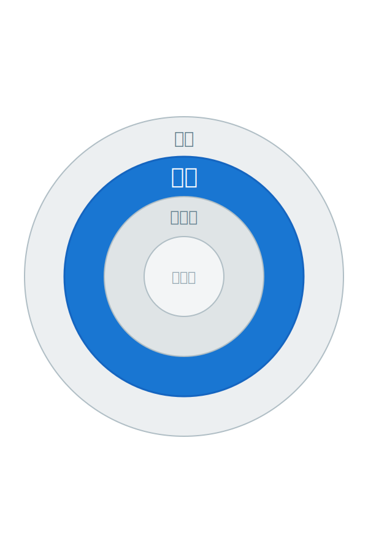

<!-- 갱신: 2026-05-31 | 범위: 올해 (2026년) -->

<!-- _class: lead -->

# Agentic AI 동향

## 올해 — 2026년의 흐름

갱신 2026-05-31 · 범위: 2026년 누적

---

# 2026 한눈에

2026년, 에이전트가 '실험'에서 '업무'로

- 모델 경쟁 — 새 AI가 쏟아짐, 전부 '에이전트'를 앞세움
- 엔터프라이즈 — 시범 운영에서 실제 도입으로 전환
- 표준화 — MCP가 업계 공용 규격으로 자리잡음
- 그림자 — 안전·관리 체계가 속도를 못 따라감

아래 슬라이드에서 네 가지를 하나씩 살펴본다

---

# 모델 경쟁 — 신모델 러시

- 올 들어 주요 AI가 줄줄이 새 버전을 내놓음
- Gemini 3.5 Flash(5/19)·Claude Opus 4.8(5/28) 등 신모델 줄지어
- 공통점 — 자랑하는 건 '에이전트로 얼마나 일을 잘하나'
- AI가 PC 화면을 직접 보고 클릭하는 'Computer Use' 정식 확산

비개발자 메모 — 버전 이름은 몰라도 된다. "에이전트로 경쟁 중"만 기억하면 충분

출처 — llm-stats, TechCrunch

---

# 파일럿에서 프로덕션으로

- 작년까지는 '시범 운영'이 대부분이었다
- 올해 4월 말, 주요 기업용 에이전트 플랫폼이 동시 출시
- Google·OpenAI 등 — 에이전트를 본격 업무에 투입
- 기업 앱의 40%가 연내 에이전트 탑재 전망

전환점 — "한번 해볼까?"에서 "이미 쓰고 있다"로

출처 — Gartner, FifthRow

---

# MCP — 공용 표준이 되다

- MCP는 AI와 도구를 잇는 '공용 콘센트' 규격 (2024년 등장)
- 월 다운로드가 1억 회 가까이로 폭증
- 기업 78%가 MCP 기반 에이전트를 실제로 운영
- 한 회사 것이 아니라 업계 공용 표준으로 관리됨

표준이 생기면 도구가 늘고, 도구가 늘면 에이전트가 더 쓸모있어진다

출처 — digitalapplied, Wikipedia

---

# Anthropic의 금융권 진출

- 5월, Anthropic이 은행용 에이전트 묶음을 출시
- Claude가 엑셀·PPT·워드·메일을 하나로 넘나들며 작업
- 소상공인용 — 회계·결제·고객관리 앱 안에서 동작
- AI 회사들이 '산업별 전용 에이전트'로 경쟁을 옮김

범용 에이전트에서 산업 맞춤 에이전트로 무게중심이 이동 중

출처 — Fortune

---

# 그림자 — 거버넌스 격차

- 에이전트는 빠르게 퍼지는데 관리 체계는 뒤처짐
- 성숙한 관리 체계를 갖춘 기업은 21%뿐
- 새 위험 — 목표 가로채기, 잘못된 권한, 공급망 오염
- 임원 67%가 "비인가 AI로 정보 유출 경험" 응답

빠른 도입만큼 '안전하게 쓰는 법'이 올해의 숙제

출처 — Deloitte, OWASP

---

# 2026, 여기까지

올해 한 줄 — 에이전트가 일터의 기본값이 되어간다

- 모델은 더 빨라지고 저렴해졌다
- 기업은 실제로 도입하기 시작했다
- 표준(MCP)이 자리잡았다
- 남은 숙제는 '안전하게 쓰기'

다음은 '이번달' 슬라이드 — 한 달을 더 가까이 들여다본다

